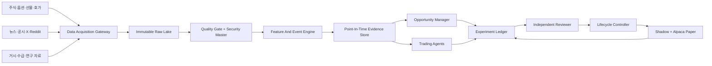

# 기관형 다중 시장 Quant Research OS

미국·한국 시장을 상시 관찰하는 전문 에이전트들이 실시간 종목을 발굴하고, day/swing/systematic/derivatives 전략을 독립적으로 연구하며, point-in-time 증거에 따라 전략 버전을 승격·유지·중단·강등하는 Quant Research OS다.

이 프로젝트의 중심은 주문이 아니라 **근거와 시점이 재현되는 추천, 반복 가능한 연구, Paper forward validation**이다. 실제 자금 거래는 영구적으로 범위 밖이며, 실행 검증은 명시적으로 승인된 미국 lane의 Alpaca Paper 계좌에서만 수행한다.

최상위 제품·데이터·에이전트 아키텍처는 [기관형 다중 시장 Quant Research OS 설계](docs/superpowers/specs/2026-07-17-institutional-multi-market-quant-research-os-design.md)에 정의한다.

## 사용자가 받는 결과

시스템은 단순한 종목명이나 `매수` 문구가 아니라 다음을 갖춘 추천 카드를 만든다.

- 시장, 종목과 현재 진입가 또는 조건부 진입 구간
- day, swing, systematic 중 추천을 만든 agent와 불변 strategy version
- 관측 시각, 데이터 최신성, 신호 유효시간
- 손절, 목표, 예상 보유 시간과 무효화 조건
- 가격·거래량·호가·수급·뉴스·공시·테마·소셜 근거
- 시장 regime, 누락 데이터와 주요 위험
- 해당 전략의 forward 표본, lifecycle과 검증 상태

가격·호가·시장 상태를 현재 시점에 확인할 수 없으면 `현재 진입 가능`으로 표시하지 않는다. 추천은 주문권한이 아니며 Paper 체결은 체결 가능성을 평가하는 하류 증거다.

## 목표 아키텍처



현재의 append-only SQLite control ledger와 Paper 실행 상태기계는 유지한다. 전 종목 tick·호가·옵션·소셜처럼 대용량인 데이터만 durable raw spool, object storage와 Parquet 계층으로 점진적으로 분리한다.

## 전문 에이전트 조직

| 역할 | 책임 | 주문권한 |
|---|---|---|
| `Opportunity Manager` | 시장 전체에서 뉴스·테마·수급·기술 조건으로 후보 발굴 | 없음 |
| `Day Trading Agent` | ORB, VWAP, HOD, news momentum 등 당일 전략 | 승인된 US Paper lane만 가능 |
| `Swing Trading Agent` | 실적·공시·테마 지속, 신고가·RVOL과 다중세션 상태 | 초기 shadow-only |
| `Systematic Quant Agent` | 팩터, 평균회귀, 추세, 로테이션, 레버리지와 논문 재현 | 초기 shadow-only |
| `Derivatives Research Agent` | 옵션 IV·skew·term structure, 선물 basis·curve·roll | read-only·shadow-only |
| `Market Context Agent` | 변동성, breadth, liquidity, macro와 risk regime | 없음 |
| `Independent Reviewer` | 인과성, OOS, 비용, 다중검정, 운영 incident 심사 | 없음 |
| `Allocation Manager` | 두 champion 이후 다음 세션 lane 위험예산 계산 | 주문하지 않음 |

에이전트 하나가 실험 하나를 뜻하지 않는다. 각 agent 안에 여러 `Strategy Lane → Strategy Version → Experiment Trial`이 존재한다. lane 간 결합은 좋은 결과를 사후 혼합하지 않고 새 composite hypothesis와 trial로 등록한다.

## 데이터 원칙

`모든 데이터`는 인터넷의 모든 bytes를 무단 수집한다는 뜻이 아니다. 전략적으로 유의미한 미국·한국 주식, 옵션·선물, 공시·재무, 뉴스, X·Reddit, 거시·수급 source를 capability registry에 등록하고 공식 API·유료 feed·허용된 계약으로 최대한 넓게 확보한다.

모든 event는 원본 reference와 함께 `event_time`, `published_at`, `provider_time`, `received_at`, correction과 schema version을 보존한다. 전략이 요구한 data capability가 없거나 stale이면 다른 source로 조용히 대체하지 않고 `blocked_by_data` 또는 `research_only`로 닫는다.

## 현재 구현 상태

> **현재 상태:** 분봉 수집·급등주 스캐너·ORB/VWAP/HOD/Gap-and-Go 추천·인과성 감사·과거 및 forward 평가에 더해 Alpaca Paper 시장시계·계좌·주문·포지션·Account Activities FILL GET, `trade_updates` 스트림 인증·구독·Ping/Pong, 단일 Writer 원장과 fail-closed 주문 승인 게이트까지 구현되어 있다. 수신 frame은 text/binary 원문 BLOB을 먼저 확정한 뒤 분류하며, 재시작 시 미분류 receipt를 원래 순서로 복구하고 매 연결 세대에서 REST 주문 snapshot·개별 FILL activity·nested 보호 OCO와 대사한다. 모호한 entry/OCO/cancel mutation은 deterministic client order ID 또는 broker order ID로 직접 GET하며, 정확한 targeted 증거가 없으면 재전송하지 않는다. 통합 운영 세션은 한 Writer lease와 한 WSS 안에서 current-epoch 복구·승인·Paper mutation·사후 대사를 직렬 실행한다. 부분체결 수량이 기존 보호 OCO보다 늘어나면 source-bound cancel만 먼저 실행하고 terminal 대사 뒤 다음 호출에서 새 client ID와 exact 수량으로 replacement OCO를 제출한다. 별도 append-only lane registry는 세 manifest·전용 Paper account binding·사전등록 experiment scope·final daily snapshot 계약을 보존하고 Reviewer용 query-only reader를 제공한다. ORB intraday producer는 장 종료 뒤 현재 GET/WSS readiness, flat broker 상태, 세 계층 account binding, exact-scope daily record와 query-only execution hash를 다시 검증해 immutable `LaneDailySnapshot`을 append한다. 독립 Reviewer는 이 snapshot과 exact daily/adaptive artifact만 읽어 별도 global append-only review ledger에 권고를 남기며 전략 상태·champion·allocation·주문권한을 바꾸지 않는다. lane·review·execution DB와 분리된 global experiment ledger schema v6는 기존 source lineage, legacy 가설·전략 버전·trial·lifecycle, exact `StrategyLaneRef` 기반 multi-market 가설·버전·shadow trial·next-session lifecycle을 append-only로 보존한다. ORB의 NYSE 거래일마다 pre-open 등록·정규장 시작·장후 terminal을 갖는 독립 `shadow_forward` trial을 만들고, exact daily/adaptive/snapshot/review evidence로 `completed`·`censored`·`failed` 중 하나를 확정하는 opt-in watch 연결도 구현됐다. local-only Lifecycle Controller v1은 exact finalized snapshot·review·현재 lifecycle chain을 다시 검증하고 성숙 구간의 명확한 5일 열화만 다음 NYSE 세션 `suspended` event로 append한다. 조기 reject, 비교·승격·복구·champion·allocation·주문권한은 계속 닫혀 있다. 전용 장후 runner는 snapshot 성공 뒤에만 Reviewer를 실행하고 단계별 audit와 redacted aggregate report를 남긴다. 일일 연구 원장은 schema v2에서 exact lane scope로만 표본을 누적한다. 신규 진입, 보호 OCO 수명주기, cutoff·kill switch·EOD cancel/flatten은 모두 정확한 arm 객체가 필요한 축소 smoke CLI로만 열렸고 실제 정규장 Paper mutation은 아직 0건이다.

2026-07-15 뉴욕 정규장에는 실제 자격증명 loader, 빈 Paper 계좌 bootstrap, WSS·REST readiness, 현재 KIS source와 opening-history 보강, 15:30 ET one-shot cutoff monitor, 최종 flat GET 대사를 통과했다. 다만 exact current ORB setup이 0건이라 mutation을 만들지 않았으며 늦은 시작 세션을 정식 forward-validation 표본으로 사용하지 않는다.

실제 자금 거래는 목표가 아니다. 앞으로 추가되는 실행 코드는 `https://paper-api.alpaca.markets`에만 연결하며 Alpaca live endpoint, 실계좌 키와 실제 주문 경로는 프로젝트에서 차단한다.

다중 시장 상위 계약도 점진적으로 추가됐다. `MarketId → AgentFamily → StrategyLaneRef` 연구 좌표, US 기존 execution lane의 명시적 adapter, 사전등록 composite experiment, causal `OpportunitySnapshot`·`TradeSignalEnvelope`를 제공한다. KIS 미국주식 스캔은 거래소×상승률/거래량 6개 요청과 NYSE halt·시장위험 근거가 모두 완전할 때 선별 후보를 append-only opportunity JSONL로 발행하고, 그 opportunity 이후 생성된 5분 미만의 같은 종목 SETUP만 conditional signal JSONL·한국어 카드로 투영한다. 새 conditional 신호는 exact KIS HTTPS origin의 무리다이렉트 미국주식 1호가 GET으로 같은 client 수명 안에서 종목당 한 번 재검증하며 transient server error만 한 번 재시도한다. 현재 정규장, provider 시각 `<5초`, spread `25bp` 이하, stop 위 bid, 진입가 대비 ask `20bp` 이하를 모두 통과할 때만 별도 immutable `current_quote_validated` 신호와 카드를 만든다. 독립 수신 quote는 별도 ID로 보존하고 base signal별 한 scan cycle에는 terminal assessment 하나만 허용한다. 원래 conditional 신호는 수정하지 않으며 외부 메시지와 주문은 수행하지 않는다.

독립 `kr_equities` 도메인에는 뉴스·DART·KIS 국내 랭킹·거래량 급증 촉매의 원문 BLOB, 최초 관측시각, cycle별 coverage와 버전형 분류 결과를 보존하는 mode-600 append-only SQLite 원장이 추가됐다. local synthetic cycle에서는 버전형 deterministic keyword baseline이 뉴스·DART 원문을 분류하고, 저장된 classification과 canonical `volume_surge` BLOB만으로 테마 신선도·전파도·거래대금 대장주를 재생해 `kr_equities/opportunity_manager/theme_momentum` Opportunity JSONL을 발행한다. 공식 OpenDART `list.json`의 당일 공시검색은 exact endpoint·무리다이렉트 GET client로 연결됐고, 응답 bytes receipt를 파싱 전에 schema v2 원장에 확정한 뒤 공시별 catalyst·observation lineage와 terminal DART source run을 append한다. LS증권 `NWS001` 뉴스 제목도 exact OAuth·WebSocket allow-list와 raw-first frame receipt, strict KST causality parser, canonical NEWS catalyst·terminal source run으로 연결됐다. LS secret은 단일 no-follow descriptor에서만 읽고 OAuth 응답은 bounded streaming하며, 비정상 종료 receipt는 빈 성공으로 재개하지 않고 immutable 실패 run으로 확정한다. 폐기·재발급한 mode-600 로컬 자격증명으로 bounded production smoke를 수행해 구독 ACK 뒤 실제 뉴스 1건을 성공 수집했다. ACK 전 뉴스, 중복 ACK와 ACK 없는 종료는 차단하며, 공식 7필드 뉴스와 운영에서 관측된 `categoryid`·`codeaccu` 확장형만 strict하게 허용한다. KIS 국내 랭킹도 exact live origin의 등락률·거래량 GET 두 종류로 연결됐다. current KST date preflight 뒤 각 HTTP 응답 BLOB을 parser보다 먼저 확정하고, transient server status만 한 번 재시도하며, 검증된 종목 행을 receipt lineage가 있는 cycle-local `kis_ranking` catalyst와 terminal source run으로 보존한다. terminal replay와 orphan receipt 재시작은 credential·network를 열지 않는다. 저장된 같은 cycle의 KIS 거래량 행만 읽는 DB-only `volume_surge` v2 파생기도 추가됐다. v1 숫자 symbol replay를 유지하면서 실제 KIS 단축코드 `[0-9A-Z]{6}`와 행별 upstream catalyst ID를 보존하고, provider 재조회나 가짜 HTTP receipt 없이 독립 terminal source run을 append한다. 기존 bounded production KIS 원장에 대한 로컬 파생 QA에서는 60개 랭킹 행 중 거래량 30개를 모두 보존했고 영문 포함 코드 7개도 유지했으며 재실행은 신규 행 0개였다. 네 terminal source run이 모두 있을 때만 exact coverage의 immutable collection cycle을 확정하는 DB-only coordinator도 추가됐으며, 누락 source는 cycle로 만들지 않고 terminal 실패는 `complete=false`로 보존한다. one-shot same-cycle Opportunity runner는 네 adapter를 직렬 실행한 뒤 등록된 policy와 5분 이내 terminal cycle을 private immutable run bundle에 고정하고 기존 theme Opportunity outbox까지 연결한다. fixture에서는 그 Opportunity의 exact composite 사전등록, same-session day onboarding receipt와 첫 shadow TradeSignal tick까지 연결했다. bounded production 전체-cycle, 열린 KRX onboarding, production 기사 본문과 LLM 분류·비교는 아직 남아 있다. 국내 계좌·주문 경로는 없고 새 swing·systematic quant 엔진도 후속 milestone이다.

**2026-07-19 업데이트:** `run_kr_same_cycle_collect.py`가 같은 날짜·cycle ID에서 `DART → LS NWS → KIS ranking → volume_surge → DB-only coordinator`를 단일 writer로 직렬 실행한다. `run_kr_same_cycle_opportunity.py`는 등록된 KR Opportunity policy를 먼저 확인하고, exact 네 terminal run과 final cycle을 대사한 뒤 첫 production projection을 cycle 완료 후 최대 5분 안에서만 허용한다. policy·rules·projection manifest는 content-addressed private bundle로 고정되며 exact replay는 expired 뒤에도 누락 outbox 복구를 위해 provider 없이 같은 시각을 재사용한다. fixture E2E는 same-session day onboarding과 첫 shadow TradeSignal tick까지 완료됐고 실제 bounded production 전체-cycle, 열린 KRX 대사와 수익성 검증은 아직 남아 있다.

같은 날 US swing `new_high_momentum` vertical도 fixture E2E까지 구현됐다. 확정 일봉 21세션으로 20일 신고가·RVOL 조건부 신호를 만들고 별도 append-only shadow ledger에 다중세션 결과를 기록한다. production은 current NYSE post-close의 bounded Alpaca market-data GET만 열 수 있으며, Paper 계좌·주문·현재 호가·외부 메시지는 이 vertical의 범위 밖이다.

**2026-07-16 업데이트:** source-bound 신고가·RVOL 가설 카드와 정확히 일치하는 신호 하나를 global `shadow_forward` trial 하나로 사전등록한다. `run_swing_shadow_trial.py`의 local-only `register → start → finalize → review` 순서는 query-only swing shadow 원장을 다시 대조해 terminal artifact hash를 확정하고, 별도 mode-600 append-only Reviewer 원장에는 `continue_collection`만 기록한다. 이 경로는 lifecycle 전이, champion, allocation, Paper 계좌·주문과 provider 연결을 만들지 않으며, `expired`는 0수익 대체가 아니라 명시적 no-entry 관찰이다.

**2026-07-19 strategy authority 업데이트:** global experiment ledger schema v3에 전략 버전별 immutable `StrategyAuthorityBinding`을 추가했다. exact `StrategyLaneRef`, 최대 운영모드와 승인된 legacy 실행 lane을 한 번만 결합하고, 부모 전략 ID·lane·기록시각 불일치와 같은 버전의 mode 변경을 fail-closed한다. Alpaca Paper mode는 미국 day/swing에만 허용하며 KR lane은 multi-market experiment scope v2 전까지 legacy `LaneId`로 위장하지 않는다. 아직 champion 전이·allocation·risk·주문 권한은 열지 않았다.

**2026-07-19 multi-market research ledger 업데이트:** global experiment ledger schema v4에 exact `StrategyLaneRef`를 사용하는 append-only multi-market hypothesis와 strategy version을 추가했다. v1~v3 행은 재작성하지 않고 다음 Writer에서 v4 객체만 원자적으로 더한다. 첫 연결은 `kr_equities/opportunity_manager/theme_momentum`이며 code-coupled version과 `shadow` 운영모드를 사전등록해야만 KR keyword projection이 Opportunity을 만들 수 있다. 이 권한은 ranked Opportunity까지만 허용하고 KR TradeSignal, shadow fill, lifecycle promotion, 국내 계좌·주문은 열지 않는다.

**2026-07-19 multi-market shadow trial 업데이트:** global experiment ledger schema v5에 multi-market trial과 최대 두 event의 append-only chain을 추가했다. v1~v4 행은 재작성하지 않으며 current schema의 table/index/trigger exact-set도 Reader와 Writer가 검증한다. 첫 consumer인 KR `theme_leader_vwap_reclaim` day lane은 exact code-coupled shadow version, 공식 KIS 거래일 스냅샷으로 확인된 session의 09:00 KST 전 등록, 고정 no-entry baseline·20 sessions·30 signals·20bp 비용·결측 0·Reviewer gate를 요구한다. 이 체크포인트 당시 local CLI는 `register`와 `start`만 제공했고 fill, terminal과 lifecycle은 아래 후속 업데이트에서 연결했다. 계좌·주문 권한은 계속 열지 않는다.

**2026-07-19 KR day conservative shadow entry 업데이트:** started daily trial과 fresh `CURRENT_QUOTE_VALIDATED` long signal을 exact 결합해 signal ask에 고정 20bp adverse slippage를 적용한 1-unit research entry artifact를 만든다. artifact는 trial registration key, started event key, canonical signal SHA, stop/targets와 evidence ID만 private append-only SQLite에 보존하고 계좌·수량·notional·broker ID를 갖지 않는다. expired signal, unstarted/변형 trial, public/hard-linked store와 payload/schema tamper는 file 생성 또는 append 전에 차단한다. 이는 체결 모델의 entry 단계일 뿐 exit, PnL, terminal, lifecycle 또는 주문 권한이 아니다.

**2026-07-19 KR day shadow exit/PnL 업데이트:** entry 시각이 속한 분은 버리고 다음 완전한 KST 1분 경계부터 symbol·시각·관측 인과성과 연속성을 검증한다. 각 봉은 stop을 first target보다 먼저 평가하며 stop, first target, 15:30 close 모두 매도 방향 20bp adverse slippage를 적용한다. 불완전 경로는 artifact 0이고 15:30까지 이어진 경로만 `time_exit`가 된다. exit artifact는 consumed bar canonical SHA/evidence, net return과 realized R을 private append-only SQLite에 보존하며 quantity, account, broker와 order authority는 없다.

**2026-07-19 KR day trial terminal 업데이트:** KST 15:30 이후 exact trial registration/start event와 private entry·exit store를 query-only 재생한다. 모든 entry가 exact exit와 1:1 대사될 때만 global trial sequence 2를 `completed`로 닫고, 빈 entry 또는 미완료 exit는 수익률 0으로 넣지 않고 `censored`, source store 변조나 계보 불일치는 `failed`로 닫는다. daily terminal artifact는 ordered entry·exit canonical SHA와 terminal reason을 별도 private append-only SQLite에 고정하며 exact restart는 artifact와 event를 늘리지 않는다.

**2026-07-19 KR day independent Reviewer 업데이트:** query-only Reviewer가 strategy version과 as-of session까지 등록된 모든 daily trial, started/terminal chain, terminal artifact, entry·exit canonical SHA를 독립 재검증한다. completed 표본만 실제 exit 시각 순서의 compounded return, mean R, win rate와 max drawdown에 포함하고 censored/failed는 별도 데이터 품질 판정으로 유지한다. 20 forward sessions·30 completed signals 전에는 `continue_collection`, 품질 문제가 있으면 `data_quality_review`, 기준 충족 뒤에도 `comparison_ready`일 뿐이며 자동 lifecycle·Paper·allocation 변경은 모두 금지된다.

**2026-07-19 KR day lifecycle Controller 업데이트:** global experiment ledger schema v6에 multi-market strategy version별 immutable lifecycle chain과 market-local next-session projection을 추가했다. local-only `run_kr_theme_day_lifecycle.py`는 exact KR day lineage, persisted Reviewer event와 그 원천 trial·entry·exit·terminal evidence, 당일 공식 KIS 거래일 snapshot을 모두 다시 검증한다. 최초 version은 다음 open session `experimental_shadow`로 등록하고, censored/failed 품질 판정은 다음 open session `suspended`, 최소 20 sessions·30 signals 판정은 `challenger`까지만 허용한다. `SHADOW_CHAMPION`, Paper·allocation·위험·계좌·주문 권한은 만들지 않으며 exact replay는 event를 늘리지 않는다.

**2026-07-19 KR day 장후 control cycle 업데이트:** 독립 `run_kr_theme_day_trial_terminal.py`, `run_kr_theme_day_reviewer.py` child와 `run_kr_theme_day_post_session.py` runner를 추가했다. runner는 `terminal → Reviewer → lifecycle`을 별도 프로세스로 직렬 실행하고 각 종료코드를 private append-only audit에 남긴 뒤 성공한 단계 다음만 시작한다. terminal exact replay는 최초 terminal 시각을 재사용해 늦은 같은-session 재시작도 artifact/event를 늘리지 않는다. aggregate `completed_control_cycle`은 전략 성과가 아니라 세 control 단계의 실행 완료만 뜻하며 자동 champion·Paper·allocation·계좌·주문 권한은 모두 false다.

**2026-07-19 KR day shadow signal 업데이트:** `kr_equities/day_trading/theme_leader_vwap_reclaim` 순수 신호 커널을 추가했다. exact KR theme Opportunity의 rank-1 대장주와 별도 완료봉 규칙 setup, 5초 이내 session·VI·단일가·거래정지·투자지정·가격제한·호가 snapshot을 모두 대사한다. blocked gate는 이유만 보존하고, spread와 손절·목표까지 통과할 때만 현재 ask 기반 `CURRENT_QUOTE_VALIDATED` TradeSignal을 만든다. 이 체크포인트 당시 live LS/KIS adapter와 shadow fill/trial은 없었고 아래 후속 업데이트에서 read-only adapter와 shadow evidence가 연결됐다. 국내 주문은 계속 없다.

**2026-07-19 KR 완료봉 VWAP setup 업데이트:** 장 시작부터 연속된 KR 1분 완료봉의 실제 거래대금과 거래량으로 point-in-time session VWAP을 계산하는 순수 extractor를 추가했다. exact Opportunity rank-1 종목이 1% 확장한 뒤 VWAP ±20bp의 첫 눌림을 만들고, 5bp 이상 재돌파와 눌림 대비 1.2배 거래량을 최신 완료봉에서 함께 충족할 때만 30초 유효 `KrThemeDaySetup`을 발행한다. 분봉 공백·미래 관측·비대장주·늦은 평가와 중복 evidence는 fail-closed하며 동일 입력은 같은 setup ID·손절·1R/2R 목표를 재생한다. fixture에서 setup→KR market gate→current-quote shadow signal을 연결했고 전체 **2639 tests**와 정적 게이트가 통과했다. provider·credential·network·국내 주문 mutation은 0건이다.

**2026-07-19 KIS KR read-only market adapter 업데이트:** 공식 KIS sample commit `885dd4e`의 당일 분봉·현재가 상태·호가 예상체결 세 live GET 계약만 exact origin/TR ID로 여는 adapter를 추가했다. 미래·오래된 요청, redirect client와 다른 origin은 GET 전에 차단하고 raw response bytes와 수신시각을 frozen receipt로 먼저 보존한다. projection은 형성 중 봉을 제외하고 장 시작 연속 완료봉의 누적 거래대금 차분을 분별 거래대금으로 만들며, 현재가/호가 두 receipt의 종목·현재가·기준가·VI·2초 수신 skew와 5초 provider 호가시각을 대사한다. 명시적 `20` 장중/`N` 정상 코드 외 상태는 `UNKNOWN`으로 남아 기존 gate가 차단한다. fixture raw→VWAP setup→current-quote shadow signal E2E와 전체 **2650 tests**가 통과했다. 오늘은 일요일이라 production GET은 0건이며 계좌·잔고·주문 endpoint와 mutation은 없다.

**2026-07-19 KR theme day 장중 evidence child 업데이트:** KIS 분봉·현재가·호가 raw bytes를 kind/symbol/수신시각 logical key로 고정하는 mode-600 append-only receipt store를 추가했다. exact replay는 no-op이고 같은 key의 다른 payload, schema/trigger·mode·hard-link 변조는 차단한다. `run_kr_theme_day_intraday.py`는 private Opportunity outbox와 receipt store를 query-only로 재생해 완료봉 VWAP setup, 현재 시장 gate, current-quote signal을 순서대로 계산하고 exact started shadow trial이 있을 때만 20bp 보수적 그림자 entry를 append한다. report에는 종목·가격·ID·경로를 쓰지 않는다. fixture happy/replay와 전체 **2726 tests**, Ruff, basedpyright 0/0, compileall, no-excuse가 통과했으며 KIS production collector/scheduler, shadow exit와 일일 supervisor 결합은 다음 단계다. provider credential·network·국내 계좌·주문 mutation은 0건이다.

**2026-07-19 KIS KR 장중 GET-only collector 업데이트:** `run_kis_kr_market_collect.py`는 exact official calendar snapshot과 현재 KST 09:01~15:30 미만을 credential 전에 검증하고, 공식 live origin의 당일 완료 분봉·현재가 상태·호가 예상체결 GET만 순서대로 실행한다. 각 응답은 provider success parsing보다 먼저 private receipt store에 append되어 이후 GET/parse 실패가 앞선 raw evidence를 지우지 않는다. 같은 logical receipt는 replay하며 current session/date를 매 GET 전에 다시 확인한다. strict fixture happy/replay, 부분 transport failure와 closed-session credential-call 0을 검증했고 전체 **2733 tests**, Ruff, basedpyright 0/0, compileall, no-excuse가 통과했다. 2026-07-19 일요일 actual production CLI는 credential·receipt store·network 전에 blocked 되었고 실제 GET 및 국내 account/order mutation은 0건이다.

**2026-07-19 KR theme day EOD minute·shadow exit 업데이트:** collector의 `--eod-minute`는 official open day의 KST 15:30~15:31에만 15:29 마지막 완료 분봉 GET 하나를 허용하고 현재가·호가 GET은 열지 않는다. raw append 뒤 응답 rows에 요청 minute가 실제 포함됐는지 검증해 wrong-minute payload도 보존된 blocked evidence로 남긴다. `run_kr_theme_day_shadow_exit.py`는 trial entry별 첫 완전한 후속 봉부터 receipt history를 재생해 기존 stop-first·first-target·15:30 time-exit projector를 실행한다. terminal entry는 재시작에서 다시 계산하지 않고, pending path는 exit store를 만들지 않는다. fixture EOD/target/replay와 전체 **2740 tests**, Ruff, basedpyright 0/0, compileall, no-excuse가 통과했으며 실제 provider GET·국내 account/order mutation은 0건이다.

**2026-07-19 KR theme day restartable session supervisor 업데이트:** `run_kr_theme_day_session.py onboard/tick`은 content-addressed mode-600 onboarding receipt와 session manifest로 open start, minute별 KIS GET-only collect→shadow entry→exit, 15:30 EOD catch-up→exit와 장후 terminal→Reviewer→lifecycle child를 직렬 연결한다. tick은 오래 sleep하지 않고 scheduler가 반복 호출하는 단발 process이며, append-only phase audit를 재생해 성공한 같은 cycle은 건너뛰고 실패 child부터 재시도한다. collector 뒤에는 현재시각을 다시 읽어 receipt보다 과거인 평가시각을 만들지 않으며 같은 장중 minute를 넘으면 fail-closed한다. 실제 열린 KRX session KIS GET smoke와 launchd 배치는 아직 수행하지 않았고 국내 account/order mutation은 0건이다.

**2026-07-19 KR session source attestation 업데이트:** supervisor는 phase audit의 exit 0만으로 완료를 재사용하지 않는다. register/start는 exact trial/event key, collect는 해당 cycle의 latest raw receipt kind/hash, entry/exit는 trial-bound artifact ID와 0건 marker, post-session은 terminal/review/lifecycle key를 기존 query-only reader로 다시 계산한다. 완료 event마다 이 source-state SHA-256과 reference count를 별도 private append-only evidence DB에 연결하고, attestation 누락·다른 digest·source 추가·schema/trigger/mode 변조 시 child exact replay부터 다시 수행한다. legacy audit-only row, source 변경, conflict/SQL tamper와 실제 intraday·no-entry daily E2E를 포함해 전체 **2754 tests**, Ruff, basedpyright 0/0가 통과했다. provider network와 국내 account/order mutation은 0건이다.

**2026-07-19 KR session query-only verifier 업데이트:** `run_kr_theme_day_session_verify.py`는 manifest, official calendar, 전체 phase chain, source attestation과 현재 query-only source projection을 대사한다. 각 `(phase, cycle)`의 최신 attempt가 completed+attested+current-source exact일 때만 verified이며 최신 blocked, legacy-only completion, 같은-minute source 추가와 store 변조는 exit 1로 닫는다. entry/exit source는 cycle cutoff의 `filled_at/evaluated_at`까지만 포함하므로 다음 minute artifact가 과거 attestation을 바꾸지 않는다. report는 count만 mode 600으로 기록하고 provider/credential/child/account/order를 호출하지 않는다. 관련 37개와 전체 **2759 tests**, Ruff, basedpyright 0/0 및 actual help/missing CLI QA가 통과했다.

**2026-07-20 KR composite·same-cycle onboarding 업데이트:** Opportunity Manager와 Day Agent의 exact strategy version 조합을 장 전에 전역 append-only composite hypothesis로 먼저 등록하고, day trial evidence budget이 그 hypothesis와 registration key, Opportunity producer version을 고정한다. 최초 composite·trial append는 CLI뿐 아니라 실제 registration service에서 입력시각과 실제 현재시각이 모두 KST 09:00 전이고 그 차이가 0~5분일 때만 허용하며 exact replay만 이후 재실행할 수 있다. 장중 `onboard`는 exact trial, official calendar, fresh same-session Opportunity와 source cycle을 다시 검증해 immutable receipt를 먼저 fsync한 뒤 manifest를 만든다. manifest v2는 onboarding 시각을 session identity에 고정해 receipt만 self-consistent하게 다시 써도 exact replay에서 차단한다. 운영 CLI에는 과거 onboarding 시각 override가 없다. receipt와 manifest는 no-follow directory descriptor에 고정한 private staging을 fsync한 뒤 process-local mutex와 race-safe per-target file lock 아래 no-overwrite hard link로 게시한다. reader와 exact replay도 같은 잠금 아래 interrupted two-link alias를 복구하고 final 이름과 root부터 다시 연 parent directory inode를 retained descriptor와 대사한다. missing read는 lock 파일도 만들지 않고, pre-link 고아 staging은 잠금 획득 뒤 정리한다. 운영 trust boundary는 untrusted code가 실행되지 않는 전용 OS identity와 그 identity만 접근하는 mode-700 root다. 동일 UID의 임의 코드가 ancestor·lock·모든 결합 artifact를 함께 다시 쓰는 host compromise는 로컬 무키 해시·advisory lock의 보장 밖이며, 그 경우 runtime을 중지하고 외부 trusted backup/attestation에서 재구축해야 한다. `tick`과 query-only verifier는 이 경계 안에서 receipt와 모든 원천을 exact replay하므로 운영자가 미래 Opportunity·종목·등록시각을 수동 조합할 수 없다. committed fixture의 `DART → LS → KIS ranking → volume surge → Opportunity → onboarding → real supervisor first tick` E2E, 관련 **128 tests**와 전체 **2803 tests**, Ruff, basedpyright 0/0가 통과했다. 실제 provider network와 국내 account/order mutation은 0건이다.

**2026-07-20 KR open-session smoke attestation 업데이트:** 일반 session verifier의 `completed_count > 0`을 scheduler 승인으로 확대하지 않고 별도 production-manifest-only evidence를 추가했다. `run_kr_theme_day_open_smoke_verify.py`는 fixture 경로가 없는 exact onboarding manifest, 현재 source와 일치하는 session verification, 최신 `register → start` prefix와 phase별 전체 최신 sequence이면서 같은 실제 장중 minute에 호출된 `intraday_collect → intraday_entry → intraday_exit` completed event, 다섯 event의 source attestation 및 단조 sequence를 모두 요구하며 open-session 밖 EOD/post-session 또는 미래 event를 거부한다. event `observed_at`은 기존 supervisor의 child 호출시각이고 source attestation은 child 종료 뒤 생성되므로 receipt는 event 뒤일 수 있지만 검증시각을 넘을 수 없다. 현재 전체 source-state와 검증시각까지의 인과적 source-state가 정확히 같아야 하며 최초 evidence는 최종 경로가 아닌 private pending artifact에 먼저 기록하고 source를 다시 계산한 뒤 pending content까지 재로딩해 일치할 때만 final immutable JSON으로 게시한다. alias 호출 직전에 caller가 pending cleanup 소유권을 publisher로 넘기고 이후 pending이나 final을 지우지 않는다. publisher는 pending inode를 final에 no-overwrite hard link하고, 자신이 link 성공을 직접 관측한 뒤 실패한 경우에만 내부 cleanup을 시도한다. cleanup도 실패하면 pending+final two-link barrier를 유지해 reader가 차단한다. cleanup ownership은 device/inode·size·mtime·ctime·link count 전체와 no-follow parent dirfd가 일치할 때만 인정하므로 same-inode relink와 parent-swap foreign final을 삭제하지 않는다. final link·content/path/link-count 검증과 parent `fsync`는 source가 남아 reader가 거부하는 two-link 상태에서 모두 끝내며, source unlink를 마지막 결과 결정 syscall로 실행한다. 따라서 그 전 cleanup이 실패하면 final은 two-link로 차단되고, commit 뒤 descriptor close나 비권위 report 기록 실패는 이미 검증된 final과 CLI 성공을 뒤집지 않는다. exact replay는 evidence를 재게시하지 않고 evidence·manifest·receipt·Opportunity를 publication lock과 `chmod`/`fchmod` 없이 읽는다. manifest가 지목한 ledger, calendar, Opportunity, receipt, entry, exit, terminal, review, audit와 파생 attestation source는 존재할 때 no-follow private-file preflight를 통과해야 하고, 아직 부모도 생성되지 않은 optional source는 정상 empty state로 허용한다. report와 evidence 대상은 이 전체 protected set과 격리된 뒤에만 source preflight와 blocked report writer가 활성화되므로, 앞선 invalid source가 뒤의 protected report target을 덮지 못한다. 모든 SQLite source reader는 percent-encoded `Path.as_uri()` read-only URI를 사용해 검증 경로가 URI 문법으로 다른 파일에 재해석되지 않게 한다. experiment ledger는 private descriptor에 고정한 단일 in-memory SQLite snapshot으로 onboarding과 source-state를 조회한다. non-mode-700 parent, source symlink/hard-link와 main/WAL/SHM drift는 차단한다. report는 no-follow retained dirfd에서만 replace해 검증 뒤 output directory 교체가 protected source를 덮지 못한다. event와 attestation content-address도 public boundary에서 재검증한다. 최초 evidence는 CLI의 실제 현재 KST가 09:01 이상 15:30 미만일 때만 생성되고, 이후 재시작은 저장된 장중 시각과 현재 source를 다시 대사해 exact replay한다. report·evidence·pending 대상은 Unicode-normalized casefold path와 existing file identity로 manifest, onboarding receipt, audit의 파생 attestation store를 포함한 모든 session source file 및 그 하위 경로와 격리하고 symlink loop도 report 격리를 먼저 확정해 manifest alias를 보존한다. CLI에는 fixture·provider·credential·account·order·time override가 없고 provider 요청도 하지 않는다. 집중 47개, 관련 288개와 전체 **2853 tests**가 통과했으며 Ruff, basedpyright, compileall과 diff check도 통과했다. 이 로컬 attestation은 전용 OS identity와 동시 session writer가 없는 검증 구간을 전제로 한 재생 증거이지 원격 provider 서명이나 network 실증이 아니다. production-shaped local store E2E는 통과했다. 2026-07-20 10시대 KST에는 작업공간에 당일 장 전 등록된 production manifest가 없어 actual smoke를 차단했으며 실제 열린 KRX GET과 production smoke evidence는 아직 0건이다. 실제 GET 운영 체크포인트와 이 evidence가 모두 생기기 전 launchd 배포는 계속 금지된다.

**2026-07-19 KIS KR 거래일 게이트 업데이트:** 공식 KIS sample commit `885dd4e`의 `GET /uapi/domestic-stock/v1/quotations/chk-holiday`, TR `CTCA0903R`만 exact live origin·no redirect로 호출하는 read-only adapter를 추가했다. 원문 JSON BLOB을 projection 전에 private append-only SQLite에 보존하고 `bzdy_yn`·`tr_day_yn`·`opnd_yn`이 모두 참인 날짜만 열린 session으로 인정한다. KR day trial 등록은 등록일 KST 기준 정확히 하나인 5분 이내 calendar snapshot을 요구하며 snapshot ID를 immutable evidence budget과 data version에 결합한다. 휴장일, 오래된·누락·변조 store는 trial append 전에 차단된다. 실제 CLI missing-store/happy/replay와 전체 **2698 tests**가 통과했으며 이 경로에는 계좌·잔고·포지션·주문 endpoint가 없다.

**2026-07-19 lifecycle v2 업데이트:** `SHADOW_CHAMPION`을 추가해 shadow와 Paper 경로를 분리했다. 신규 champion event는 exact authority key가 필요하고, shadow mode는 Shadow Champion만, Alpaca Paper mode는 `EXPERIMENTAL_PAPER`를 거친 Paper Champion만 허용한다. intraday bootstrap은 네 strategy를 Paper-capable authority로, swing trial은 shadow authority로 등록한다. 이는 상태 타입과 수동 append 검증 경계이며 자동 promotion, allocation, 위험 확대나 주문 권한을 열지 않는다.

**2026-07-17 데이터 foundation 업데이트:** `DataSourceId`, entitlement·retention·correction, capability quality/SLO, `StrategyDataRequirement`, point-in-time `InstrumentId`·alias·corporate action, raw-reference 기반 `CanonicalEventEnvelope` 계약을 추가했다. 순수 data gate는 manifest에 선언된 primary와 fallback만 순서대로 평가하고 entitlement, freshness, completeness, historical depth, timestamp semantics와 health를 고정 사유로 감사해 lane을 `ready`, `research_only`, `blocked_by_data`로 닫는다. `run_data_foundation_check.py`는 provider·credential·broker import 없이 offline local manifest를 검사하고 mode-600 aggregate report만 쓴다. 포함된 ORB 예시는 실제 feed 권한이 아닌 fixture 계약이다.

**2026-07-17 Raw Lake M3.1 업데이트:** 기존 collector나 SQLite 원장을 변경하지 않는 generic raw receipt partition projection을 추가했다. immutable receipt는 source·market date·수신 범위·receipt 수·byte 수·content SHA-256·receipt-scoped parent generation을 가진 deterministic manifest로 투영되며, 원문 bytes와 reversible base64는 public model export·manifest·CLI report에서 제외된다. local-only fixture CLI는 `fixture.` source namespace와 current-user-owned mode `0700` parent를 요구하고, macOS exclusive directory publish로 mode `0700` output과 mode `0600` manifest/summary만 확정한다. 실제 US/KR receipt-store reader, typed Parquet canonicalization, DuckDB replay는 다음 checkpoint다.

**2026-07-17 Raw Lake M3.2a 업데이트:** KR theme ledger의 completed source run을 generic raw manifest로 read-only 투영하는 adapter를 추가했다. adapter는 하나의 query-only SQLite snapshot에서 해당 run과 그 receipt BLOB만 읽고 실제 receipt `rowid` high-water를 parent generation으로 보존한다. OpenDART·LS NWS·KIS ranking은 raw receipt가 정확히 연결된 성공 run만 허용하며, raw input이 없는 `volume_surge` 파생 run만 검증된 empty 결과를 낼 수 있다. orphan·실패·날짜 누락·late same-run receipt·요청과 다른 snapshot은 모두 fail-closed이고, raw bytes·request key·source-run ID는 public manifest와 오류에 노출하지 않는다. US Paper trade-update adapter가 다음 M3.2 경계다.

**2026-07-17 Raw Lake M3.2b 업데이트:** Alpaca Paper `trade_update_raw_receipts`도 generic manifest에 read-only로 연결했다. 한 query-only SQLite transaction에서 모든 receipt의 timestamp metadata만 New York calendar date로 분류하고, 선택된 row의 BLOB만 500-row chunk로 검증·투영한다. snapshot은 bare receipt digest, aware received time, payload digest와 repr-hidden bytes만 보존하며 account fingerprint, connection epoch, wire kind, prefixed receipt key를 downstream에 전달하지 않는다. empty day는 manifest를 만들지 않고, malformed timestamp·hash·key·SQLite non-BLOB payload는 sanitized error로 fail-closed 한다. 이 경로는 기존 Paper order, position, reconciliation, account binding 또는 broker mutation을 읽거나 바꾸지 않는다. 다음 M3.3 경계는 typed Parquet canonical writer다.

**2026-07-17 Raw Lake M3.3a 업데이트:** typed Parquet writer에 앞서 canonical dataset batch 계약을 추가했다. partition은 canonical `source_id`, 명시적 market domain, event type, market date, canonical event schema version을 고정하며, batch는 exact raw manifest와 immutable canonical event만 받는다. raw manifest date, event source/type/schema, event-to-receipt lineage가 partition과 정확히 맞지 않으면 fail-closed 한다. public `model_copy`도 재검증하므로 변경된 nested schema나 empty/mixed batch를 우회할 수 없다. raw bytes 또는 민감 lineage field가 있는 입력은 constructor, `model_validate`, `model_copy` 모두 sanitized validation error로 닫고, raw payload는 public dump과 오류 `str`/`repr`에 나오지 않는다. 이 단계는 provider, credential, broker, order 또는 기존 SQLite 원장을 읽거나 바꾸지 않는다. 다음 M3.3b에서 이 검증된 batch만 deterministic typed Parquet로 publish한다.

**2026-07-17 Raw Lake M3.3b 업데이트:** 검증된 canonical batch만 explicit typed Parquet schema로 publish하는 private writer를 추가했다. event entity ref는 typed nested struct/list로, 모든 timestamp는 UTC microseconds로 기록하며 raw payload·receipt list·account/request key는 row, Parquet metadata, sidecar, public repr/error에서 제외한다. content-only SHA-256 dataset ID가 source/feed·market/event/date/schema hive partition 아래 immutable directory를 결정하고, PyArrow `25.0.0`을 정확히 고정해 locked environment에서 parquet bytes/hash가 재현된다. writer는 macOS `renamex_np(RENAME_EXCL)`와 Linux `renameat2(RENAME_NOREPLACE)`로 completed staging directory만 no-overwrite publish하고, 새 root/intermediate directory와 final parent를 fsync한다. Windows/unknown platform은 POSIX private descriptor 보장을 제공하지 않으므로 fail-closed 한다. 이 경로는 network·credential·broker·order·기존 receipt store를 읽거나 바꾸지 않는다. 다음 M3.4는 DuckDB deterministic replay hash conformance다.

**2026-07-17 Raw Lake M3.4 업데이트:** in-memory DuckDB replay verifier가 completed canonical dataset의 private directory mode·no-symlink path·canonical sidecar·Parquet SHA·exact Arrow schema를 먼저 대사한다. 이후 verified Parquet inode를 `/dev/fd`로 고정한 parameter-bound `read_parquet(..., hive_partitioning=false)` query를 `event_id`로 정렬해 재생하고, physical row마다 canonical event semantics와 partition source/type/schema를 다시 검증한다. canonical JSON hash·dataset ID·event count가 sidecar와 모두 일치해야만 safe replay result를 반환한다. file swap, Hive path masking, self-consistent malformed row, root/hive mode 변경, extra metadata와 sidecar tampering은 sanitized error로 fail-closed 한다. 이 verifier는 local Parquet와 in-memory DuckDB만 사용하며 network·credential·broker·order·research query API를 만들지 않는다. 다음 단계에서만 이 verified dataset을 제한된 research/backtest read model에 연결한다.

**2026-07-19 Raw Lake M3.5 correction/tombstone 업데이트:** 여러 completed canonical dataset을 한 시점 기준으로 결합하는 local-only history replay를 추가했다. 각 dataset은 기존 private Parquet/DuckDB 검증을 다시 통과해야 하며, event ID 충돌, 없는 target, branch correction, 역방향 처리시각, source·event type·provider identity·entity 변경을 차단한다. correction은 직전 active event 하나만 대체하고 tombstone은 root chain을 종결하며, `normalized_at`이 as-of 뒤인 이벤트는 당시 상태에 포함하지 않는다. CLI 보고서는 dataset/event 집계만 mode 600으로 기록하고 raw payload·event ID·경로를 노출하지 않는다. 이 generic conformance는 provider별 삭제 API나 retention 이행을 대신하지 않는다.

**2026-07-19 Data capability registry 업데이트:** source 이용 계약과 runtime health assessment를 mode-600 append-only SQLite에 분리해 영속화했다. entitlement ID와 유효기간은 exact immutable 계약으로 한 번만 등록되고 동일 source의 기간 중첩은 차단된다. capability는 source·UTC assessed time별로 append되며 as-of reader는 미래 assessment를 제외하고 최신 상태만 반환한다. row identity·UTC interval·canonical payload SHA를 모두 재검증하고 update/delete trigger, symlink, 소유자·mode·schema 위반을 fail-closed한다. broad scanner의 entitlement 발효일도 매 관측시각이 아니라 고정된 계약 버전 발효일로 수정했다. local CLI는 foundation을 등록한 뒤 registry snapshot만으로 data gate를 다시 평가한다.

**2026-07-19 KR source capability projection 업데이트:** 기존 KR same-cycle 원장의 exact terminal run 네 개를 `opendart/list`, `ls/nws`, `kis/kr_ranking`, `local/kr_volume_surge` capability assessment와 고정 entitlement로 투영한다. source poll이 정상 종료됐지만 결과가 0건인 희소 소스는 가짜 event 시각을 만들지 않고 별도 heartbeat만 기록한다. data gate는 실제 최신 event와 heartbeat 중 최신 시각으로 transport freshness를 판정하되 미래 시각, 실패 run, adapter·run ID·cycle/date 불일치를 차단한다. local CLI는 기존 SQLite를 query-only로 읽어 append-only registry와 mode-600 집계 보고서만 쓰며 provider, credential, account/order endpoint를 열지 않는다.

**2026-07-19 US runtime capability projection 업데이트:** 기존 M4 fleet audit의 owner별 READY/blocked/failed 결과를 재검증해 canonical evidence와 같은 `alpaca/sip` source-level capability로 투영한다. owner evidence는 원래 audit에 그대로 남기고 registry에는 bounded runtime universe의 READY 비율을 completeness bps로 기록한다. 전원 READY는 complete, 일부 READY는 degraded, 전원 실패는 failed이며 cycle 완료시각은 실제 market event 시각이 아니라 heartbeat로만 사용한다. audit store도 mode 600/current owner/no-symlink와 `BEGIN IMMEDIATE`를 강제한다. local CLI와 fixture 외 provider·credential·account/order 접근은 없다.

**2026-07-19 Alpaca SIP trade correction history 업데이트:** Alpaca stock stream의 trade `t`, correction `c`, cancel/error `x` wire shape를 strict하게 파싱하고 frame bytes를 mode-600 SQLite에 먼저 확정한 뒤에만 canonical `trade` original/correction/tombstone chain으로 투영하는 local fixture vertical을 추가했다. `oi`와 `ci`는 provider trade alias로 추적하고 market date를 포함한 stable root `provider_event_id`는 유지하므로 correction 뒤 corrected ID 또는 original ID를 가리키는 후속 취소도 직전 active event에만 연결된다. 원거래 누락, original price/size/condition 불일치, tombstone 이후 correction, wire timestamp의 NY market date 불일치와 unbound symbol은 fail-closed다. generic history coverage gate는 raw-first와 correction/tombstone 지원을 확인하지만 fixture에는 provider subscription·connection continuity 증거가 없으므로 `complete_history=false`, `continuity_unattested`로 고정한다. 기존 REST 1분봉 runtime capability의 correction policy도 실제 구현과 맞게 `snapshot_only`로 수정했다. 이는 실제 WebSocket collector, 전체시장 trade tape, 추천, Paper 계좌 또는 주문 권한이 아니다. fixture E2E와 전체 **2343 tests**가 통과했다.

**2026-07-19 Alpaca SIP bounded trade stream 업데이트:** read-only stock stream URL을 exact `wss://stream.data.alpaca.markets/v2/sip`로 고정하고 proxy·compression을 끈 단일 연결에서 connected→authenticated→trade subscription ACK를 순서대로 raw-first 보존한다. ACK는 요청한 한 종목의 `trades`, 자동 `corrections`, `cancelErrors`만 허용하며 redirect·IEX·추가 채널·누락 correction은 credential 전송 또는 attestation 전에 차단한다. control frame, data receipt link와 terminal session은 mode-600/current-owner/no-symlink append-only SQLite에 connection epoch별로 남고, payload hash·exact control wire·sequence·terminal hash를 read-back 때 다시 검증한다. 유효 frame이 0건이거나 수신/파싱이 실패한 session은 `failed`로 닫히며 complete-history가 아니다. clean bounded session의 완료시각은 context 종료시각으로 넓히지 않고 마지막 검증 raw frame 수신시각으로 고정한다. local fixture CLI의 `--stream-store` 경로는 이 실제 session API를 통과해 bounded `complete_history=true`를 만들지만 network·credential file·account/order endpoint와 mutation은 0건이다. 전체 **2357 tests**, Ruff, basedpyright 0/0, compileall, no-excuse가 통과했다.

**2026-07-19 Alpaca SIP read-only stream smoke CLI 업데이트:** `run_alpaca_sip_trade_stream_smoke.py`가 명시적 `--arm-read-only`, 현재 NYSE 정규장, current market date, exact mode-600/current-owner/no-symlink credential file을 모두 통과한 뒤에만 한 종목 SIP WebSocket을 연다. frame은 최대 10개, frame별 timeout은 최대 10초로 제한하고 매 frame 뒤 현재 정규장과 날짜를 다시 확인한다. 장이 닫히거나 arm이 없으면 credential·state dir·network 전에 exit 1, auth/subscription·frame·projection·publication 실패는 sanitized exit 2와 failed terminal evidence로 닫힌다. 성공한 한 epoch만 raw trade/control SQLite, canonical Parquet와 mode-600 JSON report로 확정하며 계좌·주문 endpoint와 broker mutation은 코드 경로에 없다. fixture happy path와 장중 종료 failure E2E를 포함한 전체 **2364 tests**가 통과했다. 2026-07-19 일요일 실제 CLI는 credential을 읽기 전에 blocked 되었고 실제 WebSocket 연결은 0건이다.

**2026-07-19 Alpaca SIP reconnect recovery 업데이트:** 데이터 수신 뒤 끊긴 세션도 `failed` terminal과 그 epoch가 소유한 exact receipt 목록으로 보존하며, 재시작 reader는 같은 symbol/date의 terminal session을 단일 SQLite read snapshot에서 시간순으로 검증한다. 새 연결은 별도 epoch로만 이어지고 두 epoch의 receipt 합집합·수신시각·provider identity·비중복 소유권을 canonical batch와 다시 대사한다. 원거래 뒤 연결이 끊기고 새 연결에서 correction/cancel을 받은 fixture는 event chain을 재생하지만, 끊긴 구간의 provider backfill 증거가 없으므로 `complete_history=false`, `continuity_unattested`를 유지한다. local CLI의 `--simulate-reconnect-after`는 credential·network·broker 없이 이 경계를 재현하며 전체 **2368 tests**가 통과했다.

**2026-07-19 Alpaca SIP failed connection attempt 업데이트:** 인증·구독 전 handshake, endpoint, control protocol과 provider rejection도 terminal session으로 가장하지 않고 별도 append-only `connection_attempts`에 남긴다. schema v1 state는 query-only로 그대로 읽고 다음 Writer 진입에서만 v2 table·trigger를 추가하며 기존 control/data/terminal row를 재작성하지 않는다. attempt는 connection epoch, symbol/date, failed time, 도달 stage와 정규화된 failure code만 보존하고 exception text나 credential을 저장하지 않는다. 공식 Alpaca code 402·406·409는 각각 `authentication_failed`·`connection_limit`·`insufficient_subscription`으로 분류한다. local fixture CLI에서 406은 control 1개, handshake failure는 control 0개와 terminal 0개로 재현했으며 network request와 broker mutation은 0건, 전체 **2376 tests**가 통과했다.

**2026-07-19 Alpaca SIP bounded reconnect supervisor 업데이트:** 같은 symbol/date의 failed attempt와 terminal session을 합친 durable connection budget을 최대 3회로 제한한다. transport·handshake·provider 500 internal error와 준비된 session의 transport disconnect만 1초·2초 bounded backoff로 새 epoch에서 재시도하고, 402·406·409·endpoint·protocol/provider rejection은 즉시 중단한다. 프로세스 재시작도 기존 원장의 connection 수를 다시 읽으므로 budget을 초기화하지 않으며, 최신 evidence가 bounded complete면 operation 0회로 재사용한다. 실패 뒤 성공해도 epoch 사이 continuity는 false다. local CLI E2E는 handshake→새 epoch 성공과 재실행 no-op을 network 0건으로 확인했으며 전체 **2381 tests**가 통과했다.

**2026-07-19 Alpaca SIP supervisor lifecycle audit 업데이트:** supervisor 실행마다 명시적 64자리 `run_id` 아래 `started → connecting → retry_scheduled → ready|blocked|stopped` 상태를 별도 mode-600 append-only SQLite에 기록한다. 각 이벤트는 실행 내 sequence와 이전 event ID를 포함한 content hash chain이며 payload·row hash·schema·소유자·mode·symlink를 읽을 때 다시 검증한다. shutdown 요청은 새 연결 또는 backoff 전에 `graceful_shutdown`으로 종료하고 terminal audit을 남긴다. local fixture는 handshake 복구, 완료 세션 재실행 no-op, 연결 전 정상 종료와 payload 변조 차단을 모두 network 0건으로 확인했으며 전체 **2386 tests**가 통과했다.

```bash
uv run python run_alpaca_sip_trade_stream_smoke.py \
  --instrument-id us-equity-aapl \
  --symbol AAPL \
  --state-dir outputs/alpaca-sip-trade-stream-smoke \
  --max-frames 1 \
  --receive-timeout-seconds 5 \
  --arm-read-only
```

```bash
uv run python run_alpaca_sip_trade_history_fixture.py \
  --input fixtures/alpaca-sip-trade-history.json \
  --store outputs/alpaca-sip-trades/raw.sqlite3 \
  --stream-store outputs/alpaca-sip-trades/stream.sqlite3 \
  --output-root outputs/alpaca-sip-trades/canonical
```

```bash
uv run python run_alpaca_sip_trade_history_fixture.py \
  --input fixtures/alpaca-sip-trade-history-reconnect.json \
  --store outputs/alpaca-sip-reconnect/raw.sqlite3 \
  --stream-store outputs/alpaca-sip-reconnect/stream.sqlite3 \
  --simulate-reconnect-after 1 \
  --output-root outputs/alpaca-sip-reconnect/canonical
```

```bash
uv run python run_alpaca_sip_trade_stream_attempt_fixture.py \
  --scenario connection-limit \
  --stream-store outputs/alpaca-sip-attempt/stream.sqlite3
```

```bash
uv run python run_alpaca_sip_trade_stream_supervisor_fixture.py \
  --state-dir outputs/alpaca-sip-supervisor-fixture
```

**2026-07-19 Research evidence read model 업데이트:** entity/claim extraction 결과를 exact active canonical event의 source, content hash, raw receipt reference와 entity set에 결합하는 공통 계약을 추가했다. deterministic extractor는 version·output hash를, LLM extractor는 model·prompt version까지 필수로 남긴다. 순수 read model은 current/baseline window에서 독립 source corroboration, supporting/disputing conflict, novelty와 rate-normalized burst를 계산한다. content-addressed derived artifact는 evidence ID와 집계만 mode 600으로 보존하고 원문·raw receipt reference를 복제하지 않는다. 이 단계는 extractor나 provider 수집을 가장하지 않으며 다음 adapter가 검증된 extraction을 공급해야 한다.

**2026-07-19 US SIP typed feature extraction 업데이트:** READY intraday feature snapshot의 breakout과 RVOL threshold를 해당 snapshot의 verified canonical dataset identity와 마지막 완료 1분봉 event에 exact 결합하는 deterministic adapter를 추가했다. dataset·source·entity·event 시각·bar 연속성, normalization causality와 20일 volume-profile evidence가 하나라도 다르면 차단한다. RVOL 기준은 claim key와 output hash에 포함되어 서로 다른 실험 기준이 섞이지 않는다. `run_us_runtime_fleet_cycle.py`의 opt-in `--research-artifact-root`는 종목별 read model을 따로 mode 600으로 저장하며 raw receipt reference를 derived artifact에 복제하지 않는다. 단일 `alpaca/sip` source의 기술적 사실은 `unconfirmed`이고 추천, 전략 우위, lifecycle 승격 또는 주문 권한이 아니다. fixture E2E와 전체 **2307 tests**, Ruff, basedpyright 0/0, compileall, no-excuse가 통과했다.

**2026-07-19 KR normalized research evidence 업데이트:** 기존 mode-600 KR 원장의 exact OpenDART 공시와 LS NWS normalized catalyst를 query-only로 읽어 deterministic `theme.catalyst` evidence로 투영한다. 각 catalyst는 raw-before-parse receipt link, terminal source run, adapter version, canonical normalized payload와 최초 관측시각을 다시 검증한다. projection은 run manifest의 exact keyword rules로 저장된 classification 전체를 재생하므로 같은 version 문자열만 유지한 rules 변조도 차단한다. 같은 사전등록 테마와 exact 종목 집합을 서로 다른 `opendart/list`·`ls/nws` source가 지지할 때만 corroborated가 되며 사후 lane 혼합은 하지 않는다. content-addressed mode-600 artifact에는 원문·evidence quote·raw receipt reference가 없고 provider·credential·계좌·주문 접근도 없다. fixture E2E와 전체 **2316 tests**, Ruff, basedpyright 0/0, compileall, no-excuse가 통과했다.

```bash
uv run python run_kr_research_evidence.py \
  --database outputs/kr-theme/kr-theme.sqlite3 \
  --run-manifest outputs/kr-theme/projection-run.json \
  --artifact-root outputs/kr-theme/research-evidence \
  --output-dir outputs/kr-theme/research-report
```

**2026-07-19 US scanner candidate evidence 업데이트:** mode-600 scanner projection store의 latest raw Opportunity, ready data foundation, optional security-master identity와 verified candidate Parquet를 한 query-only 경계에서 결합한다. raw receipt ID·payload SHA, dataset identity, candidate symbol/rank/score와 instrument event를 exact 재구성한 뒤 `ranking_momentum` 선택 사실만 deterministic `scanner.candidate_selection` claim으로 만든다. KIS ranking·NYSE halt evidence reference를 별도 canonical provider event처럼 부풀리지 않으므로 source는 `internal/us_opportunity` 하나이고 결과는 항상 `unconfirmed`다. artifact에는 raw receipt와 source evidence reference를 복제하지 않으며 추천·승격·구독·주문 권한도 만들지 않는다. fixture E2E와 전체 **2321 tests**, Ruff, basedpyright 0/0, compileall, no-excuse가 통과했다.

```bash
uv run python run_us_scanner_research_evidence.py \
  --scanner-store outputs/runtime/us-opportunity-scanner.sqlite3 \
  --artifact-root outputs/runtime/us-scanner-research-evidence \
  --output-dir outputs/runtime/us-scanner-research-report
```

**2026-07-19 Research evidence history invalidation 업데이트:** 공통 read-model kernel이 입력 event tuple을 canonical original→correction→tombstone chain으로 먼저 검증하고 `as_of` 시점의 active event set을 계산한다. superseded original에 결합된 기존 extraction은 correction과 tombstone 모두 fail-closed하며, correction은 새 event content·receipt에 결합된 새 extraction만 허용한다. 미래 correction은 효력 발생 전 original claim을 무효화하지 않고 `source_event_count`에도 포함되지 않는다. immutable 과거 artifact는 삭제·수정하지 않으며 최신 projection을 만들 때 full history를 제공해야 이 invalidation 보장이 성립한다. 전체 **2325 tests**, Ruff, basedpyright 0/0, compileall, no-excuse가 통과했다.

**2026-07-19 KIS scanner evidence operating loop 업데이트:** 기존 KIS scan/watch의 research projection opt-in 경로가 raw Opportunity·candidate Parquet·scanner SQLite를 commit한 직후 같은 store를 query-only로 재검증해 US scanner evidence artifact까지 자동 생성한다. 별도 CLI 옵션이나 수동 경로 전달은 추가하지 않고 `research_projection_store`의 부모 `research-evidence/`를 deterministic private root로 사용한다. projection이 없거나 Opportunity가 없으면 artifact도 없고, exact cycle 재실행은 같은 content-addressed artifact 하나를 재생한다. 실패한 evidence publish를 성공 scan으로 축소하지 않으며 provider·credential·broker를 다시 열지 않는다. 전체 **2326 tests**, Ruff, basedpyright 0/0, compileall, no-excuse가 통과했다.

**2026-07-18 US Always-On M4.0~M4.4 업데이트:** verified canonical replay identity, 완료된 연속 1분봉의 공통 indicator kernel, bounded quote/trade 구독 정책과 restart 가능한 read-only supervisor를 기존 US Opportunity·conditional TradeSignal 경로까지 연결했다. M4 전용 evidence gate는 candidate마다 exact ready feature를 요구하고 missing·gap·stale·insufficient·noncausal evidence를 구조화된 사유로 차단한다. Alpaca SIP provider bridge는 context에 고정된 단일 instrument/symbol의 정규장 완료 1분봉을 GET-only로 polling하고, pagination별 exact response body를 별도 append-only SQLite에 먼저 보존한 뒤 canonical Parquet·DuckDB replay identity를 supervisor에 공급한다. 동일 분 재시도와 정상 재시작은 idempotent하며, 일시적 provider minute gap은 이후 full-session sequence가 완전히 연속일 때만 verified recovery epoch로 해제한다. 불완전 backfill은 신규 receipt가 없어도 `blocked_sequence_gap`을 유지한다. 종목 교체, 휴장, 다중 종목, 비정상 base URL과 redirect는 HTTP 전에 fail-closed다. 이 경로는 streaming·계좌·주문 기능이 아니다. fixture E2E와 전체 **2170 tests**, Ruff, basedpyright, compileall, no-excuse가 통과했으며 실제 정규장 read-only GET smoke·장기 soak는 다음 운영 단계다.

**2026-07-19 US scanner 운영 투영 업데이트:** KIS의 causal `OpportunitySnapshot`을 M4.2 broad-scanner 입력으로 만드는 실제 생산 경로를 추가했다. opt-in KIS CLI는 data-foundation manifest, mode-600 append-only projection store, private canonical root 세 경로가 모두 있을 때만 활성화된다. Opportunity 원문을 먼저 보존하고 시점 유효한 US instrument alias를 exact match한 뒤 candidate event를 immutable Parquet로 발행하며, DuckDB replay가 검증한 identity와 직렬화된 scanner snapshot을 같은 projection row에 확정한다. 재시작 reader도 Parquet와 identity를 다시 검증하므로 경로·SQLite payload만으로 후보를 신뢰하지 않는다. 일부 설정, alias 누락, 미래 foundation, 변조된 dataset은 fail-closed이고 옵션이 없으면 기존 KIS 스캔은 변하지 않는다. fixture manifest는 `FIXT` 전용이며 실제 동적 후보 운영을 뜻하지 않는다. 다음 입력 단계는 현재 US security master manifest를 raw-first로 생성하는 read-only adapter다.

**2026-07-19 Alpaca US security master 업데이트:** 기존 `GET /v2/assets` universe 호출 앞에 별도 raw-first 경계를 추가했다. exact response bytes는 파싱 전에 mode-600 append-only SQLite에 저장되고, active listed/supported symbol만 Alpaca asset UUID 기반 `InstrumentId`와 provider-symbol alias로 시점 유효 snapshot에 투영된다. latest reader는 snapshot payload뿐 아니라 연결된 raw BLOB의 SHA-256과 receipt ID를 다시 계산한다. strict schema drift, duplicate ID/symbol, stale/future snapshot, live trading origin, redirect와 fixture foundation 결합은 fail-closed다. GET-only CLI의 실제 Paper asset 호출 3회 중 첫 두 회는 새 provider 필드와 비식별 name 공백을 raw 보존 후 차단했고 계약을 보정한 세 번째 호출은 33,351 raw asset 중 active instrument **13,011개**를 확정했다. 계좌·주문 endpoint와 mutation은 0건이다. 실제 snapshot의 symbol을 synthetic KIS Opportunity에 결합해 canonical broad-scanner replay까지 검증했다. 이 snapshot은 다음 broad-scanner foundation의 point-in-time universe 입력이다.

**2026-07-19 US broad-scanner foundation 업데이트:** broad candidate를 만들기 전에 narrow SIP evidence를 요구하던 순환 의존성을 제거했다. 완전한 KIS 상승률·거래량 6개 랭킹과 NYSE halt coverage, 1일 이내의 Alpaca security-master snapshot을 결합해 `alpaca/assets`, `kis/us_ranking`, `nyse/current_halts` 세 source의 causal `ready` foundation을 매 cycle 결정적으로 만든다. Opportunity ID·security snapshot ID·coverage가 manifest ID에 결합되고 exact manifest JSON은 scanner snapshot과 같은 append-only SQLite row에 저장된다. schema v1 빈 저장소는 v2로 전진 마이그레이션되며 과거 foundation 없는 row는 재생 시 신뢰하지 않는다. KIS 단발 scan과 watch는 fixture manifest 또는 operational security store 중 하나만 허용하고, watch의 세 operational 경로는 all-or-none이다. 실제 저장된 13,011개 종목 마스터를 사용한 local E2E에서 AAPL 후보, canonical replay, persisted foundation이 `ready`로 확인됐으며 외부 GET·계좌·주문·mutation은 발생하지 않았다. SIP는 이 broad scanner 뒤에 선택된 종목의 feature evidence를 만드는 M4.3/M4.4 경계로 유지된다.

**2026-07-19 Alpaca SIP runtime fleet 업데이트:** M4.2의 bounded desired set을 단일 adapter에 넣지 않고 종목별 독립 owner로 분배하는 read-only fleet를 추가했다. owner key는 instrument ID와 symbol의 SHA-256이고 각 owner는 mode-700 전용 디렉터리, mode-600 runtime/evidence SQLite, 별도 canonical root와 single writer checkpoint를 가진다. 두 후보 fixture는 각각 35개 완료 분봉을 raw-first Parquet/DuckDB evidence로 만들고 READY binding 두 개를 기존 M4.4 gate에 전달했다. 한 종목의 sequence gap이나 provider failure는 다른 종목 수집을 중단하지 않지만 fleet를 `degraded`로 만들고 실패 종목 evidence는 만들지 않는다. 프로세스 재시작은 두 owner가 기존 20개 checkpoint를 읽어 신규 15개 분봉만 추가했으며 symlink owner root와 request coverage mismatch는 HTTP 전에 차단됐다. 이 경로는 account/order API와 mutation을 import하지 않는다. 실제 운영 전에 `expected_cumulative_volume`의 historical intraday volume-profile lineage가 필요하며 KIS 현재 누적 거래량으로 임의 추정하지 않는다.

**2026-07-19 인과적 intraday volume profile 업데이트:** bare `expected_cumulative_volume` 입력을 제거하고, 목표 분까지 거래 가능한 직전 20개 완료 정규장의 누적 거래량 median evidence로 교체했다. evidence는 세션별 verified replay identity 20개, exact source session dates, 세션별 누적 거래량, 목표 거래일·분, semantic version과 SHA-256을 함께 고정한다. 현재·미래·누락·오래된 세션, 정규장 공백, 미완료 세션, 변조된 median/hash는 fail-closed다. runtime request와 feature snapshot이 같은 profile 객체를 소유하고 M4.4 evidence hash에도 profile ID와 denominator가 결합된다. 20일 historical fixture replay에서 두 종목 profile이 독립 SIP owner와 READY Opportunity gate까지 도달했다.

**2026-07-19 Alpaca historical profile collector 업데이트:** 목표 분에 필요한 직전 20개 적격 정규장 전체를 기존 GET-only Alpaca SIP minute page client로 수집하는 별도 collector를 추가했다. 각 응답 bytes는 완료성 검사 전에 기존 append-only evidence SQLite에 저장되고 세션별 canonical Parquet/DuckDB replay identity로 투영된다. 첫 fixture 실행은 20 GET으로 20개 완료 세션을 만들었고, 새 process의 동일 요청은 저장된 page chain과 canonical replay만 읽어 GET 0건으로 같은 profile을 재생했다. 마지막 분 누락은 raw 저장 후 profile 발행을 차단하며 canonical 파일 변조도 network fallback 없이 차단한다. 실제 credential smoke와 운영 CLI/fleet-cycle audit는 아직 후속 단계다.

**2026-07-19 historical profile 운영 CLI 업데이트:** `run_alpaca_sip_historical_profile.py`가 mode-700 state dir 아래 raw evidence DB, canonical session dataset과 검증 가능한 mode-600 profile JSON을 생성한다. JSON reader는 20개 source identity의 내부 SHA-256과 profile median/evidence hash를 모두 재계산하고 symlink·mode·filename 불일치를 차단한다. 실제 Paper data credential과 AAPL canonical instrument alias로 2026-07-20 목표의 35분 profile을 수집해 historical GET 20건, raw page 20개, canonical session 20개, profile 1개를 확인했다. 같은 명령 재실행은 새 raw page 0개로 끝났다. account/order endpoint와 POST/DELETE는 0건이다. 다음 경계는 append-only fleet-cycle audit와 scanner→profile→runtime→M4.4 운영 연결이다.

**2026-07-19 runtime fleet-cycle audit 업데이트:** 하나의 bounded policy cycle에서 desired instrument/symbol, 각 request의 profile evidence SHA, owner status, runtime status·epoch·last sequence, ready feature replay identity와 M4.4 gate 결과를 deterministic cycle ID로 묶는 감사 계약을 추가했다. mode-600 append-only SQLite는 exact retry만 idempotent하게 허용하고 latest reader가 payload SHA, canonical JSON과 cycle ID를 다시 계산한다. 두-owner READY와 one-owner gap/degraded→`missing_evidence`를 모두 재생했고 trigger를 우회한 payload 변조도 차단했다. 계좌·주문 필드는 감사 payload에 없다. 다음 단계는 이 store를 실제 scanner/profile/fleet orchestration에 연결하는 것이다.

**2026-07-19 US runtime fleet 운영 사이클 업데이트:** scanner DB의 원본 `OpportunitySnapshot`, verified broad snapshot, data foundation을 같은 projection 세대에서 원자적으로 재생하는 bundle reader를 추가했다. `run_us_runtime_fleet_cycle.py`는 현재 완료 분과 exact `through_minute`가 일치하는 content-addressed profile을 desired candidate마다 요구한 뒤에만 종목별 Alpaca SIP owner를 실행하고, M4.4 gate와 fleet-cycle audit을 한 사이클로 확정한다. 만료·stale·폐장·후보 축소·profile 누락/변조/분 불일치는 credential read와 HTTP 전에 차단된다. fixture CLI E2E는 FIXT 35분 입력으로 data GET 1건, READY gate와 mode-600 audit을 확인했다. account/order endpoint와 mutation은 0건이다. 정규장 actual GET smoke와 반복 supervisor는 다음 운영 단계다.

**2026-07-19 US subscription policy state 업데이트:** process restart마다 비어 있던 active/cooldown 입력을 deterministic decision SHA에 결합된 append-only runtime state로 교체했다. READY preflight 직후 desired instrument의 최초 `subscribed_at`을 보존하고, 퇴출 종목의 `eligible_after`를 만료 전까지 유지한다. state SQLite는 mode 600, current-user regular file, no-symlink, `BEGIN IMMEDIATE` single writer와 exact retry를 요구하며 payload/state hash를 재계산한다. restart fixture에서 30초 뒤 고득점 challenger가 minimum residency를 우회하지 못했고, 3분 뒤 퇴출된 종목은 5분 cooldown 동안 재진입하지 못했다. 이 상태는 policy intent만 나타내며 provider 연결이나 broker/account 상태를 주장하지 않는다.

**2026-07-19 Alpaca SIP profile 자동 materialization 업데이트:** runtime preflight를 provider/profile과 무관한 policy scope와 검증 profile binding 단계로 분리했다. `--auto-profile-root` 경로는 fresh scanner와 durable policy state로 desired instrument를 먼저 확정하고, 종목별 mode-700 cache에서 직전 20개 완료 정규장을 raw-first 수집·canonical replay한 뒤 현재 완료 분 profile을 자동 발행한다. 2종목 첫 fixture는 historical GET 40건, 즉시 재실행은 0건이었고, CLI 1종목 E2E는 historical GET 20건 뒤 current GET 1건으로 READY gate에 도달했다. 수동 `--profile`과 자동 경로는 상호배타적이며 account/order API는 없다.

**2026-07-19 US bounded minute supervisor 계약 업데이트:** 정규장 안에서 최대 390회, 1~3600초 interval로 read-only runtime operation을 반복하는 provider-neutral supervisor를 추가했다. 각 attempt는 시작/종료 시각, 순번, READY 또는 구조화된 blocked reason, 연결된 fleet cycle ID를 deterministic hash로 묶어 별도 append-only SQLite에 저장한다. 한 cycle의 stale scanner/profile/provider block은 다음 cycle을 중단하지 않으며 16:00 ET에는 operation 전에 종료한다. store는 mode 600 current-user regular file, no-symlink, `BEGIN IMMEDIATE`, canonical payload/hash replay를 요구한다. 아직 production CLI runner 결합과 fixture soak는 다음 단계다.

**2026-07-19 US runtime fleet supervisor CLI 업데이트:** `run_us_runtime_fleet_supervisor.py`가 매 attempt마다 scanner를 다시 읽고 자동 historical profile cycle을 실행한 뒤, 같은 evaluated time의 새 fleet audit만 READY 근거로 supervisor audit에 연결한다. 이전 fleet audit 재사용은 차단하며 cycle block은 다음 분으로 격리한다. 2-cycle fixture soak에서 첫 분 historical 20 + current 1 GET, fresh scanner 갱신 뒤 두 번째 분 current 1 GET만 추가되어 총 22건이었고 두 attempt 모두 READY였다. 폐장 시작은 credential, supervisor DB, fleet DB를 열기 전에 종료했다. SIGINT/SIGTERM은 interruptible wait를 즉시 깨우고 다음 clock·credential·provider cycle 전에 `stopped` private report로 정상 종료하며 기존 signal handler를 복원한다. 종료 전후 fixture는 secret·scanner·fleet/supervisor DB 접근 0건을 확인했고 전체 **2389 tests**가 통과했다. 실제 운영에서는 별도 KIS watch가 30초 이내 scanner snapshot을 계속 공급해야 한다.

**2026-07-19 US runtime supervisor restart budget 업데이트:** 새 프로세스는 supervisor store의 전체 canonical history를 먼저 재생하고 뉴욕 거래일별 `cycle_index`가 1부터 연속인지 검증한다. 같은 거래일 재시작은 다음 index와 남은 configured daily budget만 실행하며 이미 소진됐으면 provider operation을 열지 않는다. 미래 clock, 역순 history, 중복·누락 index와 exact duplicate append는 fail-closed하고 다음 거래일에는 index를 1로 재설정한다. process restart fixture와 전체 **2391 tests**가 통과했으며 account/order mutation은 0건이다.

**2026-07-19 US runtime supervisor store hardening 업데이트:** 재시작 budget의 권위인 SQLite는 `runtime_minute_supervisor` table과 두 append-only trigger의 exact schema object 집합을 read/write 연결마다 확인한다. current-user mode 600 regular file이어도 hard-link가 하나라도 있거나 trigger가 삭제되면 payload가 아직 유효해도 fail-closed한다. 정상 mode-600 replay와 trigger/hard-link fault injection, 전체 **2393 tests**가 통과했다.

**2026-07-19 US runtime provider fault soak 업데이트:** 2-cycle CLI fixture에서 20일 historical profile을 만든 뒤 첫 current SIP minute GET에 503을 주입했다. 첫 attempt는 `BLOCKED`로 보존되고 즉시 retry하지 않으며, fresh scanner가 공급된 다음 minute cycle은 historical GET 0건·current GET 1건만 추가해 `READY`로 회복했다. 전체 기록은 `BLOCKED → READY`, 요청은 historical 20 + current 2로 재생되며 이전 실패가 있으므로 process exit는 1을 유지한다. 전체 **2394 tests**가 통과했고 account/order mutation은 0건이다.

**2026-07-19 Alpaca SIP dynamic subscription plan 업데이트:** M4.2의 READY quote+trade desired set을 한 fresh provider connection의 deterministic subscribe request로 결합하는 계약을 추가했다. plan ID는 scanner replay identity, policy version, evaluated time, New York market date와 ordered instrument-symbol binding을 고정한다. request는 exact quote/trade symbol 목록만 보내고 ACK는 trades·quotes·자동 corrections·cancelErrors가 같은 중복 없는 symbol 집합이며 bars·status·LULD가 비어 있을 때만 허용한다. ACK 순서는 provider 비보장 목록이므로 집합으로 비교하지만 missing·extra·duplicate symbol, partial channel과 provider error, malformed nested policy config는 fail-closed한다. 전체 **2402 tests**가 통과했으며 실제 WebSocket·credential·account/order 호출은 0건이다.

**2026-07-19 Alpaca SIP dynamic raw receipt 업데이트:** dynamic plan과 connection epoch를 먼저 append-only binding한 뒤 control/data payload 원문을 해석 전에 저장하는 private single-writer SQLite 경계를 추가했다. receipt는 plan ID, epoch, 연속 sequence, UTC received time, kind와 payload hash에 결합되고 exact retry만 idempotent하다. 미등록 epoch, sequence gap/conflict, 다른 plan, bind 이전 수신 시각, payload 변조, 스키마·mode·owner·symlink·hardlink 불일치는 fail-closed한다. 전체 **2412 tests**가 통과했으며 실제 WebSocket·credential·account/order 호출은 0건이다. 실제 connection owner와 symbol별 quote/trade projection은 다음 체크포인트다.

**2026-07-19 Alpaca SIP dynamic connection owner 업데이트:** 한 invocation이 exact plan을 bind하고 store별 non-blocking lease를 연결 전체 수명 동안 잡아 두 번째 owner를 connector 이전에 차단한다. canonical 요청 URL과 handshake의 final URL을 모두 확인한 뒤에만 auth를 전송하고, connected/authenticated/exact multi-symbol subscription control과 설정된 수만큼의 data frame을 raw-first 저장한다. invalid auth·ACK와 data timeout도 이미 받은 receipt를 보존한다. 전체 **2418 tests**가 통과했으며 검증 connector는 fixture뿐이고 실제 WebSocket·credential file·account/order 호출은 0건이다. terminal attestation과 strict symbol projection은 다음 체크포인트다.

**2026-07-19 Alpaca SIP dynamic symbol projection 업데이트:** private store가 재검증한 replay만 입력으로 받아 connected/authenticated/exact ACK를 다시 확인하고, quote·trade·correction·cancel data message를 strict Pydantic wire contract로 파싱해 plan의 instrument ID에 귀속한다. 각 immutable message ID는 raw receipt, frame 내 index와 canonical content hash에 결합된다. unbound symbol, 미래·다른 NY market-date event, control-in-data는 fail-closed한다. 전체 **2424 tests**가 통과했으며 correction chain의 상태 전이·terminal attestation·실제 provider smoke는 아직 완료되지 않았다.

**2026-07-19 Alpaca SIP dynamic trade active-state 업데이트:** verified dynamic projection을 다시 통과한 trade `t`, correction `c`, cancel/error `x`만 symbol·provider trade ID alias graph로 재생하는 as-of read model을 추가했다. correction의 원가격·원수량·조건이 현재 active state와 정확히 일치할 때만 original/corrected alias를 새 immutable 상태로 함께 이동하고, cancel은 어느 현재 alias를 가리켜도 root trade를 제거한다. missing target, 값 불일치, tombstone 뒤 correction·conflicting ID 재사용과 receipt-time regression은 fail-closed한다. exact 동일 payload 재수신은 duplicate count만 증가시키고 상태를 바꾸지 않는다. 전체 future chain은 검증하지만 `received_at <= as_of`인 raw receipt만 관측 상태에 반영하며 같은 receipt의 메시지는 한 인과 시점으로 취급한다. 전체 **2455 tests**가 통과했고 provider·credential·계좌·주문 요청은 0건이다.

**2026-07-19 Alpaca SIP dynamic reconnect history gate 업데이트:** plan별 verified terminal과 각 epoch의 exact receipt ownership을 다시 읽어 failed epoch의 trade 뒤 complete epoch의 correction/cancel까지 하나의 read model로 재생한다. epoch 경계가 하나라도 있으면 provider backfill 증거가 없으므로 상태 재생 성공과 무관하게 `continuity_unattested`, `complete_history=false`로 닫고 feature용 `require_complete` gate가 거부한다. exact duplicate provider payload는 idempotent count-only로 처리하지만 같은 trade ID의 다른 payload, receipt-time overlap, complete 뒤 epoch, 10회 초과 history는 fail-closed한다. 단일 `BOUNDED_COMPLETE` epoch도 requested `as_of`에 terminal이 이미 관측됐을 때만 bounded complete-history gate를 통과한다. 전체 **2463 tests**가 통과했고 provider·credential·계좌·주문 요청은 0건이다.

**2026-07-19 Alpaca SIP dynamic feature confirmation 업데이트:** READY completed-minute snapshot과 같은 `as_of`·NY market date·instrument에 결합된 complete single-epoch trade history만 read-only confirmation으로 허용한다. active trade가 여러 개면 event time, receipt time, source sequence, frame index와 event ID 순으로 최신 항목을 선택하고, event·receipt가 마지막 완료 봉보다 빠르거나 receipt가 관측시점보다 미래 또는 2분 초과로 오래되면 차단한다. confirmation ID는 snapshot research identity, plan/epoch, exact trade source order, 마지막 체결가와 VWAP 관계를 고정한다. multi-epoch, terminal 미관측, blocked snapshot, instrument/profile mismatch와 canceled-only state는 feature 생성 전에 fail-closed한다. 이 bridge는 지표를 재계산하거나 claim·추천·주문을 만들지 않으며 canonical minute dataset 재검증은 기존 typed feature extractor가 계속 담당한다. 전체 **2470 tests**가 통과했고 fixture transport 밖 provider·credential·계좌·주문 요청은 0건이다.

**2026-07-19 Alpaca SIP dynamic quote feature confirmation 업데이트:** terminal·epoch·raw receipt ownership 검증을 공통 history coverage kernel로 추출해 trade와 quote가 같은 complete-history 권위를 사용한다. quote state는 전체 projection을 검증하면서 `received_at <= as_of`인 종목별 최신 event만 event time, receipt time, source sequence, frame index 순으로 선택한다. READY completed-minute snapshot과 같은 as-of·market date·instrument에 결합된 single complete epoch에서 마지막 완료 봉 이후이며 provider event age가 5초 미만인 quote만 confirmation으로 만든다. bid/ask, midpoint, size-weighted microprice, order-book imbalance, spread bps와 midpoint-vs-VWAP를 deterministic ID에 고정하고 crossed quote와 표시 수량 합계 0은 차단한다. wide spread는 측정값으로 보존할 뿐 current-entry actionability로 승격하지 않으며 25bp 정책·신호·주문 판단은 기존 actionability kernel에 남는다. 전체 **2480 tests**가 통과했고 provider·credential·계좌·주문 요청은 0건이다.

**2026-07-19 Alpaca SIP dynamic microstructure feature bundle 업데이트:** 같은 READY snapshot에서 독립 검증된 trade와 quote confirmation을 exact research identity, dynamic plan, connection epoch, market date, instrument/symbol, as-of, 마지막 완료 봉과 VWAP가 모두 같을 때만 하나의 immutable bundle로 결합한다. bundle은 last trade의 quote midpoint 대비 bps와 bid/ask 내부 여부를 계산하고 두 confirmation ID와 파생값을 deterministic ID에 고정한다. 서로 다른 complete epoch도 결합하지 않으며 quote 밖 trade는 관측값으로 보존할 뿐 current-entry actionability로 승격하지 않는다. 이는 신규 데이터 결합 계약이지 전략 lane 결과의 사후 혼합이 아니며 signal publication·추천·승격·주문 권한이 없다. 전체 **2484 tests**가 통과했고 외부 요청과 계좌·주문 mutation은 0건이다.

**2026-07-19 US quote actionability kernel 분리 업데이트:** 698 pure LOC의 KIS-specific actionability 모듈을 공개 facade, deterministic identity, frozen models, 공통 규칙, KIS projection, policy orchestration, artifact 재검증으로 분리했다. schema v2, ID 공식, `quote/snapshot` evidence와 base/session/future/stale/spread/stop/slippage/waiting 순서는 그대로이며 모든 모듈은 166 pure LOC 이하다. focused 66개와 전체 **2484 tests**, Ruff, basedpyright 0/0, compileall, no-excuse가 통과했다. 이는 provider-neutral 계약을 위한 동작 보존 리팩터링이며 아직 Alpaca SIP를 KIS provider나 단일 exchange로 표현하지 않는다.

**2026-07-19 provider-neutral US quote policy evidence 업데이트:** provider 이름과 저장 포맷에서 독립된 `UsQuotePolicyEvidence`를 추가해 공통 terminal policy, derived publication과 artifact matcher가 exact source reference, symbol, provider/receipt 시각, bid/ask·잔량·spread만 소비한다. KIS v2 snapshot은 기존 `quote/snapshot` evidence로 투영되므로 schema·ID·outbox·평가 순서가 그대로다. focused 69개와 전체 **2487 tests**, Ruff, basedpyright 0/0, compileall, no-excuse가 통과했다. provider completeness는 adapter 책임이며 Alpaca SIP 고유 plan/epoch/venue projection과 durable outbox는 아직 연결하지 않았다.

**2026-07-19 Alpaca SIP dynamic quote actionability 업데이트:** complete single-epoch trade+quote microstructure bundle만 provider-neutral policy evidence로 투영하는 read-only adapter를 추가했다. 평가시각과 quote ID/source reference는 bundle observation과 ID에 고정되고 decision이 원본 research identity·plan·epoch·instrument·bid/ask venue를 보존한다. 기존 5초 freshness, 25bp spread, stop, 20bp slippage, waiting/trigger 정책으로 별도 `current_quote_validated` signal을 만들지만 KIS snapshot/provider를 위조하지 않는다. focused 6개, related 84개와 전체 **2493 tests**, Ruff, basedpyright 0/0, compileall, no-excuse가 통과했다. durable append와 주문 권한은 아직 없다.

**2026-07-19 Alpaca SIP quote actionability durable store 업데이트:** base conditional, full dynamic bundle, provider-neutral evidence, terminal assessment와 derived signal을 하나의 self-verifying frozen envelope로 묶어 private append-only SQLite에 저장한다. assessment ID가 artifact identity이며 exact replay는 no-op, 같은 base+scan의 다른 terminal은 conflict다. canonical bytes/hash, nested 계약, exact schema/trigger, mode 600/current owner/single hard link를 read마다 재검증한다. SQL update, mode 변조, hard link와 trigger 삭제 fault injection을 차단했고 focused 12개, related 90개와 전체 **2499 tests**, Ruff, basedpyright 0/0, compileall, no-excuse가 통과했다. runtime 자동 호출·외부 전달·Paper 주문 연결은 아직 없다.

**2026-07-19 Alpaca SIP quote actionability projector 업데이트:** READY snapshot, dynamic plan과 stored receipt DB를 받아 exact as-of trade/quote history를 각각 materialize하고 complete same-epoch bundle→공통 policy→private durable append를 한 query-only API로 연결했다. append는 모든 검증 뒤 마지막에만 실행되므로 multi-epoch, terminal 미관측과 snapshot/plan mismatch는 output DB 생성 없이 차단되고 exact replay는 append 0이다. focused 3개, related 44개와 전체 **2502 tests**, Ruff, basedpyright 0/0, compileall, no-excuse가 통과했다. 아직 runtime owner/CLI가 이 projector를 자동 호출하지 않으며 network·account/order 권한은 없다.

**2026-07-19 Alpaca SIP quote actionability operational CLI 업데이트:** base conditional, READY snapshot, dynamic plan과 scan start 전체를 content-addressed mode-600 canonical manifest로 고정하고 stored receipt projector를 실행하는 `run_alpaca_sip_quote_actionability_projection.py`를 추가했다. exact instrument-symbol/current-signal/time causality를 manifest에서 검증하고 non-private/incomplete/mismatch receipt는 sanitized blocked report와 actionability write 0으로 닫는다. success report도 status·new/replay·derived 여부·mutation 0만 기록해 symbol/price/ID를 노출하지 않는다. focused 8개, related 49개와 전체 **2507 tests**, Ruff, basedpyright 0/0, compileall, no-excuse가 통과했다. runtime owner 자동 manifest 생성·dispatch와 실제 정규장 read-only dynamic smoke는 아직 남아 있다.

**2026-07-19 US runtime actionability manifest dispatch 업데이트:** strict signal outbox reader와 deterministic dispatcher를 추가해 runtime fleet의 exact READY binding마다 snapshot 시점에 current인 conditional signal이 하나일 때만 content-addressed actionability manifest를 만든다. 0개는 no-op, 2개 이상과 plan/instrument/symbol mismatch는 write 전에 차단하고 scan identity는 base observed time으로 고정한다. fleet cycle과 bounded supervisor의 optional outbox/root pair가 이를 매 cycle 자동 실행하며 한쪽만 주면 provider와 state DB 전에 차단한다. focused 6개, integration 20개, related 40개와 전체 **2515 tests**, Ruff, basedpyright 0/0, compileall, no-excuse가 통과했다. dynamic WebSocket owner와 projection CLI 자동 dispatch는 다음 단계다.

**2026-07-19 US dynamic plan epoch 업데이트:** 매 minute policy decision마다 새 WebSocket plan을 만들던 인과성 오류를 제거했다. mode-600 append-only dynamic plan store는 같은 NY 거래일의 동일 instrument/symbol topology 동안 첫 plan을 exact replay하고 topology 또는 거래일이 바뀔 때만 새 epoch를 append한다. runtime manifest는 이 durable active plan을 참조하므로 첫 cycle에서 plan을 배포하고 read-only stream receipt를 누적한 뒤 다음 minute snapshot이 같은 plan의 선행 quote/trade를 소비할 수 있다. `--dynamic-plan-store`를 생략하면 policy-state 파일 옆 deterministic private 경로를 사용하며, 명시 경로는 signal outbox/root pair와 함께만 허용한다. 두 minute fixture에서 manifest 2개와 plan row 1개, account/order mutation 0건을 확인했다. 전체 **2525 tests**, Ruff, changed-file format, basedpyright 0/0, compileall, no-excuse가 통과했다.

**2026-07-19 Alpaca SIP live actionability lifecycle 업데이트:** `run_alpaca_sip_live_actionability.py`가 runtime manifest의 durable active plan과 90초 이내 policy state를 대사한 뒤 explicit `--arm-read-only`에서만 bounded SIP quote/trade epoch를 연다. raw control/data와 terminal을 먼저 저장하고, terminal이 original READY snapshot과 같은 completed-minute이며 base signal이 여전히 current일 때만 그 terminal 시각으로 feature를 재관측해 stored projector를 즉시 실행한다. 미래 receipt를 과거 snapshot에 넣지 않으며 minute rollover, quote/trade 불완전, public credential, stale/mismatched plan은 actionability write 0이다. exact restart는 complete terminal을 재생해 connector 0건·append replay로 끝나고 계좌·주문 endpoint는 import하지 않는다. 전체 **2537 tests**, Ruff, basedpyright 0/0, compileall과 changed-file no-excuse가 통과했다.

**2026-07-19 US runtime live actionability 자동 dispatch 업데이트:** fleet cycle과 bounded supervisor에 별도 `--arm-live-actionability`, receipt root, actionability store의 all-or-none 계약을 추가했다. 이번 cycle의 exact READY 관측시각과 일치하는 content-addressed manifest만 먼저 전부 검증하고, 종목별 mode-600 receipt SQLite를 mode-700 root에서 순차 single-writer로 실행한다. stale manifest는 연결하지 않고 malformed/public/중복 instrument batch와 부분 옵션은 credential·policy/provider 전에 차단한다. fixture cycle과 supervisor는 current manifest 1개를 bounded quote/trade WebSocket lifecycle에 연결했고 exact retry는 기존 terminal을 재생해 connector 0건·actionability append replay로 끝났다. 전체 **2545 tests**, Ruff, basedpyright 0/0, compileall과 changed-file no-excuse가 통과했으며 실제 Alpaca SIP provider WebSocket과 account/order mutation은 0건이다.

**2026-07-19 runtime supervisor live child audit 업데이트:** 기존 supervisor attempt payload와 SHA identity는 재작성하지 않고 store schema v2에 attempt ID 1:1 child table을 추가했다. cycle은 Markdown을 역파싱하지 않는 frozen structured outcome으로 live 단계의 `disabled`, `not_attempted`, `completed`, `blocked`와 selected/new/replay aggregate만 반환한다. supervisor는 parent attempt와 content-addressed child를 같은 `BEGIN IMMEDIATE` 트랜잭션에서 append하고 query-only replay가 parent 전체 history, child payload/hash/order와 exact parent binding을 다시 검증한다. v1 파일은 읽을 때 바꾸지 않고 다음 Writer에서만 v2로 이관되며 기존 parent bytes는 그대로다. fixture supervisor는 completed `1/1/0`, blocked child와 tamper 차단을 확인했다. 전체 **2553 tests**와 정적 게이트가 통과했고 symbol·price·credential·account/order 필드와 broker mutation은 0건이다.

**2026-07-19 runtime supervisor live audit 조회 CLI 업데이트:** `run_us_runtime_supervisor_live_audit.py`가 private supervisor store의 parent와 child를 query-only로 완전 재생한 뒤 parent/legacy/child, 네 live status와 selected/new/replay 합계만 mode-600 보고서에 기록한다. child attempt ID가 parent history의 연속 suffix가 아니면 중간 누락으로 차단하고, missing/public/symlink/schema/trigger/payload 변조는 store 생성이나 원문 오류 노출 없이 exit 1이다. actual CLI help, missing-store와 completed `2/1/1` happy path를 확인했고 전체 **2560 tests**, Ruff, basedpyright 0/0, compileall, changed-file no-excuse가 통과했다. credential·provider·account/order import와 mutation은 0건이다.

**2026-07-19 Alpaca SIP dynamic terminal 업데이트:** receipt DB를 기존 v1 행을 다시 쓰지 않는 v2로 확장해 epoch별 append-only terminal evidence를 추가했다. bounded owner 성공은 최소 control 3 + data 1의 receipt IDs를 `BOUNDED_COMPLETE`로 고정하고, final URL·auth·ACK·timeout 실패는 당시 0개 이상의 receipt를 `FAILED`로 보존한다. terminal content hash는 plan/epoch/UTC time/status/receipt IDs를 결합하며 후속 receipt 추가, row 변조, naive time과 schema 불일치는 fail-closed한다. 전체 **2427 tests**가 통과했으며 실제 provider·credential file·account/order 요청은 0건이다.

**2026-07-19 Alpaca SIP dynamic reconnect policy 업데이트:** plan별 terminal history를 각 epoch의 binding·receipt·content hash와 함께 시간순 재검증하고, 재시작 후에도 configured `max_attempts`에서 완료된 terminal 수를 차감한다. complete가 있으면 `BLOCKED_COMPLETE`, failed 수가 budget에 닿으면 `BLOCKED_BUDGET`, 그 외에는 exact next attempt와 remaining budget을 가진 `READY`만 반환한다. complete 뒤 추가 terminal, unordered·mixed-plan·중복 epoch history는 fail-closed한다. 전체 **2433 tests**가 통과했으며 아직 connector retry loop나 실제 provider 요청은 열지 않았다.

**2026-07-19 Alpaca SIP dynamic reconnect supervisor 업데이트:** verified reconnect decision을 bounded owner loop에 연결했다. timeout·socket·handshake 오류만 terminal 기반 remaining budget 안에서 재시도하고, endpoint/protocol/ACK 오류는 `BLOCKED_NON_RETRYABLE`로 다음 connector 전에 중단한다. 기존 complete와 exhausted history는 connector를 열지 않으며 restart는 이전 failed terminal을 포함해 exact attempt count를 복원한다. failed terminal 시각과 attempt 수로 `1s → 2s → 최대 4s`의 다음 eligible time을 계산해 재시작 후 남은 시간만 interruptible하게 기다린다. stop 신호나 persisted terminal보다 과거인 clock은 다음 connector 전에 각각 `STOPPED`, `BLOCKED_CLOCK_REGRESSION`으로 닫는다. 전체 **2446 tests**가 통과했으며 실제 대기는 fixture clock으로 대체했고 provider·credential file·account/order 요청은 0건이다.

**2026-07-20 SEC EDGAR submissions read-only 업데이트:** M5의 첫 US regulatory source로 exact `https://data.sec.gov/submissions/CIK##########.json` GET을 추가했다. 선언된 연락처 `User-Agent`, no redirect, hard 45초 전체 deadline과 wire·decoded 각각 64 MiB cap을 강제하며 0-byte HTTP 오류를 포함한 success/error wire bytes와 content encoding을 parser 전에 별도 mode-600 append-only SQLite receipt로 확정한다. raw 64 MiB 상한은 built-in HTTP·fixture뿐 아니라 typed response와 store public boundary에서 실제 buffer 크기로 다시 검증하고 exact `bytes`로 canonicalize해 custom fetcher나 `bytes` subtype이 우회할 수 없다. recent filing은 document·response·accession CIK가 모두 같은 경우에만 accession별 immutable linear version chain으로 보존하고 correction parent는 mutable SQLite `rowid`가 아니라 자식이 없는 유일한 chain tip으로 선택한다. 동일 terminal 또는 orphan receipt replay는 fixture·User-Agent·provider client를 열기 전에 복구한다. receiptless terminal은 transport failure만 허용하고 receipt-backed failure code는 exact raw response와 일치해야 하며, 모든 receipt-backed run은 `started_at <= received_at <= completed_at`을 만족해야 한다. receiptless transport terminal key에는 늦은 receipt를 추가하지 않고 재시도는 새 collection ID로만 한다. DB/report alias·broken DB symlink·symlinked 또는 non-private DB parent·foreign version-0 SQLite·unsafe path는 fixture·User-Agent·provider client와 store mutation 전에 거부하며 SQLite structural integrity, exact DDL·foreign key·raw hash·run/receipt/observation lineage·전체 correction ancestor와 시각 순서를 재검증한다. caller snapshot과 저장된 ordered observation도 exact raw receipt의 deterministic projection과 일치해야 하며, 모든 public write 전에 기존 전체 evidence graph를 먼저 재생한다. fixture success·correction·HTTP failure·transport failure와 CLI happy/replay, focused SEC **69 tests**, SEC+OpenDART **121 tests**, 전체 **2922 tests**, Ruff, basedpyright 0/0를 통과했으며 회사명·accession·CIK·원문·User-Agent는 report에 쓰지 않는다. `filings.files`는 개수만 기록하고 추가 history는 아직 수집하지 않으며 실제 SEC GET, broker/account/order mutation은 0건이다.

```bash
./run_data_foundation_check.py \
  --manifest examples/data/us-orb-data-foundation-v1.json \
  --output-dir outputs/data_foundation/check

./run_data_capability_registry.py \
  --manifest examples/data/us-orb-data-foundation-v1.json \
  --database outputs/data_foundation/capability-registry.sqlite3 \
  --output-dir outputs/data_foundation/registry-check
```

## 연구·승격 루프

```text
논문·GitHub·시장 이상현상·기존 실패
→ ResearchSource와 반증 가능한 Hypothesis 등록
→ 불변 Strategy Version과 data capability 고정
→ historical replication과 purged walk-forward/OOS
→ shadow forward trial
→ Alpaca Paper forward trial (권한 있는 US lane만)
→ Independent Reviewer
→ 다음 세션 lifecycle event
→ 실패 원인과 regime·cohort 분석에서 다음 가설 생성
```

매일 결과를 기록하되 하루 손익으로 전략을 교체하지 않는다. rolling·expanding window, 시장 regime, 유동성 cohort, 비용·capacity, block bootstrap, DSR/PBO와 parameter plateau를 함께 평가한다. LLM은 source 해석, 가설 초안과 분류에 사용할 수 있지만 주문·위험한도·승격을 단독으로 결정하지 않는다.

연구 운영 역할은 다음처럼 분리한다.

- `Researcher`: source와 실패 원장에서 경제적 mechanism과 반증 조건이 있는 가설 생성
- `Developer`: 동일한 historical/live 계약으로 새 불변 strategy version 구현
- `Reviewer`: 구현과 독립적으로 evidence, OOS, 비용, data quality와 incident 판정
- `Operator`: 상시 수집, Paper 실행, 대사, kill switch와 장후 snapshot 운영

과거 원장 삭제, 결과 사후 재분류, 실거래 활성화와 안전선 우회는 허용하지 않는다.

### Single Writer, Multiple Readers

- 실행 원장과 향후 broker paper 상태를 변경하는 프로세스는 하나뿐이다.
- Writer는 canonical SQLite 경로의 `.writer.lock`을 비차단으로 획득한 뒤에만 스키마 생성과 계좌 결합을 수행한다.
- 두 번째 Writer는 자격증명 또는 공급자 호출 전에 즉시 실패한다.
- 연구·리뷰·보고 작업은 SQLite `mode=ro`와 `query_only` 연결만 사용한다.
- 같은 intent 또는 broker event key의 immutable 필드가 다르면 재시도로 간주하지 않고 차단한다.
- 장중 운영 세션은 하나의 WSS에서 `trade_updates` 수신과 주문 admission을 직렬화하고, current-epoch 복구 checkpoint 전후의 원장 세대를 비교한다.
- 읽기 전용 Alpaca client는 GET 메서드만 공개한다. 별도 mutation adapter는 단일 Writer/current-epoch 운영 세션 안에서만 열리며 entry·보호 OCO·cancel/EOD 평탄화 공개 메서드는 모두 정확한 `PaperMutationArm`을 요구한다.
- execution schema v9와 분리된 lane registry schema v1은 manifest·account fingerprint binding·experiment scope·final snapshot을 append-only 저장하고 `mode=ro`/`query_only` Reviewer reader를 제공한다. registry는 주문 메서드가 없다.
- global experiment ledger schema v1은 별도 mode 600 SQLite와 single Writer lease를 사용한다. hypothesis/version/trial 등록과 trial/lifecycle event는 UPDATE·DELETE할 수 없고 Reader는 canonical key와 전체 previous-key chain을 다시 검증한다.

## 현재 구현된 세 연구 Lane

| Lane | 포함 연구 | 실행 권한 | 상태 |
|---|---|---|---|
| `intraday_momentum` | ORB, 첫 눌림 VWAP reclaim, HOD breakout, Gap-and-Go | 정규장 Alpaca Paper, 전용 account binding 필수 | manifest 1.0.1 등록 |
| `swing_momentum` | 신고가·RVOL v1, Regend 후속 | shadow-only 다중세션 상태기계 | fixture E2E, signal-level trial, 독립 Reviewer, local CLI 구현 |
| `market_regime` | VIX, VIX3M, SKEW, SCR | signal-only, account binding 금지 | manifest 1.0.0 등록 |

세 lane은 같은 실험 원장과 버전 체계를 사용하지만 성과를 사후 혼합하지 않는다. VIX 필터를 ORB에 추가하려면 `ORB baseline`과 `ORB + VIX regime`을 같은 기간·위험으로 비교하는 새 challenger를 등록해야 한다.

## 현재 활성 intraday Paper pilot 계약

- 기준 자본: USD 30,000 로컬 reference equity
- 레버리지: 1.0배
- 거래당 planned risk: 최대 USD 10
- 종목당 명목금액: 최대 USD 100
- 동시 포지션: 최대 1개
- 일일 kill switch: 실현손익과 보수적 미실현손익 합계 −USD 30
- 비용 가정: 편도 최소 20bp
- 장전: 스캔만 수행하고 주문 금지
- 정규장: paper 주문만 허용
- 폐장 30분 전 신규 진입 중단, 폐장 5분 전 전량 청산
- 오버나이트 포지션: 0

`paper_risk.py`의 USD 75 risk, USD 6,000 notional, 3포지션과 USD 300 daily loss는 일반 Paper 코드가 넘을 수 없는 하드 상한이지 현재 pilot의 승인 한도가 아니다. entry와 armed safety mutation smoke는 `INTRADAY_PILOT_RISK_CONTRACT`의 더 작은 값을 사용하며 성과 근거와 별도 manifest 승인 없이 넓힐 수 없다.

Alpaca paper 체결은 실제 호가 잔량·시장충격·지연 슬리피지·주문 대기열을 완전히 재현하지 않는다. 따라서 broker paper fill과 보수적 shadow fill을 별도 원장으로 계산하고 둘 다 통과해야 Paper Champion으로 승격한다.

## 전략 lifecycle 기준

`IDEA → HISTORICAL → EXPERIMENTAL_SHADOW → CHALLENGER → SHADOW_CHAMPION ↔ SUSPENDED → REJECTED`

`IDEA → HISTORICAL → EXPERIMENTAL_SHADOW → EXPERIMENTAL_PAPER → CHALLENGER → PAPER_CHAMPION ↔ SUSPENDED → REJECTED`

상태 이벤트는 결정일보다 뒤의 첫 NYSE 정규 세션부터 유효하다. 신규 champion append는 exact strategy authority key와 운영모드별 경로를 요구한다. Lifecycle Controller v1은 exact finalized ORB snapshot과 Reviewer evidence를 다시 검증해 이미 성숙한 전략의 명확한 5일 열화만 `suspended`로 전이한다. `early_stop` reject, 동일 위험 비교, promotion, 복구, champion 자동 선언과 주문권한 변경은 아직 닫혀 있다.

60거래일은 전략을 그대로 두고 기다리는 기간이 아니다. 모든 전략은 매일 독립 shadow로 동시에 평가한다. 최근 5 적격일·10거래에서 편도 20bp PF<0.75, 평균<0, 거래일 block-bootstrap 95% CI 상단<0이 모두 확인되면 조기중단하고, 10일에는 약한 edge를 진단하며, 20일·30거래부터 동일 위험 champion 비교 후보가 된다. 이미 성숙한 후보도 최근 5일의 같은 명확한 열화가 발생하면 즉시 `SUSPENDED` 권고를 받는다.

Paper Champion 최종 검토는 최소 60 적격 거래일·100건, 최근 60일 broker/shadow 양쪽 PF 1.15 이상, 편도 20bp 비용 후 평균수익 양수, 거래일 block-bootstrap 95% CI 하한 0 이상, 장전 시점 시장 국면 coverage 80% 이상·최소 2개 국면, 진입 시점 가격·갭·volume/ADV·거래대금 특성 coverage 80% 이상, DSR/PBO와 인접 파라미터 plateau를 모두 통과해야 한다. 10거래 이상인 시장 국면 또는 종목 특성 cohort의 PF<0.8·평균≤0도 aggregate 성과와 별개로 차단한다. 이 단계도 자동 승격하지 않는다. IEX-only 결과는 Challenger까지만 허용하고 SIP 또는 동등 consolidated feed 검증 뒤 시장 전체 Champion으로 승격한다.

## 문서

- [기관형 다중 시장 Quant Research OS 최상위 설계](docs/superpowers/specs/2026-07-17-institutional-multi-market-quant-research-os-design.md)
- [Lifecycle v2 champion authority 체크포인트](docs/checkpoints/2026-07-19-lifecycle-v2-champion-authority-ko.md)
- [US Always-On M4 구현 계획](docs/superpowers/plans/2026-07-18-m4-us-equity-data-vertical.md)
- [US read-only runtime supervisor 체크포인트](docs/checkpoints/2026-07-18-us-market-data-runtime-supervisor-ko.md)
- [Alpaca SIP runtime provider bridge 체크포인트](docs/checkpoints/2026-07-18-alpaca-sip-runtime-provider-bridge-ko.md)
- [US intraday volume profile 체크포인트](docs/checkpoints/2026-07-19-us-intraday-volume-profile-ko.md)
- [Alpaca historical profile collector 체크포인트](docs/checkpoints/2026-07-19-alpaca-historical-profile-collector-ko.md)
- [Alpaca historical profile 운영 CLI 체크포인트](docs/checkpoints/2026-07-19-alpaca-historical-profile-cli-ko.md)
- [US runtime fleet-cycle audit 체크포인트](docs/checkpoints/2026-07-19-us-runtime-fleet-audit-ko.md)
- [US runtime capability registry 체크포인트](docs/checkpoints/2026-07-19-us-runtime-capability-registry-ko.md)
- [Research evidence read model 체크포인트](docs/checkpoints/2026-07-19-research-evidence-read-model-ko.md)
- [US SIP typed feature extraction 체크포인트](docs/checkpoints/2026-07-19-us-sip-typed-feature-extraction-ko.md)
- [KR normalized research evidence 체크포인트](docs/checkpoints/2026-07-19-kr-normalized-research-evidence-ko.md)
- [US scanner candidate evidence 체크포인트](docs/checkpoints/2026-07-19-us-scanner-candidate-evidence-ko.md)
- [Research evidence history invalidation 체크포인트](docs/checkpoints/2026-07-19-research-evidence-history-invalidation-ko.md)
- [KIS scanner evidence operating loop 체크포인트](docs/checkpoints/2026-07-19-kis-scanner-evidence-operating-loop-ko.md)
- [US runtime fleet 운영 사이클 체크포인트](docs/checkpoints/2026-07-19-us-runtime-fleet-cycle-ko.md)
- [US subscription policy state 체크포인트](docs/checkpoints/2026-07-19-us-subscription-policy-state-ko.md)
- [Alpaca SIP profile 자동 materialization 체크포인트](docs/checkpoints/2026-07-19-alpaca-sip-profile-materializer-ko.md)
- [US bounded minute supervisor 계약 체크포인트](docs/checkpoints/2026-07-19-us-runtime-minute-supervisor-ko.md)
- [US runtime fleet supervisor CLI 체크포인트](docs/checkpoints/2026-07-19-us-runtime-fleet-supervisor-cli-ko.md)
- [US runtime live actionability dispatch 체크포인트](docs/checkpoints/2026-07-19-us-runtime-live-actionability-dispatch-ko.md)
- [Runtime supervisor live child audit 체크포인트](docs/checkpoints/2026-07-19-runtime-supervisor-live-child-audit-ko.md)
- [Runtime supervisor live audit 조회 CLI 체크포인트](docs/checkpoints/2026-07-19-runtime-supervisor-live-audit-cli-ko.md)
- [US feature evidence projection 체크포인트](docs/checkpoints/2026-07-18-us-feature-evidence-projection-ko.md)
- [Grok 개발 하네스 설계](docs/superpowers/specs/2026-07-18-grok-development-harness-design.md)
- [Grok 개발 하네스 체크포인트](docs/checkpoints/2026-07-18-grok-development-harness-ko.md)
- [구현된 다중 시장 Agent·Signal 계약 설계](docs/superpowers/specs/2026-07-15-multi-market-agent-research-os-design.md)
- [한국 테마주 Shadow 연구 Lane 설계](docs/superpowers/specs/2026-07-15-kr-theme-lane-design.md)
- [KR Theme keyword·Opportunity projection 설계](docs/superpowers/specs/2026-07-15-kr-theme-keyword-opportunity-design.md)
- [OpenDART read-only collector 설계](docs/superpowers/specs/2026-07-15-opendart-readonly-collector-design.md)
- [OpenDART read-only collector 체크포인트](docs/checkpoints/2026-07-15-opendart-readonly-collector-ko.md)
- [OpenDART read-only collector 구현 계획](docs/superpowers/plans/2026-07-15-opendart-readonly-collector.md)
- [LS NWS read-only collector 설계](docs/superpowers/specs/2026-07-15-ls-nws-readonly-collector-design.md)
- [LS NWS read-only collector 체크포인트](docs/checkpoints/2026-07-15-ls-nws-readonly-collector-ko.md)
- [LS NWS read-only collector 구현 계획](docs/superpowers/plans/2026-07-15-ls-nws-readonly-collector.md)
- [LS NWS 구독 ACK 설계](docs/superpowers/specs/2026-07-16-ls-nws-subscription-ack-design.md)
- [LS NWS 구독 ACK 운영 체크포인트](docs/checkpoints/2026-07-16-ls-nws-subscription-ack-ko.md)
- [LS NWS 구독 ACK 구현 계획](docs/superpowers/plans/2026-07-16-ls-nws-subscription-ack.md)
- [KIS 국내 랭킹 read-only collector 설계](docs/superpowers/specs/2026-07-16-kis-kr-ranking-collector-design.md)
- [KIS 국내 랭킹 read-only collector 체크포인트](docs/checkpoints/2026-07-16-kis-kr-ranking-collector-ko.md)
- [KIS 국내 랭킹 read-only collector 구현 계획](docs/superpowers/plans/2026-07-16-kis-kr-ranking-collector.md)
- [KR volume surge v2 파생 설계](docs/superpowers/specs/2026-07-16-kr-volume-surge-v2-design.md)
- [KR volume surge v2 파생 체크포인트](docs/checkpoints/2026-07-16-kr-volume-surge-v2-ko.md)
- [KR volume surge v2 파생 구현 계획](docs/superpowers/plans/2026-07-16-kr-volume-surge-v2.md)
- [KR multi-source cycle coordinator 설계](docs/superpowers/specs/2026-07-15-kr-source-cycle-coordinator-design.md)
- [KR multi-source cycle coordinator 체크포인트](docs/checkpoints/2026-07-15-kr-source-cycle-coordinator-ko.md)
- [KR multi-source cycle coordinator 구현 계획](docs/superpowers/plans/2026-07-15-kr-source-cycle-coordinator.md)
- [KR same-cycle source orchestrator 설계](docs/superpowers/specs/2026-07-16-kr-same-cycle-orchestrator-design.md)
- [KR same-cycle source orchestrator 체크포인트](docs/checkpoints/2026-07-16-kr-same-cycle-orchestrator-ko.md)
- [KR same-cycle source orchestrator 구현 계획](docs/superpowers/plans/2026-07-16-kr-same-cycle-orchestrator.md)
- [KR source capability registry 체크포인트](docs/checkpoints/2026-07-19-kr-source-capability-registry-ko.md)
- [KR Theme keyword·Opportunity 체크포인트](docs/checkpoints/2026-07-15-kr-theme-keyword-opportunity-ko.md)
- [KR theme day 장중 evidence child 체크포인트](docs/checkpoints/2026-07-19-kr-theme-day-intraday-evidence-child-ko.md)
- [KIS KR 장중 GET-only collector 체크포인트](docs/checkpoints/2026-07-19-kis-kr-market-collector-ko.md)
- [KR theme day EOD minute·shadow exit 체크포인트](docs/checkpoints/2026-07-19-kr-theme-day-eod-exit-child-ko.md)
- [KR open-session smoke attestation 체크포인트](docs/checkpoints/2026-07-20-kr-theme-day-open-smoke-attestation-ko.md)
- [KR Theme keyword·Opportunity 구현 계획](docs/superpowers/plans/2026-07-15-kr-theme-keyword-opportunity.md)
- [KR projection output guard 체크포인트](docs/checkpoints/2026-07-16-kr-projection-output-guard-ko.md)
- [KR projection output guard 구현 계획](docs/superpowers/plans/2026-07-16-kr-projection-output-guard.md)
- [US swing shadow vertical 체크포인트](docs/checkpoints/2026-07-16-us-swing-shadow-vertical-ko.md)
- [US swing signal-level trial·Reviewer 체크포인트](docs/checkpoints/2026-07-16-us-swing-shadow-trial-review-ko.md)
- [연구 source lineage 설계](docs/superpowers/specs/2026-07-16-research-source-lineage-design.md)
- [연구 source lineage 체크포인트](docs/checkpoints/2026-07-16-research-source-lineage-ko.md)
- [연구 source lineage 구현 계획](docs/superpowers/plans/2026-07-16-research-source-lineage.md)
- [KR Theme ledger foundation 체크포인트](docs/checkpoints/2026-07-15-kr-theme-ledger-foundation-ko.md)
- [KR Theme ledger foundation 구현 계획](docs/superpowers/plans/2026-07-15-kr-theme-ledger-foundation.md)
- [다중 시장 Agent 계약 체크포인트](docs/checkpoints/2026-07-15-multi-market-agent-contracts-ko.md)
- [US opportunity·conditional signal 발행 체크포인트](docs/checkpoints/2026-07-15-us-opportunity-signal-publication-ko.md)
- [US opportunity·conditional signal 구현 계획](docs/superpowers/plans/2026-07-15-us-opportunity-signal-publication.md)
- [승인된 전체 설계](docs/superpowers/specs/2026-07-14-autonomous-paper-trading-research-os-design.md)
- [Lane control-plane 계약 설계](docs/superpowers/specs/2026-07-15-lane-control-plane-contracts-design.md)
- [ORB lane 일일 snapshot·Reviewer loop 설계](docs/superpowers/specs/2026-07-15-orb-lane-daily-review-loop-design.md)
- [Global experiment ledger·lifecycle 설계](docs/superpowers/specs/2026-07-15-global-experiment-ledger-lifecycle-design.md)
- [Lifecycle Controller v1 설계](docs/superpowers/specs/2026-07-15-lifecycle-controller-v1-design.md)
- [ORB 일일 Shadow Trial 설계](docs/superpowers/specs/2026-07-15-orb-daily-shadow-trial-design.md)
- [Alpaca paper-only 안전 기반 구현 계획](docs/superpowers/plans/2026-07-14-alpaca-paper-foundation.md)
- [현재 코드 아키텍처](docs/architecture_ko.md)
- [KIS 실시간 연결 현황](docs/kis_live_integration_ko.md)
- [런타임 인과성·안전 감사](docs/runtime_audit.md)
- [Account Activities 체결 복구 체크포인트](docs/checkpoints/2026-07-15-paper-account-activities-ko.md)
- [부분체결 보호 OCO 계획 체크포인트](docs/checkpoints/2026-07-15-paper-protective-oco-plan-ko.md)
- [보호 OCO 원장·nested 복구 체크포인트](docs/checkpoints/2026-07-15-paper-protective-oco-ledger-ko.md)
- [보호 OCO armed smoke CLI 체크포인트](docs/checkpoints/2026-07-15-paper-protective-oco-smoke-cli-ko.md)
- [보호 OCO staged cancel·replacement 체크포인트](docs/checkpoints/2026-07-15-paper-protective-oco-resize-ko.md)
- [Lane control-plane 계약 체크포인트](docs/checkpoints/2026-07-15-lane-control-plane-contracts-ko.md)
- [ORB intraday lane 일일 snapshot 체크포인트](docs/checkpoints/2026-07-15-orb-lane-daily-snapshot-ko.md)
- [ORB lane 독립 Reviewer loop 체크포인트](docs/checkpoints/2026-07-15-orb-lane-review-loop-ko.md)
- [ORB lane 장후 forward-validation runner 체크포인트](docs/checkpoints/2026-07-15-orb-lane-forward-validation-runner-ko.md)
- [Global experiment ledger foundation 체크포인트](docs/checkpoints/2026-07-15-global-experiment-ledger-ko.md)
- [Lifecycle Controller v1 체크포인트](docs/checkpoints/2026-07-15-lifecycle-controller-v1-ko.md)
- [ORB 일일 Shadow Trial 운영 체크포인트](docs/checkpoints/2026-07-15-orb-daily-shadow-trial-ko.md)
- [cancel·EOD 평탄화 armed smoke CLI 체크포인트](docs/checkpoints/2026-07-15-paper-safety-mutation-smoke-cli-ko.md)
- [intraday Paper 전 수명주기 fake broker E2E 체크포인트](docs/checkpoints/2026-07-15-paper-smoke-e2e-ko.md)
- [Alpaca Paper CLI 오류 정보 최소화 체크포인트](docs/checkpoints/2026-07-15-paper-cli-error-redaction-ko.md)
- [첫 정규장 Alpaca Paper smoke 런북](docs/runbooks/alpaca-paper-first-regular-session-smoke-ko.md)
- [Alpaca Paper 정규장 readiness 체크포인트](docs/checkpoints/2026-07-16-alpaca-paper-regular-session-readiness-ko.md)
- [cancel·EOD 평탄화 smoke 구현 계획](docs/superpowers/plans/2026-07-15-paper-safety-mutation-smoke.md)
- [새 작업 시작 안내](CODEX_START_HERE.md)

## 현재 가능한 일

- KIS 실전 시세 서버의 NASDAQ·NYSE·AMEX 상승률·거래량 랭킹 조회
- KIS 읽기 전용 GET의 일시적 500/502/503/504를 80ms 뒤 정확히 한 번 재시도하고 반복 오류·429는 fail-closed 처리
- 각 scan cycle의 재시도·복구·최종 실패 수와 안전한 endpoint/종목 상세를 별도 CSV로 감사하고 일일 연구 원장 checksum에 포함
- 매 cycle의 상승률·거래량 원시 랭킹 행과 실제 선택 여부를 CSV에 누적
- 선택 후보의 완료 정규장 1분봉을 최초 관찰 시각과 함께 SQLite에 중복 없이 보존
- 실제 신호 평가에 사용한 전일 종가·평균 거래량·spread·최신 완료 봉을 후보 입력 snapshot으로 별도 보존
- 적격 장마감 세션의 시점 고정 후보 입력·최초 관찰 분봉만으로 VWAP/HOD/Gap-and-Go를 독립 재생하고, 불완전 종목은 0수익이 아닌 censored로 분리
- 한 번 선택된 후보를 해당 뉴욕 거래일 동안 watchlist에 유지하고 랭킹 탈락 뒤에도 추적
- 최초 선택 후보의 다음 1분봉 시가부터 EOD·MFE·MAE와 임계값·비용 민감도 진단
- ORB 81개 인접 파라미터의 실제 관찰시각·다음 1분봉 조건부 진입·최대 10포지션 전진성과 진단
- 첫 HOD 뒤 2~8봉 base와 1.5배 거래량 재확대를 요구하는 독립 HOD breakout paper 신호
- 첫 5분 half-gap 유지·시가·VWAP 상회로 continuation과 gap failure를 분리하는 Gap-and-Go paper 신호
- NYSE 공식 현재 거래정지·호가 없음·역전 호가·100bp spread·왕복비용 140bp 위험 게이트
- 전체 위험판정 후보를 보존하고 spread·slippage·왕복비용 27개 인접값마다 최대 10개를 재선정하는 진단
- 전체 위험판정 후보의 누적 volume·ADV를 저장하고 등락률·가격·거래대금·volume/ADV 81개 조합마다 최대 10개를 재선정하는 후보 진단
- 정규장에만 위험통과 전체 후보의 종목별 현재가상세를 조회해 전일 종가·당일 시가·시가 갭을 append-only 저장
- 급등 후보의 1분봉과 최근 일봉 문맥 수집
- 뉴욕 정규장, 당일 데이터, 3분 이내 최신 완료 봉 검증
- 5분 ORB·상대거래량·스프레드·위험폭 필터
- 조건부 진입가·손절가·1R·2R 목표가 생성
- 추천·무효·손절·목표 상태를 SQLite에 보존
- 종목별 마지막 완료 봉 checkpoint와 재시작 중복 방지
- 날짜별 영속 감시, 부분 실패 cycle 감사, 정규장 종료 시 자동 중단
- NYSE 공식 2026~2028 휴장일·13:00 조기폐장 반영, 지원범위 밖 fail-closed
- SQLite immutable outbox와 JSONL·한국어 추천 카드 projection
- 뉴스·DART·KIS 국내 랭킹·거래량 급증 coverage를 exact-count로 확정하는 KR 촉매 수집 계약
- 원문 BLOB·cycle 관측·coverage·버전형 분류 결과를 보존하는 mode-600 KR append-only SQLite 원장과 query-only reader
- exact OpenDART response receipt·공시 observation lineage·terminal source run을 보존하고 기존 v1 행을 재작성하지 않는 KR ledger schema v2
- 공식 OpenDART 당일 공시검색의 고정 host/path GET, `000`/`013` strict parser, 안정 pagination과 restart no-network 수집기
- 공식 LS OAuth와 `NWS001`만 허용하는 WebSocket, 구독 ACK 상태기계, frame별 `101` raw receipt·strict 뉴스 parser·restart no-network 수집기
- 공식 KIS live origin의 국내 등락률·거래량 순위 GET만 허용하고 current KST date·raw-first receipt·strict item lineage·bounded retry/pagination·restart no-network를 강제하는 수집기
- 숫자 전용 v1 replay와 영숫자 v2를 명시적으로 분리하고, 저장된 같은-cycle KIS 거래량 행에서 행별 catalyst lineage가 있는 canonical `volume_surge` v2 source run을 무네트워크로 파생하는 상태기계
- 네 terminal source run exact 집합에서만 immutable collection cycle을 확정하고 missing·failed coverage를 숨기지 않는 DB-only coordinator
- path traversal·symlink escape·중복 source identity를 거부하는 local-only KR raw manifest ingest
- exact news/DART JSON text field만 읽고 ambiguous theme를 차단하는 버전형 KR keyword baseline
- 완전 cycle·exact classifier cohort·checksum 검증 `volume_surge` metric만 결합하는 KR theme state·대장주 pure projection
- 테마를 사후 혼합하지 않고 각각 발행하는 immutable KR Opportunity JSONL과 aggregate 한국어 보고서
- KIS 알림은 스캔 직전 5분 이내 생성된 추천만 queue해 과거 추천의 지연 발송 차단
- 정규장 종료 시 마지막 완료 봉 가격으로 열린 paper 추천을 당일 `time_exit`
- 정규장 종료 65초 뒤 tracked 후보의 마지막 15:59 봉을 한 페이지씩 순차 보강하고 기존 추천만 갱신한 뒤 metrics 실행
- 완료된 paper 거래를 편도 5/10/20bp 비용으로 집계하고 연도별 결과·bootstrap CI·장 마감 fallback 비율을 출력
- checksum으로 고정한 개별 거래 원장에서 5/10/20/60 적격일 롤링 성과와 장전 시장 국면별 성과를 계산하고 조기중단·진단·비교·최종검토 권고를 출력
- CSV 분봉 replay
- Alpaca Paper 고정 도메인·별도 mode 600 자격증명·무리다이렉트 GET client
- 계좌 식별자를 저장하지 않는 SHA-256 fingerprint 기반 실행 원장 결합
- 단일 Writer 파일 잠금, WAL, 외래키, UPDATE/DELETE 금지 trigger가 있는 append-only 원장
- 세 lane의 immutable manifest·분리 account/ledger binding·사전등록 experiment scope·final daily snapshot을 저장하는 별도 append-only registry와 query-only Reviewer reader
- 가설·전략 버전·trial 및 실패·검열을 포함한 terminal event, next-session lifecycle event를 보존하고 날짜 기준 상태를 재생하는 별도 global experiment ledger
- exact ORB snapshot·Reviewer event·현재 lifecycle chain을 다시 검증해 성숙 구간의 명확한 열화만 다음 세션 `suspended`로 append하는 local-only Lifecycle Controller v1
- ORB 거래일별 pre-open registration·정규장 started·장후 `completed`/`censored`/audited `failed`를 exact evidence로 보존하는 global shadow trial
- 장 종료 뒤 현재 Paper GET/WSS·flat broker·exact ORB scope·execution hash를 다시 검증해 intraday daily snapshot을 append하는 credential 후순위 CLI
- query-only lane snapshot과 exact daily/adaptive artifact만 읽고 별도 append-only ledger에 false-only 권한 권고를 남기는 독립 Reviewer
- ORB watch의 metrics→daily record→adaptive 성공 뒤에만 snapshot→Reviewer runner를 호출하는 opt-in scheduled forward-validation 단계
- `DailyResearchRecord` schema v2와 adaptive evaluator의 exact scope key 표본 격리, schema v1 원장·개별 record 무재작성 intraday projection
- 계좌·주문·포지션과 로컬 intent를 전체 필드로 비교하는 fail-closed preflight
- Alpaca Paper 시장시계 GET과 고정 WSS endpoint의 `trade_updates` 인증·구독·Ping/Pong
- text/binary frame 원문 BLOB을 먼저 append-only 저장하고 검증 결과를 별도 disposition으로 남기는 raw-first 체결 원장
- 재시작 시 미분류 raw receipt를 원래 수신 순서·연결 세대·수신시각으로 다시 분류하고 불일치·미지 주문을 격리하는 복구 경로
- heartbeat 사이 계좌·open 주문·미해결 intent 주문·최근 7일 주문·포지션을 안전하게 페이지 조회해 원장과 대사하는 GET-only REST recovery
- Account Activities FILL을 ID cursor로 전 페이지 순회하고 엄격 파싱한 뒤 SQLite v4 append-only 원장에 복구 브래킷별로 보존
- REST 누적 체결 snapshot과 WSS·Account Activities 개별 execution 증거를 분리해, 세 출처가 정확히 일치할 때만 누락된 WSS 체결 상세를 복구하는 projection
- 검증된 부분체결과 현재 포지션이 일치할 때 정확한 수량의 DAY OCO(stop-market + 2R limit)를 결정론적으로 계획하고, broker 보호 OCO 확인 전에는 모든 신규 진입을 차단
- schema v5 불변 보호 OCO 계획·두 leg recovery 원장, `nested=true` open/recent 주문 분리, 계획·수량·가격·현재 heartbeat 일치 대사
- schema v9 `cancel_protective_oco` mutation 원장, 기존 계획·관측된 parent broker order source binding, timeout exact-ID 복구와 호출 간 staged cancel·replacement
- 스트림의 두 Pong 사이 REST·원장 재대사와 공개 의존성 주입 없는 활성 세션 전용 정규장·최신 완료 1분봉·전체 포트폴리오 위험 승인 상태기계
- 체결된 parent intent를 명시해 current-epoch 보호 OCO를 제출하는 arm 필수 smoke CLI. 차단·noop·ack 보고서는 남기지만 정규장 안전조건이 부족하면 실제 POST를 실행하지 않는다
- current-epoch 안전계획의 entry·보호 OCO 취소와 exact 정수 포지션 평탄화를 순서대로 실행하는 arm 필수 smoke CLI. 축소 한도는 notional 100 USD·계획위험 10 USD·1포지션·일손실 30 USD·편도 20bp로 고정되며, mutation broker를 열기 전에 계획을 만든 동일 REST snapshot의 주문·포지션·symbol 수와 합산 notional에 실제 적용된다

## 실행

### US swing 신고가·RVOL shadow

아래 fixture 명령은 21개 완료 일봉만 읽어 `us_equities/swing_trading/new_high_momentum`의 다음 세션 조건부 신호를 만들고, 별도 mode-600 SQLite에 `signal_created`를 append한다. 신호는 현재 호가나 주문이 아니며, 같은 입력의 재실행은 신호·event·outbox를 추가하지 않는다.

```bash
uv run python run_us_swing_shadow.py \
  --session-date 2026-07-15 \
  --fixture-root examples/us_swing_shadow \
  --database /tmp/us-swing-shadow.sqlite3 \
  --output-dir /tmp/us-swing-shadow-output
```

production에서는 `--fixture-root` 대신 정렬된 1~50개 미국 종목을 담은 `--universe-file`을 준다. `--session-date`가 실행 시점 뉴욕 날짜이고 정규장 종료 뒤일 때만 mode-600 `~/.config/trading-agent/alpaca.env`를 읽어 Alpaca market-data 일봉 GET을 수행한다. historical·장마감 전·비정규장 요청은 자격증명과 HTTP client를 열기 전에 거절한다. 이 CLI는 Alpaca Paper endpoint, 계좌, 주문, 현재 호가 또는 외부 메시지를 호출하지 않는다.

### KR 촉매 원장 로컬 적재

아래 명령은 committed synthetic fixture만 읽으며 HTTP, 자격증명, LLM 또는 주문 코드를 호출하지 않는다. 원문은 지정한 mode-600 SQLite BLOB에만 저장되고 보고서에는 source별 성공 여부와 건수만 기록된다. 같은 manifest를 다시 실행하면 동일 원문·관측·cycle은 추가되지 않는다.

```bash
./run_kr_theme_ingest.py \
  --manifest examples/kr_theme_ingest/manifest.json \
  --database outputs/kr_theme/kr_theme.sqlite3 \
  --output-dir outputs/kr_theme/latest
```

실제 공급자 수집과 theme 분류·projection은 이 ingest 명령 하나의 범위가 아니다.

### OpenDART 공시 source read-only 수집

아래 fixture 명령은 committed OpenDART 형식 응답만 읽고 자격증명이나 network를 사용하지 않는다. raw response receipt를 먼저 저장한 뒤 개별 공시 catalyst와 receipt item lineage를 append한다. 같은 cycle을 다시 실행하면 terminal DART source run을 읽고 HTTP 없이 no-op한다.

```bash
./run_opendart_collect.py \
  --collection-cycle-id kr-dart-fixture-001 \
  --collection-date 2026-07-15 \
  --fixture-manifest examples/opendart_collect/fixture-manifest.json \
  --database outputs/kr_theme/kr_theme.sqlite3 \
  --output-dir outputs/kr_theme/opendart/latest
```

production mode에서는 `--fixture-manifest`를 생략한다. 이때 exact mode-600 `~/.config/trading-agent/opendart.env`의 `OPENDART_API_KEY`만 읽고 `https://opendart.fss.or.kr/api/list.json`에 당일 read-only GET만 보낸다. DART source run 하나만으로 네 source 최종 cycle을 확정하지 않으며, fixture 결과는 분류 정확도·추천 품질·수익성 증거가 아니다.

### LS NWS 뉴스 source read-only 수집

아래 fixture 명령은 synthetic 구독 ACK와 `NWS001` frame만 읽고 secret, OAuth 또는 WebSocket을 사용하지 않는다. text/binary frame bytes를 `http_status=101` receipt로 먼저 확정하고 ACK가 검증된 뒤에만 strict KST causality parser가 flat NEWS catalyst와 receipt lineage를 append한다. 같은 terminal cycle을 다시 실행하면 source를 열지 않고 no-op한다.

```bash
./run_ls_nws_collect.py \
  --collection-cycle-id kr-ls-nws-fixture-001 \
  --collection-date 2026-07-15 \
  --duration-seconds 60 \
  --max-frames 10 \
  --fixture-manifest tests/fixtures/ls_nws/fixture-manifest.json \
  --database outputs/kr_theme/kr_theme.sqlite3 \
  --output-dir outputs/kr_theme/ls_nws/latest
```

production mode에서는 `--fixture-manifest`를 생략한다. 폐기·재발급한 자격증명만 `~/.config/trading-agent/ls.env`에 `LS_APP_KEY`, `LS_APP_SECRET` 두 설정으로 두고 파일을 현재 사용자 소유 exact mode `600`으로 만든다. client는 exact OAuth endpoint와 `wss://openapi.ls-sec.co.kr:9443/websocket`의 `tr_type=3`, `NWS`, `NWS001`만 사용한다. 2026-07-16 bounded smoke는 ACK 1건과 뉴스 1건을 receipt 2건으로 보존하고 catalyst 1건으로 성공했으며, LS 기사 본문·시세·계좌·잔고·주문 호출과 외부 mutation은 0건이었다.

### KIS 국내 랭킹 source read-only 수집

아래 fixture 명령은 committed synthetic 등락률·거래량 응답 두 개만 읽고 credential이나 network를 사용하지 않는다. 응답 BLOB을 먼저 저장한 뒤 검증된 종목 행을 `kis_ranking` catalyst와 receipt item lineage로 append한다. 같은 terminal cycle을 다시 실행하면 credential과 HTTP를 열지 않고 no-op한다.

```bash
./run_kis_kr_ranking_collect.py \
  --collection-cycle-id kr-kis-ranking-fixture-001 \
  --collection-date 2026-07-16 \
  --fixture-manifest tests/fixtures/kis_kr_ranking/fixture-manifest.json \
  --database outputs/kr_theme/kr_theme.sqlite3 \
  --output-dir outputs/kr_theme/kis_kr_ranking/latest
```

production mode에서는 `--fixture-manifest`를 생략한다. `collection_date`가 실행 시점 KST 날짜와 정확히 같을 때만 기존 mode-600 `~/.config/trading-agent/kis.env`를 읽고 exact `https://openapi.koreainvestment.com:9443`의 등락률·거래량 순위 GET만 호출한다. 계좌·잔고·포지션·주문 endpoint, 현재 호가, TradeSignal과 외부 메시지는 호출하지 않는다. 이 결과는 source 가용성 확인과 종목 발굴 evidence이며 추천 품질이나 수익성 증거가 아니다.

### KR volume surge v2 로컬 파생

아래 명령은 같은 cycle ID의 성공한 KIS 국내 랭킹 source run과 immutable receipt·catalyst·observation만 기존 원장에서 읽는다. 거래량 순위 각 행의 누적거래량을 평균거래량으로 나눈 고정-context 비율과 거래대금을 canonical v2 payload에 보존하고, 행별 upstream catalyst ID가 있는 독립 `volume_surge` terminal source run을 append한다.

```bash
./run_kr_volume_surge_derive.py \
  --collection-cycle-id kr-kis-ranking-fixture-001 \
  --collection-date 2026-07-16 \
  --database outputs/kr_theme/kr_theme.sqlite3 \
  --output-dir outputs/kr_theme/volume_surge/latest
```

이 CLI에는 fixture·production 모드 구분이 없다. provider client, 자격증명, HTTP와 broker를 열지 않으므로 보존된 historical cycle도 재생할 수 있고, source run이 실패했거나 lineage·날짜·평균거래량 계약이 맞지 않으면 파생 run을 fail-closed로 닫는다. 재실행은 terminal 결과를 그대로 읽고 새 catalyst나 observation을 만들지 않는다. 출력은 종목 수와 신규 행 수만 담는 mode-600 aggregate 보고서이며 추천 품질이나 수익성 증거가 아니다.

### KR multi-source collection cycle 확정

아래 명령은 같은 cycle ID의 `news`, `dart`, `kis_ranking`, `volume_surge` terminal source run을 기존 KR 원장에서만 읽는다. 네 run이 모두 있어야 cycle을 append하며, source 하나가 없으면 원장을 닫지 않고 nonzero로 종료한다. terminal 실패 run이 있으면 failure code와 부분 count를 보존한 `complete=false` cycle을 append하고 nonzero로 종료한다.

```bash
./run_kr_source_cycle.py \
  --collection-cycle-id kr-source-cycle-20260715-001 \
  --database outputs/kr_theme/kr_theme.sqlite3 \
  --output-dir outputs/kr_theme/source_cycle/2026-07-15
```

이 CLI는 provider, 자격증명, network, LLM, 현재가와 주문 코드를 호출하지 않는다. 같은 새 cycle ID로 네 source를 순서 실행하려면 아래 same-cycle CLI를 사용한다. coverage CSV와 한국어 요약은 aggregate 감사 자료이며 추천 품질이나 수익성 증거가 아니다.

### KR same-cycle source collection

아래 fixture 명령은 committed synthetic 입력을 `DART → LS NWS → KIS ranking → volume_surge → DB-only coordinator` 순서로 직렬 처리한다. source 또는 SQLite writer를 병렬 실행하지 않는다.

```bash
./run_kr_same_cycle_collect.py \
  --collection-cycle-id kr-same-cycle-fixture-20260716-001 \
  --collection-date 2026-07-16 \
  --database /tmp/kr-same-cycle.sqlite3 \
  --output-dir /tmp/kr-same-cycle-report \
  --fixture-root tests/fixtures/kr_same_cycle
```

production은 `--fixture-root`를 생략한다. 네 source가 terminal replay 가능한 경우에는 과거 날짜도 provider를 열지 않고 재생한다. 하나라도 새 stage가 필요하면 collection date가 실행 시점 KST 날짜와 정확히 같아야 하며, 그 외에는 provider callback 전에 차단한다. terminal source 실패는 이후 stage를 직렬로 끝까지 검사한 뒤 `complete=false` cycle과 nonzero 결과로 보존한다. 이 명령은 KR Opportunity, TradeSignal, shadow fill, 현재가·VI·가격제한 risk gate, LLM, 국내 계좌·주문을 구현하거나 호출하지 않는다.

### KR keyword theme Opportunity 로컬 projection

아래 세 명령은 KR Opportunity Manager의 code-coupled shadow 가설·전략 버전을 전역 원장에 먼저 사전등록하고, 별도 synthetic cycle을 적재한 뒤 committed keyword rules와 저장된 `volume_surge` BLOB으로 theme Opportunity을 만든다. 같은 등록 CLI는 별도 manifest로 `kr_equities/day_trading/theme_leader_vwap_reclaim` day shadow 가설도 사전등록할 수 있다. 두 계약은 허용된 hypothesis ID, exact lane, 코드 다이제스트 전략 버전과 `shadow` 운영모드가 모두 일치해야 하며 등록만으로 trial, fill, 승격 또는 주문 권한을 만들지 않는다. 전체 과정은 local-only이며 현재 호가, LLM, KIS/Alpaca 호출, TradeSignal과 주문을 사용하지 않는다.

```bash
./run_kr_theme_research_register.py \
  --manifest examples/kr_theme_projection/research-registration.json \
  --database outputs/experiment_control/experiment_ledger.sqlite3 \
  --output-dir outputs/experiment_control/kr-theme-registration/latest

./run_kr_theme_ingest.py \
  --manifest examples/kr_theme_projection/ingest-manifest.json \
  --database outputs/kr_theme/kr_theme.sqlite3 \
  --output-dir outputs/kr_theme/projection-ingest

./run_kr_theme_projection.py \
  --run-manifest examples/kr_theme_projection/projection-run.json \
  --database outputs/kr_theme/kr_theme.sqlite3 \
  --output-dir outputs/kr_theme/projection/latest \
  --experiment-ledger outputs/experiment_control/experiment_ledger.sqlite3
```

같은 등록과 run을 다시 실행하면 hypothesis, strategy version, classification과 Opportunity은 추가되지 않는다. projection manifest의 producer strategy version·runtime code version·투영시각은 전역 원장의 exact KR theme shadow version과 일치해야 한다. projection은 원장을 열거나 classification을 append하기 전에 resolved source/experiment SQLite와 sidecar가 output artifact와 경로 또는 파일 동일성(hard link)으로 겹치는지도 fail-closed로 거부한다. KR projection outbox와 요약은 mode `600`으로 보존한다. 이 synthetic 결과는 실제 한국장 추천·분류 정확도·수익성 증거가 아니며 provider, LLM, broker, TradeSignal, 국내 주문을 호출하지 않는다.

### KR same-cycle Opportunity 운영 연결

아래 fixture 명령은 별도 ingest manifest를 만들지 않고 네 source 수집에서 theme Opportunity outbox까지 한 번에 재생한다. 사전등록된 strategy version과 policy의 code version이 같아야 한다. source terminal date·adapter·coverage와 final cycle을 다시 대사하고, policy·rules·분류 및 projection 시각은 cycle별 mode-600 run bundle에 고정한다.

```bash
./run_kr_same_cycle_opportunity.py \
  --collection-cycle-id kr-same-cycle-opportunity-fixture-20260716-001 \
  --collection-date 2026-07-16 \
  --policy examples/kr_theme_projection/same-cycle-opportunity-policy.json \
  --database /tmp/kr-same-cycle-opportunity.sqlite3 \
  --experiment-ledger outputs/experiment_control/experiment_ledger.sqlite3 \
  --collection-output-dir /tmp/kr-same-cycle-opportunity/collection \
  --run-root /tmp/kr-same-cycle-opportunity/runs \
  --projection-output-dir /tmp/kr-same-cycle-opportunity/projection \
  --output-dir /tmp/kr-same-cycle-opportunity/operator \
  --fixture-root tests/fixtures/kr_same_cycle
```

production은 `--fixture-root`를 생략하고 현재 KST 날짜만 허용한다. 첫 projection은 final cycle 완료 뒤 policy의 `maximum_cycle_age_seconds` 이내여야 하며 상한은 300초다. 기존 immutable bundle의 exact replay는 분류/outbox crash 복구를 위해 같은 과거 projection 시각을 재사용한다. committed policy는 synthetic QA 전용이므로 production에는 별도 검토·사전등록한 실제 rules와 clean checkpoint code version을 사용해야 한다. 이 CLI는 국내 계좌·주문·broker·arm·endpoint 옵션이 없고 Opportunity이 0건인 정상 cycle은 `no_opportunity`로 종료한다.

KR day shadow trial은 Opportunity와 day component version을 각각 등록한 뒤 두 version의 결합을 장 전에 별도 composite hypothesis로 사전등록한다. 그 다음 day trial을 등록하면 trial evidence budget이 composite hypothesis ID·registration key·Opportunity producer version을 함께 고정한다. 아래 값은 committed fixture QA 전용이며 실제 forward run은 clean checkpoint SHA로 만든 두 strategy version과 실제 다음 KRX session을 사용한다.

```bash
./run_kr_theme_research_register.py \
  --manifest examples/kr_theme_projection/research-registration.json \
  --database outputs/experiment_control/experiment_ledger.sqlite3 \
  --output-dir outputs/experiment_control/kr-theme-opportunity-registration/latest

./run_kr_theme_research_register.py \
  --manifest examples/kr_theme_projection/day-research-registration.json \
  --database outputs/experiment_control/experiment_ledger.sqlite3 \
  --output-dir outputs/experiment_control/kr-theme-day-registration/latest

./run_kr_theme_day_composite.py \
  --day-strategy-version kr-theme-leader-vwap-reclaim-v1-code-3a5b6542ec6b373b \
  --opportunity-strategy-version kr-theme-keyword-projection-v1-code-c80f7023e84a6369 \
  --registered-at 2026-07-19T08:31:00+09:00 \
  --database outputs/experiment_control/experiment_ledger.sqlite3 \
  --output-dir outputs/experiment_control/kr-theme-day-composite/latest

./run_kr_theme_day_trial.py register \
  --strategy-version kr-theme-leader-vwap-reclaim-v1-code-3a5b6542ec6b373b \
  --code-version kr-theme-day-fixture-code-v1 \
  --opportunity-strategy-version kr-theme-keyword-projection-v1-code-c80f7023e84a6369 \
  --session-date 2026-07-20 \
  --registered-at 2026-07-19T08:32:00+09:00 \
  --calendar-store outputs/kr_theme/calendar.sqlite3 \
  --database outputs/experiment_control/experiment_ledger.sqlite3 \
  --output-dir outputs/experiment_control/kr-theme-day-trial/latest
```

장중 same-cycle runner가 fresh Opportunity을 outbox에 확정하면 `./run_kr_theme_day_session.py onboard --help` 계약으로 exact trial ID와 Opportunity ID, 기존 private store 경로를 전달한다. `onboard`는 trial에 커밋된 producer version, official calendar, Opportunity 관측시각·유효시간·source cycle·rank-1 symbol을 다시 계산한다. 운영자가 strategy/code version, 사전등록 시각이나 symbol을 입력하는 옵션은 없다. 검증이 끝나면 `<manifest-stem>.onboarding.json` receipt를 먼저 mode 600으로 fsync한 뒤 session manifest를 만든다. receipt와 manifest 사이 crash는 같은 명령의 exact replay로 복구한다.

scheduler는 이후 `tick --manifest ... --output-dir ...`를 반복 호출한다. tick은 매번 onboarding receipt와 원천 trial/composite/Opportunity을 먼저 exact replay하고, 09:00 start부터 intraday·EOD·post-session phase를 연다. production에는 현재시각 override가 없고 fixture manifest 두 경로는 all-or-none이다. 15:30 EOD raw가 없는 채 15:31 이후 재시작하거나 register/start source attestation이 없으면 장후 성공으로 복구하지 않고 차단한다. phase audit sibling의 `*-evidence.sqlite3`도 owner/mode 600/single-link append-only store이며 함께 보존해야 한다. 각 운영 tick 뒤에는 `./run_kr_theme_day_session_verify.py --manifest ... --output-dir ...`로 provider나 child를 열지 않는 cross-store 대사를 실행한다. verifier도 exact onboarding receipt가 없거나 원천이 바뀌면 exit 1로 닫는다.

로컬 lane registry는 네트워크나 자격증명 없이 초기화할 수 있다. 기존 intraday execution 원장을 지정하면 이미 저장된 account fingerprint와 binding 시각만 읽어 전용 lane 결합을 등록하며, 보고서에는 fingerprint·경로·registry key를 쓰지 않는다.

```bash
./run_lane_control_plane_bootstrap.py \
  --database outputs/lane_control/lane_registry.sqlite3 \
  --output-dir outputs/lane_control/latest \
  --intraday-execution-database outputs/paper_execution/paper_execution.sqlite3
```

lane registry의 현재 intraday manifest와 네 experiment scope가 canonical 계약과 정확히 일치할 때만 global experiment ledger를 초기화한다. 이 명령은 credential·HTTP·broker·execution DB를 import하지 않고 네 전략을 다음 NYSE 정규 세션부터 유효한 `experimental_shadow` 등록 event 하나씩으로 이관한다. 같은 source와 code version의 재실행은 최초 기록 시각을 재사용하며, 보고서에는 경로·key·hash를 쓰지 않는다.

```bash
./run_experiment_ledger_bootstrap.py \
  --database outputs/experiment_control/experiment_ledger.sqlite3 \
  --lane-registry outputs/lane_control/lane_registry.sqlite3 \
  --output-dir outputs/experiment_control/bootstrap/latest \
  --code-version "$(git rev-parse HEAD)"
```

연구 source lineage 등록은 공개 문헌·공식 규정·공급자 문서 또는 내부 관찰의 주장과 한계를 immutable source로 남기고, 기존 global experiment hypothesis에 source-bound card를 붙인다. 기존 schema v1 ledger는 기존 행을 재작성하지 않고 v2 append-only table만 추가한다. 아래 예시는 US swing 가설의 공개 문헌 근거를 local SQLite에 사전등록할 뿐 strategy version, trial, Reviewer, Paper 계좌·주문 또는 자동 승격을 만들지 않는다.

```bash
uv run python run_research_hypothesis_register.py \
  --manifest examples/research/us-swing-new-high-rvol-v1.json \
  --database outputs/experiment_control/research_source_lineage.sqlite3 \
  --output-dir outputs/experiment_control/research_source_lineage/latest
```

ORB 세션의 장 종료 확정은 로컬 source preflight를 자격증명보다 먼저 실행하고, 통과할 때만 Alpaca Paper GET/WSS readiness를 수집한다. fixture 우회 플래그와 POST/DELETE 경로는 없으며 같은 근거의 재실행은 한 행을 exact replay한다.

```bash
./run_intraday_lane_daily_snapshot.py outputs/live_sessions/<거래일> \
  --session-date YYYY-MM-DD \
  --execution-database outputs/paper_execution/paper_execution.sqlite3 \
  --lane-registry outputs/lane_control/lane_registry.sqlite3 \
  --output-dir outputs/lane_control/snapshots/<거래일>
```

snapshot이 finalized된 뒤 독립 Reviewer를 실행한다. 이 명령은 credential·broker·execution DB를 읽지 않으며 review event의 자동 상태변경과 주문권한 변경 필드는 항상 false다.

```bash
./run_lane_reviewer.py outputs/live_sessions/<거래일> \
  --session-date YYYY-MM-DD \
  --lane-registry outputs/lane_control/lane_registry.sqlite3 \
  --review-ledger outputs/lane_control/lane_review.sqlite3 \
  --output-dir outputs/lane_control/reviews/<거래일>
```

Reviewer event가 확정된 뒤 Lifecycle Controller를 별도로 실행할 수 있다. Controller는 세 SQLite source만 읽고 exact mature-window `suspend` 근거가 있을 때만 다음 NYSE 정규 세션 `suspended` event를 append한다. 수집·진단은 상태를 유지하고 early-stop·비교·promotion은 필요한 terminal trial·승격 증거가 없어 차단한다. 보고서에는 source 경로·key·hash·raw reason을 쓰지 않으며 broker mutation은 없다.

```bash
./run_lifecycle_controller.py \
  --experiment-ledger outputs/experiment_control/experiment_ledger.sqlite3 \
  --lane-registry outputs/lane_control/lane_registry.sqlite3 \
  --review-ledger outputs/lane_control/lane_review.sqlite3 \
  --session-date YYYY-MM-DD \
  --output-dir outputs/experiment_control/lifecycle/<거래일>
```

일일 운영에서는 두 명령을 직접 이어 붙이지 않고 전용 fail-closed runner를 사용한다. snapshot이 실패하면 Reviewer는 시작하지 않으며 각 단계의 audit CSV와 경로·key·hash·계좌정보를 제외한 aggregate report를 남긴다. 이 runner는 스케줄러나 주문 엔진이 아니며 child CLI의 GET/WSS·query-only 권한을 확대하지 않는다.

```bash
./run_orb_lane_forward_validation.py outputs/live_sessions/<거래일> \
  --session-date YYYY-MM-DD \
  --execution-database outputs/paper_execution/paper_execution.sqlite3 \
  --lane-registry outputs/lane_control/lane_registry.sqlite3 \
  --review-ledger outputs/lane_control/lane_review.sqlite3 \
  --output-dir outputs/lane_control/forward_validation
```

ORB 일일 trial은 `run_orb_forward_trial.py`의 `register`, `start`, `finalize`, `fail` 네 local-only operation으로 운영한다. 신규 registration은 정규장 open 전만 허용하고, 장중 재시작은 이미 존재하는 exact registration replay만 허용한다. finalizer는 daily record 원문·adaptive 원문·snapshot key·review key와 모든 artifact checksum을 다시 검증하며, phase 실패는 같은 세션의 nonzero audit가 있을 때만 `failed` terminal로 기록한다. CLI에는 credential·endpoint·arm·fixture·force 옵션이 없고 broker mutation도 없다.

Alpaca Paper 안전 기반은 별도 `~/.config/trading-agent/alpaca-paper.env`의 paper 계정 키만 사용한다. 파일 권한은 정확히 `600`이어야 한다.

```text
APCA_API_KEY_ID=...
APCA_API_SECRET_KEY=...
```

최초 한 번 실행 원장과 현재 빈 Paper 계정을 결합한다. 이 명령의 외부 호출은 계좌·미체결 주문·포지션 GET뿐이며 broker 상태를 변경하지 않는다.

```bash
./run_alpaca_paper_bootstrap.py \
  --database outputs/paper_execution/paper_execution.sqlite3 \
  --output-dir outputs/paper_execution/bootstrap/latest
```

이후 시작 전 안전 대사를 수행한다. preflight는 로컬 실행 원장을 생성하거나 수정하지 않으며, 미결합·계좌 변경·알 수 없는 주문·주문 필드 불일치·미해결 intent·열린 포지션을 발견하면 준비 상태를 거부한다.

```bash
./run_alpaca_paper_preflight.py \
  --database outputs/paper_execution/paper_execution.sqlite3 \
  --output-dir outputs/paper_execution/preflight/latest
```

`bootstrap`과 `preflight` 모두 실제 주문을 제출하지 않는다. 이 둘을 포함한 Paper 운영 CLI는 잡힌 실행 예외의 클래스명만 stderr와 실패 보고서에 남기며 원문 예외 메시지에 섞일 수 있는 계좌·broker 식별자와 내부 경로는 출력하지 않는다. 정상적인 fail-closed 판단 사유와 집계 수치는 그대로 보존한다.

주문 스트림과 REST를 한 연결 세대 안에서 실제 확인하려면 다음 명령을 실행한다. 스트림 Ping → 계좌·미체결·포지션·시장시계 GET → 단일 SQLite 원장 스냅샷과 대사·포트폴리오 집계 → 스트림 Ping 순서로 검사한다. 장이 닫혀 있어도 이 읽기 전용 probe가 정상이면 성공하지만, 결과는 세션 종료 뒤 주문 승인에 재사용할 수 없고 보고서도 현재 주문 승인을 주장하지 않는다.

```bash
./run_alpaca_paper_readiness.py \
  --database outputs/paper_execution/paper_execution.sqlite3 \
  --output-dir outputs/paper_execution/readiness/latest
```

이 명령도 POST/DELETE를 호출하지 않는다. 실제 주문 승인에는 열린 런타임 세션 안에서 5초 이내 두 Pong과 같은 `connection_epoch`의 REST·원장 대사를 먼저 통과해야 한다. 그 뒤 브로커와 로컬 정규장 일치, 폐장 30분 전 이전, 방금 완성된 정확한 현재 정규장 1분봉, 현재 스트림 상태, 부분체결 포함 전체 포트폴리오 위험을 순서대로 검사한다. 기존 노출은 원장 손절거리와 왕복 최소 20bp 비용으로 다시 계산해 종목별 위험·명목 한도를 적용하고, 신규 수량은 여기에 관측 spread까지 포함해 내부 산정한다.

현재 계좌의 cutoff·kill switch·EOD 조치를 current-epoch에서 계산하고 로컬 불변 원장에만 저장하려면 다음 명령을 사용한다. 이 GET-only 진단 CLI도 active intraday lane contract를 명시적으로 사용해 일손실 USD 30 한도를 적용하며, entry와 armed safety mutation smoke와 같은 위험 권위를 공유한다. 15:30 ET부터 남은 entry를 취소 대상으로, kill switch 도달 시 또는 15:55 ET부터 entry·보호 OCO 취소 뒤 정수 주식 포지션 평탄화를 계획한다. 이 명령 자체는 broker 주문을 변경하지 않는다.

```bash
./run_alpaca_paper_safety.py \
  --database outputs/paper_execution/paper_execution.sqlite3 \
  --output-dir outputs/paper_execution/safety/latest
```

계획은 계좌 fingerprint·뉴욕 거래일·MTM 손익·미청산 계획위험을 차감한 보수적 손익·순서화된 조치를 schema v9 append-only 원장에 결합한다. 당일 kill 기록은 재시작이나 equity 회복 뒤에도 신규 진입을 다시 열지 않으며 다음 뉴욕 거래일에만 만료된다. 이 계획 CLI 자체의 외부 동작은 WSS와 REST GET뿐이다.

Paper mutation 요청이 timeout 또는 응답 형식 오류로 모호해졌을 때는 다음 GET-only 명령으로만 복구한다. 같은 단일 Writer/WSS의 current `connection_epoch`에서 open·targeted·최근 주문, nested OCO와 포지션을 다시 대사한다. 정확한 broker 주문이 확인되면 `RECOVERED_ACKNOWLEDGED`, 안전한 정착시간 뒤 요청 부재가 증명되면 `RECOVERED_ABSENT`를 schema v9 원장에 append한다. 그 전에는 동일 POST/DELETE를 다시 보내지 않는다.

```bash
./run_alpaca_paper_mutation_recovery.py \
  --database outputs/paper_execution/paper_execution.sqlite3 \
  --output-dir outputs/paper_execution/mutation_recovery/latest
```

이 명령 자체는 WSS와 REST GET만 사용한다. 신규 진입 production 경계는 free-form 종목·가격·시각·수량 인자를 받지 않는다. query-only watch SQLite의 추천·후보 입력·최초 관찰 1분봉을 한 read transaction에서 결합하고, 현재 시각 기준 직전 완료 정규장 1분봉에서 생성된 30초 이내 `setup` ORB 후보가 정확히 하나일 때만 기존 recommendation ID와 가격 계보를 `PaperOrderAdmissionRequest`로 투영한다. liquidity 허용량은 1주로 고정되며 위험 한도는 notional 100 USD·계획위험 10 USD·포지션 1개·일손실 30 USD로 코드에 고정된다.

```bash
./run_alpaca_paper_entry_smoke.py \
  --arm-paper-mutation ARM_ALPACA_PAPER_ONLY \
  --database outputs/paper_execution/paper_execution.sqlite3 \
  --output-dir outputs/paper_execution/entry_smoke/latest \
  --watch-database outputs/live_sessions/YYYYMMDD/paper_recommendations.sqlite3
```

source loader는 자격증명 로드와 운영 세션 개방보다 먼저 실행된다. 그 뒤에도 운영 세션이 정규장·현재 봉·빈 포트폴리오·WSS heartbeat·계좌 대사를 독립적으로 다시 검사하며 하나라도 틀리면 POST 전에 차단한다. 실행 예외는 클래스명으로 만든 고정 안전 사유만 stderr와 보고서에 기록하며 원문 메시지는 출력하지 않는다. 이 경계는 read-only SQLite fixture, MockTransport와 fake CLI로 검증됐고 entry script의 Git 실행 비트와 직접 `--help` 실행도 회귀 테스트로 고정했지만, 실제 정규장 최소 주문은 아직 보내지 않았다.

진입 체결 뒤 보호 OCO를 별도 smoke하려면 정확한 parent intent를 지정한다. 이 명령도 같은 arm 값과 단일 Writer/WSS current-epoch 복구를 요구하며, 체결 원장·broker 포지션·보호 OCO 계획이 일치하지 않으면 POST 전에 차단한다.

```bash
./run_alpaca_paper_protective_oco_smoke.py \
  --arm-paper-mutation ARM_ALPACA_PAPER_ONLY \
  --database outputs/paper_execution/paper_execution.sqlite3 \
  --output-dir outputs/paper_execution/protective_oco_smoke/latest \
  --intent-id orb-AAPL-YYYYMMDD-HHMMSS
```

이 CLI는 이미 체결된 축소 Paper entry의 보호 주문 수명주기를 검증하기 위한 것이며, 신규 진입을 만들지 않는다. 현재 5초 REST/WSS·ACTIVE 계좌 대사·브로커/로컬 정규장 일치·15:55 ET 이전 조건이 모두 맞아야 mutation broker를 연다. 기존 OCO가 exact 포지션을 덮으면 noop이다. 추가 체결로 수량이 부족하면 첫 호출은 source-bound OCO cancel만 실행해 `incomplete`/종료코드 2로 끝나며, broker terminal 상태를 다음 current-epoch에서 대사한 뒤 다시 실행할 때만 고유 client ID의 exact-quantity replacement OCO를 POST한다. cancel과 replacement를 한 호출에서 함께 전송하지 않는다. 실행 예외도 클래스명으로 만든 고정 안전 사유만 기록하고 원문 broker·계좌·경로 정보는 버린다.

cutoff·kill switch·EOD 계획을 실제 Paper cancel/flatten mutation으로 별도 smoke하려면 다음 명령을 사용한다. 현재 WSS 세대 안에서 미해결 mutation을 먼저 복구하고 broker·원장·계좌 fingerprint가 맞을 때만 계획 순서대로 entry와 보호 OCO를 취소한 뒤 exact 정수 포지션을 평탄화한다.

```bash
./run_alpaca_paper_safety_mutation_smoke.py \
  --arm-paper-mutation ARM_ALPACA_PAPER_ONLY \
  --database outputs/paper_execution/paper_execution.sqlite3 \
  --output-dir outputs/paper_execution/safety_mutation_smoke/latest
```

이 CLI는 Paper-only DELETE를 실행할 수 있다. mutation 전에는 entry order·position·보호 OCO가 각각 최대 1개이고 전체 mutation 대상이 한 symbol이며, 현재 포지션 market value와 미체결 entry 잔량의 limit notional 합이 100 USD 이하인지 확인한다. 하나라도 넘거나 notional을 확정할 수 없으면 broker adapter를 열지 않는다. cancel과 close가 한 계획에 있으면 첫 호출은 cancel만 원장에 확정하고 current-epoch 대사 뒤 종료한다. 이때 close가 아직 미실행이므로 결과는 `incomplete`, 종료코드는 2다. 같은 명령을 다시 실행해 broker 주문이 terminal이고 새 exact 포지션 수량으로 close-only 계획이 만들어졌을 때만 평탄화를 제출한다. 모든 현재 계획 조치가 `acknowledged` 또는 `already_acknowledged`일 때만 종료코드 0이며, mutation 전 current-epoch 차단은 1, 거절·모호·일부 미실행 또는 mutation 뒤 대사 실패는 2다. 오류·차단 보고서는 원시 broker/recovery 사유를 출력하지 않는다. 정규장 smoke는 축소 entry 체결과 보호 OCO 대사 직후 또는 EOD 경계에서만 수행하고, 종료 뒤 open order 0·position 0·broker/shadow/원장 일치를 별도 GET 대사로 확인해야 한다.

재시작 직후에는 다음 명령으로 미분류 raw receipt를 먼저 처리하고, 같은 WSS 연결 세대의 두 heartbeat 사이에서 REST 주문 snapshot을 원장에 저장한다.

```bash
./run_alpaca_paper_recovery.py \
  --database outputs/paper_execution/paper_execution.sqlite3 \
  --output-dir outputs/paper_execution/recovery/latest
```

복구 명령은 WSS 인증·구독과 REST GET만 사용한다. open/recent 주문은 `nested=true`로 읽어 entry와 보호 OCO를 분리하고, OCO는 사전 저장된 계획이 정확히 하나일 때만 두 leg를 append-only 저장한다. 정상 종료는 복구 snapshot 저장과 현재 로컬 차단 사유 부재만 뜻하며, 종료된 세션의 결과로 새 주문 admission을 승인하지 않는다. REST 누적 체결량만 있고 개별 execution이 없으면 aggregate 상태는 복원하되 체결 상세를 완전하다고 만들지 않는다. Account Activities FILL의 개별 수량·누적 수량·잔량·평균가격이 REST 주문과 정확히 일치할 때만 WSS 누락 상세를 보강한다. 같은 activity ID의 payload 변경, activity 누락으로 인한 REST 누적값 감소, 새 모순 activity와 출처 간 불일치는 자동 수정하지 않고 차단한다. Alpaca WSS에는 replay cursor나 처리 high-water 보장이 없고 공식 FILL activity 형식에도 별도 correction/bust 이벤트가 명시돼 있지 않으므로 이 명령 하나가 이벤트 무손실이나 체결 정정 복구를 증명하지 않는다.

Alpaca 과거 SIP 1분봉 아카이브:

```bash
./run_alpaca_minute_archive.py \
  --start 2026-06-12 --end 2026-06-12 \
  --symbols-file examples/alpaca_probe_symbols.txt
```

`--symbols-file`을 생략하면 Alpaca Assets API의 현재 `active+inactive` 미국 상장 종목을 조회하고 유니버스 스냅샷을 저장한다. OTC는 제외한다. 데이터는 날짜·유니버스 지문·종목 묶음별 `CSV.gz`와 메타데이터로 즉시 확정되며, 재실행은 동일 날짜·동일 유니버스·동일 종목 묶음의 완료 체크포인트를 재사용한다. 장전 04:00부터 장후 20:00 ET까지 `feed=sip`, `1Min`, `adjustment=raw`, 날짜별 `asof`로 요청한다. 무료 한도에 맞춰 요청 시작 간격을 0.31초 이상으로 유지하고 RSS가 10GiB에 도달하면 중단한다.

자격증명은 `~/.config/trading-agent/alpaca.env`에 다음 이름으로 저장하고 권한을 `600`으로 설정해야 한다.

```text
APCA_API_KEY_ID=...
APCA_API_SECRET_KEY=...
```

Alpaca의 현재 Assets API는 비활성 종목을 포함하지만 완전한 과거 point-in-time 종목마스터는 아니다. 따라서 상장폐지·티커 변경·기업행위 편향은 별도 품질 진단 대상으로 유지한다.

KIS paper 스캔:

```bash
./run_kis_paper_scan.py --top 3 --max-pages 10
./run_kis_paper_scan.py --strategy vwap_reclaim --top 3 --max-pages 10
./run_kis_paper_scan.py --strategy hod_breakout --top 3 --max-pages 10
./run_kis_paper_scan.py --strategy gap_and_go --top 3 --max-pages 10
./run_kis_daytime_scan.py --top 10
./run_session_continuity.py outputs/live_sessions/<거래일>
```

`orb`, `vwap_reclaim`, `hod_breakout`, `gap_and_go`는 별도 전략 이름과 출력 폴더로 실행한다. 성과를 합쳐 유리하게 만들지 않으며, 기본값은 `orb`다.

완전한 정규장 KIS 랭킹 cycle에서는 기존 추천 outbox와 별도로 다음 v2 계약 산출물을 추가한다.

- `opportunities.v1.jsonl`: 6개 랭킹 요청·NYSE halt·시장위험 선별 근거를 결합한 60초 유효 후보 스냅샷
- `us-quote-snapshots.v2.jsonl`: KIS provider 시각과 독립 수신시각, bid/ask·잔량·spread를 정규화한 현재 호가 근거
- `quote-actionability-assessments.v2.jsonl`: base 신호와 scan cycle별 단 하나의 waiting·trigger reached 또는 fail-closed terminal 판정
- `trade-signals.v1.jsonl`: exact opportunity의 conditional 신호와 quote를 통과한 별도 `current_quote_validated` 신호
- `trade-signal-cards-ko/`: conditional 카드와 현재 호가 시각·bid/ask·spread·트리거 상태를 포함한 validated 카드

JSONL은 동일 ID·동일 payload 재실행을 추가하지 않고, 동일 ID의 payload가 달라지거나 기존 행이 계약 형식에 맞지 않으면 fail-closed한다. quote ID는 provider 시각뿐 아니라 로컬 수신시각도 포함하고, assessment ID는 base signal과 scan 시작시각으로 고정해 cycle당 terminal 결과를 하나로 제한한다. 이 identity 변경은 quote·assessment schema/file v2에만 기록하므로 기존 v1 파일을 재해석하거나 덮어쓰지 않는다. quote artifact에는 임의 path standalone writer가 없고, 일반 signal writer도 conditional만 허용한다. batch writer는 먼저 `trade-signals.v1.jsonl`에서 실제 base conditional을 구조 검증해 조회한다. 그 원본과 derived의 lane·side·entry type·가격·stop·targets·rationale·opportunity·유효기간을 대조하고, derived ID 공식, snapshot과 quote validation의 값 및 base·quote evidence의 ID와 관측시각을 다시 계산한다. 모든 assessment도 base current 여부→정규장→quote 존재→future/stale→spread→stop→slippage→waiting/reached 순서로 terminal 상태를 재판정한 뒤에만 append한다. malformed·symbol mismatch quote는 snapshot 없는 `provider_failed`로 축약하고, provider 실패 완료시각에 base·session을 다시 검증한다. 기존 v2의 `invalid_quote` 행은 append-only 재생 호환을 위해 읽기만 하지만 새 batch로는 받지 않는다. 카드 디렉터리의 기존 경로 타입도 첫 append 전에 검사한다. 랭킹 요청 하나라도 실패하면 기존 부분 모집단 shadow scan·coverage 기록·비정상 종료 동작은 유지하지만 v2 opportunity와 그 하위 신호는 발행하지 않는다. 호가 실패·장 마감·만료·미래/과거 시각·wide spread·stop 무효·entry slippage는 validated 신호를 만들지 않고 terminal assessment만 남긴다. 이 actionability 관측은 Paper 주문 승인이나 전략 승격이 아니다.

KIS 날짜별 paper 감시:

```bash
./run_kis_paper_watch.py --wait-until-open --max-wait-minutes 720 \
  --collect-premarket --premarket-interval-seconds 300 \
  --cycles 390 --interval-seconds 60 --top 10 --max-pages 1
```

현재 Alpaca 종목 마스터로 broad-scanner 입력까지 함께 보존하는 operational watch는 세 경로를 모두 지정한다. 이 옵션은 read-only 연구 투영만 추가하며 Paper 주문 권한을 열지 않는다.

```bash
./run_alpaca_security_master.py \
  --store outputs/runtime/alpaca-security-master/security-master.sqlite3 \
  --output-dir outputs/runtime/alpaca-security-master

./run_kis_paper_watch.py --wait-until-open --max-wait-minutes 720 \
  --cycles 390 --interval-seconds 60 --top 10 --max-pages 1 \
  --research-projection-store outputs/runtime/us-broad-scanner/scanner.sqlite3 \
  --research-canonical-root outputs/runtime/us-broad-scanner/canonical \
  --research-security-master-store outputs/runtime/alpaca-security-master/security-master.sqlite3
```

선택된 종목별 historical profile을 현재 완료 분까지 준비한 뒤, scanner→SIP feature→M4.4를 GET-only로 한 번 실행한다. `--profile`은 desired candidate마다 반복한다.

```bash
./run_us_runtime_fleet_cycle.py \
  --scanner-store outputs/runtime/us-broad-scanner/scanner.sqlite3 \
  --profile 'alpaca:ASSET_UUID=/private/profile/root/profile_SHA256.json' \
  --runtime-root outputs/runtime/us-sip-fleet/owners \
  --canonical-root outputs/runtime/us-sip-fleet/canonical \
  --audit-store outputs/runtime/us-sip-fleet/fleet-audit.sqlite3 \
  --policy-state-store outputs/runtime/us-sip-fleet/policy-state.sqlite3 \
  --conditional-signal-outbox outputs/runtime/us-signals/trade-signals.v1.jsonl \
  --actionability-manifest-root outputs/runtime/us-sip-fleet/actionability-manifests \
  --dynamic-plan-store outputs/runtime/us-sip-fleet/dynamic-plans.sqlite3 \
  --research-artifact-root outputs/runtime/us-sip-fleet/research-evidence \
  --minimum-rvol-bps 15000 \
  --output-dir outputs/runtime/us-sip-fleet/report
```

이 명령은 정규장·fresh scanner·만료 전 opportunity·exact candidate/profile coverage를 먼저 확인한 뒤에만 Alpaca data credential을 읽는다. actionability 세 옵션을 모두 생략하면 dynamic plan과 manifest dispatch도 비활성화된다. outbox/root만 주면 plan store는 policy-state 파일 옆 `<stem>.dynamic-plans.sqlite3`으로 정해지며, `--dynamic-plan-store`만 단독으로 주거나 outbox/root 중 하나만 주면 provider와 state write 전에 차단한다. research artifact 옵션을 주면 owner별 breakout·RVOL evidence를 별도 read model로 만들며 서로 다른 종목을 하나의 corroborated claim으로 혼합하지 않는다. trading origin, account, position, order API는 사용하지 않는다.

같은 cycle의 manifest를 bounded Alpaca SIP quote/trade lifecycle에 자동 연결하는 옵션은 기본적으로 비활성화한다. 열린 NYSE 정규장, mode-600 current-owner/single-hard-link market-data credential과 SIP entitlement를 별도로 확인한 실행에서만 다음 세 옵션을 함께 추가한다. 하나라도 빠지거나 arm만 주면 policy state와 provider 접근 전에 차단한다.

```bash
  --arm-live-actionability \
  --live-actionability-receipt-root outputs/runtime/us-sip-fleet/live-receipts \
  --live-actionability-store outputs/runtime/us-sip-fleet/live-actionability.sqlite3
```

armed dispatcher는 current manifest를 실행하기 전에 기존 actionability 원장을 query-only로 전부 재생한다. 같은 base signal ID와 scan 시작시각의 terminal이 이미 있으면 다음 minute에 새 manifest가 생겨도 receipt 경로나 WebSocket을 다시 열지 않고 replay로 감사한다. signal ID가 새로 바뀐 경우에는 기존 terminal과 혼동하지 않고 새 manifest digest receipt로 bounded lifecycle을 실행한다. 2분 fixture supervisor soak는 manifest 2개, WebSocket·receipt·terminal 1개와 live child `1/1/0 -> 1/0/1`을 확인했으며 두 fleet cycle 모두 READY였다. 이는 실제 SIP entitlement 또는 수익성 증거가 아니다.

수동 profile 경로 대신 현재 desired 종목의 20일 history와 완료 분 profile을 자동 생성·재생하려면 `--profile`을 빼고 다음 옵션을 사용한다.

```bash
  --auto-profile-root outputs/runtime/us-sip-fleet/profiles
```

fresh scanner를 외부 KIS watch가 계속 갱신하는 동안 bounded supervisor를 실행한다.

```bash
./run_us_runtime_fleet_supervisor.py \
  --scanner-store outputs/runtime/us-broad-scanner/scanner.sqlite3 \
  --auto-profile-root outputs/runtime/us-sip-fleet/profiles \
  --runtime-root outputs/runtime/us-sip-fleet/owners \
  --canonical-root outputs/runtime/us-sip-fleet/canonical \
  --audit-store outputs/runtime/us-sip-fleet/fleet-audit.sqlite3 \
  --policy-state-store outputs/runtime/us-sip-fleet/policy-state.sqlite3 \
  --conditional-signal-outbox outputs/runtime/us-signals/trade-signals.v1.jsonl \
  --actionability-manifest-root outputs/runtime/us-sip-fleet/actionability-manifests \
  --dynamic-plan-store outputs/runtime/us-sip-fleet/dynamic-plans.sqlite3 \
  --supervisor-store outputs/runtime/us-sip-fleet/supervisor.sqlite3 \
  --output-dir outputs/runtime/us-sip-fleet/report \
  --secret-path ~/.config/trading-agent/alpaca.env \
  --cycles 390 --interval-seconds 60
```

supervisor parent/live child 감사 원장을 ID·가격 없이 집계하려면 query-only 조회 CLI를 사용한다.

```bash
./run_us_runtime_supervisor_live_audit.py \
  --supervisor-store outputs/runtime/us-sip-fleet/supervisor.sqlite3 \
  --output-dir outputs/runtime/us-sip-fleet/live-audit-report
```

completed live child의 selected/new/replay를 manifest, bounded receipt terminal과 actionability artifact까지 query-only로 대사하려면 cross-store verifier를 실행한다. credential·provider·account/order 인자는 없고 보고서에는 aggregate만 쓴다.

```bash
./run_us_runtime_live_evidence_verify.py \
  --supervisor-store outputs/runtime/us-sip-fleet/supervisor.sqlite3 \
  --manifest-root outputs/runtime/us-sip-fleet/actionability-manifests \
  --receipt-root outputs/runtime/us-sip-fleet/live-receipts \
  --actionability-store outputs/runtime/us-sip-fleet/live-actionability.sqlite3 \
  --output-dir outputs/runtime/us-sip-fleet/live-evidence-report
```

verifier는 parent 시작시각의 exact manifest, 원래 terminal을 만든 source manifest identity, manifest digest receipt, bounded-complete plan/epoch/terminal과 artifact bundle을 모두 재생한다. created receipt 누락·public mode·중복 terminal key·child aggregate 불일치는 `blocked`다. schema v2 creation이 있으면 exact source manifest를 우선 사용하고, legacy v1 artifact는 생성 시도를 추정하거나 backfill하지 않는다.

actionability SQLite schema v2는 신규 artifact와 exact runtime manifest ID·snapshot 관측시각의 content-addressed creation row를 한 transaction에 append한다. live projector가 이 manifest-aware append를 사용하고 dispatcher가 connector 전에 creation history까지 재생하며 verifier가 child `new/replay`를 exact binding으로 대사한다. v1 query는 무재작성이고 legacy artifact를 사후 backfill하지 않는다.

supervisor가 만든 manifest 하나를 같은 completed-minute 안에서 read-only dynamic quote/trade와 결합해 즉시 actionability로 확정하는 bounded lifecycle은 다음처럼 실행한다. manifest의 base signal, policy state 또는 minute window가 만료되면 실제 WebSocket 전에 차단한다.

```bash
./run_alpaca_sip_live_actionability.py \
  --manifest outputs/runtime/us-sip-fleet/actionability-manifests/<manifest-sha256>.json \
  --plan-store outputs/runtime/us-sip-fleet/dynamic-plans.sqlite3 \
  --policy-state-store outputs/runtime/us-sip-fleet/policy-state.sqlite3 \
  --receipt-store outputs/runtime/us-sip-fleet/dynamic-receipts/<cycle>.sqlite3 \
  --actionability-store outputs/runtime/us-sip-fleet/actionability.sqlite3 \
  --output-dir outputs/runtime/us-sip-fleet/live-actionability-report \
  --secret-path ~/.config/trading-agent/alpaca.env \
  --max-attempts 1 --max-data-frames 10 --receive-timeout-seconds 5 \
  --arm-read-only
```

한 bounded epoch 안에 target의 quote와 trade가 모두 없으면 receipt/terminal만 감사 증거로 남고 actionability는 생성되지 않는다. 실패 epoch를 complete history로 축소하거나 다음 minute snapshot에 소급 사용하지 않는다. 이 명령은 market-data WebSocket만 열며 Paper account/order/position과 broker mutation은 0건이다.

첫 명령은 Paper assets endpoint를 GET-only로 한 번 읽어 pre-session 종목 마스터를 갱신한다. 최신 snapshot이 KIS Opportunity보다 미래이거나 1일을 넘으면 watch의 연구 투영은 fail-closed한다.

장 전에 실행하면 최대 대기시간 안에서 뉴욕 정규장 개장을 30초 간격으로 확인한 뒤 시작한다. `--wait-until-open`을 생략하면 폐장 중에는 API를 호출하지 않고 즉시 종료한다.
`--collect-premarket`을 사용하면 04:00~09:29 ET에는 전용 읽기 전용 CLI가 원시 랭킹과 위험판정만 기본 5분 간격으로 저장하고, 09:30부터 기존 전략 감시로 전환한다. 장전에는 추천 DB·후보 watchlist·분봉 전략 평가를 만들지 않는다.
`--top`은 위험 통과 뒤 스냅샷별 포트폴리오 상한이며 기본값은 10이다. 조건을 충족하지 않는 종목을 강제로 채우지 않는다.
`--max-pages`는 반복 cycle의 종목별 분봉 페이지 상한이며 기본값은 1이다. 최근 120개 봉을 다시 읽고 앞선 완료 봉은 SQLite에 누적해 매분 과거 10페이지를 반복 요청하지 않는다.

하루 감시가 폐장 3분 이내에 끝나면 16:01:05 ET까지 기다린 뒤 별도 `run_kis_eod_catchup.py`를 한 번만 순차 실행한다. 이 child는 당일 `tracked_candidates`만 읽고 종목마다 최신 한 페이지에서 15:59 봉을 확인해 보존한다. 신규 신호나 후보 입력 snapshot은 만들지 않고 이미 열린 추천만 갱신한다. 마지막 봉이 없거나 종목 조회가 실패하면 child 종료코드가 1이며, 그 뒤 fallback 보고와 metrics는 남기되 완전한 challenger 경로로 간주하지 않는다. 짧은 수동 watch가 폐장보다 3분 이상 일찍 끝나면 장시간 대기하지 않고 EOD 단계를 건너뛴다.

EOD child의 종목별 결과와 요약은 `kis_eod_catchup_observations.csv`, `kis_eod_catchup_summary.csv`에 남고, child 종료상태는 `eod_catchup_cycles.csv`, 읽기 재시도는 정규장 cycle과 섞지 않은 `eod_kis_read_retry_*`에 저장된다.

신규 추천이 있으면 같은 출력 폴더에 다음 파일이 생성된다.

- `recommendation_alerts.jsonl`: 외부 알림 어댑터용 구조화 카드
- `recommendation_alerts_ko.md`: 사람이 확인하는 한국어 카드
- `paper_recommendations.sqlite3`: 중복 방지의 원본 immutable outbox

추천 유무와 관계없이 `kis_ranking_snapshots.csv`에는 관찰 시각, 랭킹 출처, 거래소, 원천 순위, 가격·등락률·호가·거래량·거래대금과 실제 선택 여부가 append-only로 저장된다. `kis_ranking_request_coverage.csv`에는 거래소×상승률/거래량 요청 6개의 성공 여부와 행 수·실패 사유를 cycle마다 남긴다. 한 요청이 실패해도 성공한 거래소 후보는 계속 shadow 평가하지만, 보고서는 `부분 모집단`으로 표시되고 child 종료코드는 1을 유지한다. `market_risk_screen.csv`에는 공식 현재 거래정지, 호가 결손·역전, spread, 편도 20bp 슬리피지 예비비를 합친 예상 왕복비용과 최종 선정 여부를 별도로 누적한다.

장전 수집을 사용하면 같은 구조의 `premarket_ranking_snapshots.csv`와 `premarket_risk_screen.csv`, child 종료 상태를 담은 `premarket_watch_cycles.csv`가 추가된다. KIS 누적 거래량은 실제 세션 reset을 검증하기 전에는 장전 전용 RVOL로 해석하지 않는다.

`run_kis_daytime_scan.py`는 KIS 미국 주간거래 시간에만 `BAQ/BAY/BAA` 랭킹을 읽는다. `daytime_ranking_snapshots.csv`, `daytime_risk_screen.csv`, `daytime_session_map.csv`를 별도로 저장하고 이 가격을 정규장 시가·opening gap으로 사용하지 않는다.

`run_session_continuity.py`는 세션별 전체 위험판정 후보를 비교해 주간거래→프리마켓→정규장 재등장률을 별도 CSV와 한국어 보고서로 만든다. 미래 세션이 아직 없으면 연속률을 공란으로 두며 수익성 결과로 해석하지 않는다.

`kis_opening_gap_cycles.csv`는 정규장 여부와 시가 조회 성공·실패 수를 남긴다. `kis_opening_gap_snapshots.csv`는 정규장 중에만 포트폴리오 한도 밖을 포함한 위험통과 후보의 전일 종가·당일 시가·갭·현재/전일 거래량을 저장한다. 폐장에는 이전 거래일 시가를 현재 시가로 소급하지 않는다. 이 값은 아직 추천 선정에 사용하지 않으며 forward 표본이 쌓인 뒤 인접값을 별도로 승격한다.

같은 SQLite의 `candidate_minute_bars`에는 선택 후보의 완료 정규장 OHLCV·거래대금과 최초 관찰 시각을 저장한다. 동일 거래소·종목·분봉을 다시 조회해도 최초 행을 유지해 당시 알려진 데이터 경로를 재현한다.

`candidate_input_snapshots`에는 신규 신호를 평가한 후보의 실제 관찰 시각, 당시 최신 완료 봉, 완료 일봉에서 계산한 전일 종가·20일 평균 거래량과 관측 spread를 append-only로 저장한다. 사후 challenger replay는 이 입력과 `candidate_minute_bars`를 함께 사용해야 하며, 현재 랭킹이나 나중에 수정된 일봉 문맥으로 대체하면 안 된다.

`candidate_input_cycles.csv`는 watch cycle별 선정 후보 수, 실제 입력 snapshot 수와 scan 완료 여부를 남긴다. 일일 연구 원장은 이 행 수가 `watch_cycles.csv`와 같고, 모든 scan이 완료됐으며, 보고된 snapshot 합계가 SQLite 실제 행 수와 일치해야 해당 날짜를 적격으로 판정한다.

장마감 challenger causal replay:

```bash
./run_shadow_challenger_replay.py outputs/live_sessions/<거래일> \
  --strategy gap_and_go \
  --output-dir outputs/challengers/<거래일>/gap_and_go
```

`vwap_reclaim`, `hod_breakout`, `gap_and_go`만 challenger로 허용한다. source 날짜가 일일 품질 게이트를 통과하고 장마감 metrics 성공 감사행이 있어야 하며, 후보 입력이 미완료 봉을 가리키거나 정규장 1분 경로가 완전하지 않으면 각각 날짜 거부 또는 종목 검열로 처리한다. 전략마다 별도 SQLite·추천 보고서·5/10/20bp metrics·종목 커버리지·게이트를 생성한다. 아직 ORB와 동일한 최대 포지션·위험 예산으로 재선정하는 비교기는 연결하지 않았으므로 출력의 `comparison_eligible`은 `false`이며 champion 승격에 사용하지 않는다.

정규장에서 한 번 선택된 종목은 `tracked_candidates`에 거래일 단위로 저장한다. 이후 상위 랭킹에서 빠지면 새 추천은 만들지 않고 분봉 보존과 이미 열린 추천의 손절·목표 상태 갱신만 계속한다. 폐장·휴장에는 watchlist를 만들거나 이전 거래일 후보를 불러오지 않는다.

CSV replay:

```bash
./run_trading_agent_replay.py examples/example_intraday.csv \
  --output-dir outputs/replay/example
```

누적 paper 성과 보고서:

```bash
./run_paper_metrics.py outputs --output-dir outputs/paper_metrics/latest
```

`active` 뒤 손절·2R·당일 종료가 확인된 추천만 거래로 집계한다. 출력은 `paper_metrics.csv`, `paper_yearly_metrics.csv`, `paper_trades.csv`, `paper_metrics_ko.md`이며, 현재 저장된 2건은 기능 검증용 QA 표본이므로 수익성 증거가 아니다. 날짜별 watch가 공식 정규장 종료 뒤 끝나면 같은 CLI를 자동 실행해 세션의 `paper_metrics/`에 저장하고 `post_session_metrics_cycles.csv`에 종료코드를 남긴다. 장중 단발 watch나 DB가 없는 실행은 자동 일일 평가를 만들지 않는다.

장마감 Paper 연구 원장:

```bash
./run_daily_research_record.py outputs/live_sessions/<거래일> \
  --session-date YYYY-MM-DD --strategy orb
```

장마감 metrics가 성공하면 watch가 이 CLI도 순차 실행한다. 세션별 불변 JSON, 상위 `daily_research_ledger.jsonl`, 한국어 요약과 별도 종료코드를 남기며 코드·데이터·평가기·파라미터·비용·품질 계보를 함께 고정한다. 랭킹 6개 요청과 watch cycle이 완전하지 않거나 실패 cycle이 있으면 해당 날짜를 적격 forward day로 세지 않는다. 평균수익 CI는 뉴욕 거래일 전체를 블록으로 재표본화하며 원장 평가기 버전은 `paper_metrics_day_block_bootstrap_v2`다. 최소 60거래일·100건 외에도 broker ledger, DSR/PBO, 인접 파라미터 평탄성, SIP 검증이 없으므로 자동 승격과 자동 주문은 계속 금지한다.

적응형 전략 평가:

```bash
./run_adaptive_strategy_evaluation.py outputs/live_sessions/<거래일>
```

일일 연구 원장이 성공하면 watch가 이 CLI를 마지막으로 순차 실행하고 `post_session_adaptive_evaluation_cycles.csv`에 종료코드를 남긴다. `paper_metrics/paper_trades.csv`가 원장 checksum과 다르거나 연구 record를 세션 폴더 하나로 결정할 수 없으면 fail-closed한다. 시장 국면은 선택 artifact인 `research_regime_snapshot.json`이 해당 거래일 정규장 개장 이전에 관측되고 원장 checksum에 포함됐을 때만 분할 평가에 사용한다. 라벨이 없으면 `unclassified`로 추정하지 않고 최종 검토의 coverage·다양성 문턱을 통과시키지 않는다.

ORB watch에 네 lane 경로를 모두 지정하면 adaptive 성공 뒤 `run_orb_lane_forward_validation.py`를 자동으로 한 번 더 실행한다. 여기에 `--experiment-ledger`를 함께 지정하면 watch가 provider 호출 전 해당 거래일 trial을 등록하고 정규장 scan 전에 시작한 뒤, 장후 exact evidence를 terminal로 확정한다. 장중 직접 시작은 이미 preregistered trial이 있을 때만 통과한다. 설정은 all-or-none·ORB-only이며 watch 시작과 provider 접근 전에 검증된다. metrics, daily record, adaptive 또는 lane 단계가 실패하면 이후 계산을 중단하고 해당 nonzero audit로 `failed` terminal을 시도한다. terminal projection 자체가 실패하면 결과를 추정하지 않고 watch 전체를 실패시킨다.

```bash
./run_kis_paper_watch.py \
  --strategy orb --wait-until-open \
  --lane-execution-database outputs/paper_execution/paper_execution.sqlite3 \
  --lane-registry outputs/lane_control/lane_registry.sqlite3 \
  --lane-review-ledger outputs/lane_control/lane_review.sqlite3 \
  --lane-forward-output-dir outputs/lane_control/forward_validation \
  --experiment-ledger outputs/experiment_control/experiment_ledger.sqlite3
```

이 scheduled 연결은 subprocess 순서만 소유한다. watch 자체는 global ledger connection을 열지 않고 짧게 실행되는 trial child만 single Writer lease를 잡는다. arm·credential·endpoint 인자를 받거나 전달하지 않으며 snapshot child는 기존 고정 Paper credential·GET/WSS 경계를, Reviewer와 trial child는 local evidence 경계를 그대로 유지한다. `completed`는 수익 확정이나 승격이 아니고 `censored`는 수익 0으로 바뀌지 않는다.

종목 차이는 반복 가능성이 낮은 ticker 이름이 아니라 추천 생성시각에 실제로 알려진 가격·opening gap·누적 volume/ADV·거래대금 cohort로 분리한다. `candidate_input_snapshots`의 정확한 추천 생성시각과 거래소를 먼저 고정한 뒤, 그 시각 이하의 최신 checksum된 `market_risk_screen.csv`와 `kis_opening_gap_snapshots.csv`만 조인한다. 미래 행은 무시하며 원천이 없으면 `censored`다. 사전 구간은 가격 `<$5/$5~20/$20~50/$50+`, gap `<4%/4~10%/10~20%/20%+`, volume/ADV `<10%/10~25%/25~50%/50%+`, 거래대금 `<$1M/$1~5M/$5~20M/$20M+`다. 출력은 `adaptive_evaluation.json`, `adaptive_evaluation_ko.md`, 개별 조인 감사용 `trade_feature_assignments.csv`이며 전략 상태나 주문 권한을 자동 변경하지 않는다.

스캐너 forward outcome 진단:

```bash
./run_scanner_forward_metrics.py outputs/live_sessions/<거래일> \
  --output-dir outputs/scanner_forward_metrics/<거래일>
```

종목·거래일 최초 실제 선택 1건만 사용하고, 다음 완전한 1분봉 시가부터 공식 close 직전 봉까지 연속 경로가 있을 때만 5/15/30분·EOD·MFE·MAE를 계산한다. 중도절단 경로는 별도 표시하고 성과 0이나 완료 거래로 바꾸지 않는다.

ORB forward paper 진단:

```bash
./run_orb_forward_metrics.py outputs/live_sessions/<거래일> \
  --output-dir outputs/orb_forward_metrics/<거래일>
```

OR 1/5/15분, 거래량 1.0/1.5/2.0배, 손절폭 0.75/1.0/1.25배, 목표 1R/2R/3R의 81개 조합을 비교한다. 각 조합은 편도 5/10/20bp, PF·승률·평균·누적·MDD·bootstrap CI와 연도별 결과를 출력한다. 랭킹 응답 뒤 실제 분봉 조회가 끝난 시각 이후만 신호로 인정하고, 다음 완전한 1분봉부터 조건부 진입하며 동시 보유는 상승률·거래대금 순 최대 10개다.

시장위험 인접값 진단:

```bash
./run_market_risk_sensitivity.py outputs/live_sessions/<스캔폴더>
```

spread 80/100/120bp, 편도 slippage 10/20/30bp, 최대 왕복비용 100/140/180bp의 27개 조합을 비교한다. 각 조합은 저장된 전체 위험판정 후보에서 다시 필터링하고 최대 10개를 재선정한다. 출력은 후보 보존율과 선택 목록이며 수익성 백테스트가 아니다.

스캐너 후보 인접값 진단:

```bash
./run_scanner_candidate_sensitivity.py outputs/live_sessions/<스캔폴더>
```

등락률 4/6/8%, 최대가격 20/50/200달러, 누적 거래대금 0.5/1/2백만 달러, 시점 누적 거래량/ADV 0.05/0.10/0.20의 81개 조합을 전체 위험판정 후보에서 다시 선정한다. 후행수익·PF 결과가 아니며 KIS 랭킹에 없는 전체 후보 opening gap은 계산하지 않는다.

테스트:

```bash
uv run pytest -q
```

## 개발 하네스

`run_grok_task.py`는 현재 repository root의 `main`에서 in-place non-interactive Grok worker를 돌리기 위한 developer-only 도구다. task contract가 base commit, 허용 파일, 검증 명령과 worker summary 형식을 고정하고, dry-run은 Grok 호출이나 Git 상태 변경 없이 preflight만 검사한다. worker는 branch/worktree를 만들지 않으며 allow-list 안 working-tree 파일만 수정할 수 있고 commit/push는 금지된다. contract `required_commands`는 pytest·Ruff·basedpyright를 모두 포함해야 하며 `manual_qa_commands`는 no-op이 아닌 안전한 repository-relative Python CLI help(예: `uv run python run_grok_task.py --help`)를 요구한다. linked worktree·repository path symlink component·사전 assume-unchanged/skip-worktree·sparse-checkout masking·symlinked/non-regular/non-owned/multi-link `.git/index`는 거절하고, 실행 전·후 HEAD·refs/reflog와 metadata-only full `.git` topology/state inventory(binary `.git/index` 제외, `index.lock`·`sharedindex.*`·operation state·internal symlink·symlinked objects root fail-closed)·logical index entry/flag(`git ls-files --stage -v -z`)·user-owned/ignored metadata(빈 ignored 디렉터리 포함)·visible worktree entry metadata(allowed path·required parent·ignored·user-owned 제외)·unignored empty directory inventory가 snapshot과 같아야 하며 변경 경로는 allow-list 안이어야 한다. dirty checkout 검사는 `status.showUntrackedFiles=no`여도 untracked를 강제 보고하고, independent verification success/nonzero/timeout/side-effect 뒤에도 동일 post-workspace validation을 다시 돌리며, empty directory 생성/삭제는 allowed path의 필수 parent만 허용한다. walk/stat/enumeration 오류는 fail-closed다. harness Git/worker/verification subprocess는 이름이 `GIT_`로 시작하는 모든 ambient env 키를 fail-closed로 제거하고, launch 직전 clean snapshot/root와 post-worker topology/index ownership을 재검증한다. worker와 completed 전 offline 재검증이 동일 helper로 bytecode·pytest cache를 끄고, Ruff에는 documented `--no-cache`를 inject하며, required/manual QA는 `uv run --offline`을 process group에서 독립 재실행하고 ordinary background descendant를 reap한다. 결과는 자동 병합되지 않는다. local Codex checkpoint commit은 exact-SHA review용이며 worker는 commit하지 않고, remote push는 모든 reviewer PASS 뒤에만 수행한다. 최종 전체 회귀 기준선은 **2129 passed**다.

이 도구는 `trading_agent` provider·credential·broker·execution 모듈을 import하지 않으며, 시장 데이터 수집, backtest, 외부 network 호출, Paper 주문이나 실제 자금 거래 권한이 없다. 생성 명령은 `--cwd`, `--always-approve`, `--permission-mode bypassPermissions`, `-p`, strict JSON schema summary, `--no-plan`, `--no-subagents`, `--disable-web-search`, `--no-memory` 경계를 따르며 summary는 `structuredOutput`만 사용하고 raw stdout/stderr·prompt·credential은 보고하지 않는다. `--sandbox strict`는 사용하지 않으므로 credential 읽기·network·push·repo 밖 write·`setsid`로 분리된 descendant 재수거는 OS sandbox가 아니라 prompt/contract residual risk다.

## 폴더 구조

```text
trading-recommendation-agent/
├── trading_agent/        추천·전략·리스크·공급자·Paper 실행 기반
├── scr_backtest/         KIS 분봉 저수준 어댑터
├── tests/                인증·최신성·인과성·추천 회귀 테스트
├── docs/                 설계·실데이터 연결·런타임 감사
├── examples/             공급자 독립 분봉 예시
├── artifacts/            검증된 실행 결과 표본
├── outputs/              새 실행 결과, Git 제외
├── run_kis_paper_scan.py
├── run_kis_paper_watch.py
├── run_alpaca_minute_archive.py
├── run_alpaca_paper_bootstrap.py
├── run_alpaca_paper_entry_smoke.py
├── run_alpaca_paper_preflight.py
├── run_alpaca_paper_readiness.py
├── run_alpaca_paper_recovery.py
├── run_us_runtime_live_evidence_verify.py
├── run_lane_control_plane_bootstrap.py
├── run_experiment_ledger_bootstrap.py
├── run_research_hypothesis_register.py
├── run_data_foundation_check.py
├── run_lifecycle_controller.py
├── run_intraday_lane_daily_snapshot.py
├── run_lane_reviewer.py
├── run_orb_lane_forward_validation.py
├── run_kis_daytime_scan.py
├── run_ls_nws_collect.py
├── run_sec_edgar_collect.py
├── run_kis_kr_ranking_collect.py
├── run_kr_volume_surge_derive.py
├── run_kr_same_cycle_opportunity.py
├── run_session_continuity.py
├── run_paper_metrics.py
├── run_daily_research_record.py
├── run_adaptive_strategy_evaluation.py
├── run_orb_forward_metrics.py
├── run_market_risk_sensitivity.py
├── run_scanner_candidate_sensitivity.py
├── run_scanner_forward_metrics.py
└── run_trading_agent_replay.py
```

## 보안

자격증명은 프로젝트 안에 저장하지 않는다. KIS, OpenDART, LS와 Alpaca market data는 각각 `~/.config/trading-agent/kis.env`, `~/.config/trading-agent/opendart.env`, `~/.config/trading-agent/ls.env`, `~/.config/trading-agent/alpaca.env`를 사용한다. SEC는 토큰 대신 `~/.config/trading-agent/sec.env`의 `SEC_USER_AGENT`에 실제 애플리케이션·조직과 연락처를 선언한다. OpenDART 파일은 `OPENDART_API_KEY` 한 설정만 가진 현재 사용자 소유 regular file이며 mode가 정확히 `600`이어야 한다. LS와 SEC 파일도 같은 소유·regular·mode 계약을 따른다. Paper 계좌 조회와 향후 실행은 별도 `~/.config/trading-agent/alpaca-paper.env`만 사용한다. Paper 파일도 일반 파일·현재 사용자 소유·정확한 mode `600`을 모두 요구한다.

Alpaca paper 코드는 trading base URL을 설정값으로 자유롭게 받지 않는다. REST는 정확한 `https://paper-api.alpaca.markets`, 주문 스트림은 정확한 `wss://paper-api.alpaca.markets/stream`만 허용하고 다른 URL은 자격증명 전송 전에 거절한다. REST 리다이렉트도 따르지 않는다. KIS와 LS는 계속 읽기 전용이다. LS는 exact OAuth와 `NWS001` 구독 외 임의 endpoint를 받지 않으며 `/stock/accno`, `/stock/order`, WebSocket 계좌등록 타입 `1/2`를 지원하지 않는다.

문서, 채팅 또는 로그에 평문으로 노출된 앱 키·시크릿은 사용하지 않고 운영 전 폐기·재발급하고 삭제해야 한다.

## 현재 한계

- Data Plane foundation, append-only capability/entitlement registry와 US read-only supervisor·feature evidence gate, Alpaca SIP 단일 종목 완료 분봉 polling bridge는 구현됐다. 실제 정규장 read-only GET smoke·장기 soak, 모든 source의 운영 health projection, 전 종목 상시 raw stream, object-storage catalog 및 deterministic cross-source replay는 아직 없다. fixture receipt와 evidence-gated signal을 live entitlement, 운영 coverage 또는 수익성으로 해석하면 안 된다.
- X·Reddit·Stocktwits의 운영용 공식 connector, provider별 수정·삭제·retention 수집과 social evidence pipeline이 없다. generic canonical correction/tombstone as-of replay와 Alpaca SIP `t/c/x` bounded stream fixture는 구현됐지만 실제 provider WebSocket 운영 smoke·재연결 gap 복구·삭제 요청 이행을 뜻하지 않는다. 현재 뉴스·공시 수집을 전체 대체 데이터 coverage로 해석하면 안 된다.
- SEC EDGAR submissions의 recent filing raw-first vertical은 구현됐지만 additional history 파일, filing document 본문, 회사 발표와 SEC capability registry projection은 아직 없다. 실제 연락처 User-Agent를 임의 생성하지 않아 production SEC GET은 수행하지 않았다.
- 옵션·선물 chain·quote·trade·OI, IV·Greeks, futures basis·curve·roll adapter와 derivatives agent가 없다. provider 지표를 실시간 수집하고 있다고 주장할 수 없다.
- KIS 랭킹 상위 후보를 감시하며 미국 전체 종목 원시 스트림을 완전히 열거하지 않는다.
- 영속 감시는 NYSE가 게시한 2026~2028 캘린더를 반영한다. 2029년 이후 일정과 임시 휴장 변경은 표를 갱신하기 전까지 안전하게 닫힌다.
- 로컬 추천 카드 outbox는 구현했지만 Telegram·Codex 외부 전송 어댑터는 아직 연결하지 않았다.
- OpenDART 공시검색, LS NWS 뉴스 제목, KIS 국내 랭킹 source run, 저장된 KIS evidence에서 canonical `volume_surge` v2를 파생하는 상태기계와 네 terminal run을 확정하는 coordinator가 구현됐다. DART·LS normalized catalyst는 exact keyword rules replay를 거쳐 별도 research evidence artifact로 투영할 수 있다. `run_kr_same_cycle_opportunity.py`는 네 source를 같은 새 cycle ID·날짜로 직렬 실행하고 검증된 policy·cycle을 KR theme Opportunity outbox까지 연결하며 exact replay에서는 provider를 열지 않는다. fixture에서는 exact composite 사전등록, same-session day onboarding receipt와 첫 TradeSignal shadow tick까지 검증됐다. bounded 동일-cycle production 수집, 실제 rules 품질, 열린 KRX onboarding 실증과 기사 본문 `t3102`는 아직 수행하지 않았다.
- LS 체결·호가·VI·봉과 외인·기관·프로그램 수급 snapshot은 후속 read-only adapter다. VWAP·ATR·RSI·MACD·RVOL은 provider 계산값을 사후 혼합하지 않고 immutable raw bar에서 historical/live 공통 kernel로 계산해야 한다.
- KR day shadow 앞의 provider-neutral market gate는 세션·VI·단일가·거래정지·투자지정, 상하한가·+27% 근접, 5초 quote freshness와 bid/ask usability를 explicit evidence로 요구한다. KIS GET-only collector와 private receipt store가 완료 분봉·현재가·호가 원문을 raw-first 보존하고, 장중 child가 rank-1 leader의 exact session VWAP setup→current-quote signal→started trial의 보수적 entry를 만든다. EOD minute-only catch-up과 exit child는 entry 이후 연속 path의 stop-first·target·15:30 time exit까지 fixture E2E로 연결한다. restartable session manifest·phase audit·source attestation·tick supervisor와 query-only verifier도 child 전체를 연결했으며, 실제 열린 정규장 KIS GET smoke와 launchd 반복 배치는 아직 남아 있다.
- 장 마감 `time_exit` 가격은 실제 MOC가 아니라 마지막 처리 완료 봉 fallback이므로 성과 집계에서 별도 구분해야 한다.
- 성과 대시보드는 구현됐지만 실제 정규장 paper 거래가 아직 누적되지 않아 수익성은 검증되지 않았다.
- 현재 paper 추천 전략은 ORB, 첫 눌림목 VWAP reclaim, 첫 HOD 거래량 돌파, Gap-and-Go 지속이다. 모두 구현·인과성 회귀만 완료됐고 실제 정규장 성과는 아직 0건이다.
- US swing 신고가·RVOL v1은 완료 일봉에서 다음 세션 조건부 신호와 shadow outcome을 누적할 수 있다. fixture E2E만 검증됐으며 current NYSE day-close production data, long-horizon forward 표본, global experiment trial·Reviewer 연결과 Paper 승격은 아직 없다.
- global experiment ledger schema v6는 기존 schema 행을 유지하면서 exact `StrategyLaneRef` 기반 multi-market hypothesis, strategy version, shadow trial과 started/terminal/lifecycle chain을 append-only로 보존한다. KR theme Opportunity Manager와 `theme_leader_vwap_reclaim` day agent의 code-coupled shadow version, pre-open composite hypothesis, daily trial, conservative entry·exit/PnL·terminal, 독립 Reviewer와 next-session lifecycle projection까지 연결됐다. 실제 열린 KRX forward evidence와 자동 promotion은 아직 없다.
- lane manifest·binding·experiment scope·daily snapshot registry, ORB intraday final snapshot producer, 독립 Reviewer event projection과 fail-closed 장후 순차 runner는 구현됐다. 별도 global experiment ledger는 네 intraday 계약의 `experimental_shadow` bootstrap, immutable authority·trial/lifecycle chain과 as-of projection을 보존한다. Lifecycle v2는 shadow/Paper champion 상태와 상호배타 authority 검증을 구현했지만 Controller v1은 exact mature-window degradation의 다음 세션 `suspended` 전이만 연다. early reject·동일위험 비교·자동 promotion·복구와 champion evidence 판정은 아직 없다. Portfolio Manager는 최소 두 executable Paper champion 전에는 구현하거나 주문권한을 갖지 않는다.
- Alpaca Paper GET 대사, 주문 스트림 control plane·heartbeat, raw-first `trade_updates` 영속화·격리·재시작 복구, Account Activities FILL 기반 누락 execution 보강, 부분체결 보호 OCO 계획·durable nested leg 대사, 단일 WSS/Writer generation barrier, cutoff·일손실 kill·EOD 평탄화 계획, schema v9 mutation attempt/outcome 원장과 exact entry/OCO/protective-cancel targeted current-epoch timeout 복구는 구현됐다. 추가 체결의 보호 OCO cancel·terminal 대사·다음 호출 replacement 상태기계도 fake broker에서 검증됐다. Paper-only entry POST, 보호 OCO POST, cancel/flatten DELETE는 명시적 arm 단발 CLI까지 열렸지만 실제 주문 실증은 아직 0건이다. 첫 정규장 smoke와 보호 OCO·최종 flat broker/shadow 대사 전에는 ORB 반복 pilot을 허용하지 않는다.
- PIT free float가 없으므로 low-float를 추정하지 않는다. 거래대금 기준은 저유동성 대리필터이며 float 필터가 아니다.
- ORB 신호 시각은 돌파 1분봉의 시작이 아니라 봉 완료 뒤로 기록한다. 15:59 봉처럼 확인 가능 시각이 정규장 close인 신호는 신규 추천에서 제외한다.

새 Codex 작업은 [CODEX_START_HERE.md](CODEX_START_HERE.md)를 먼저 읽고 이어서 진행한다.
