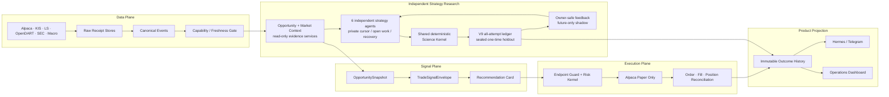

# Evidence-First Multi-Market Trading Research OS

> 미국·한국 시장 데이터를 수집하고, 자율 리서처가 가설과 Python 전략을 생성하며,
> 모든 판단을 재현 가능한 evidence와 append-only history로 남기는 Quant Research OS

[](https://www.python.org/)
[](https://docs.pydantic.dev/)
[](https://docs.alpaca.markets/docs/paper-trading/)
[](#안전-경계)

이 시스템은 종목과 `매수` 문구만 출력하는 봇이 아니다. 외부 데이터 수신부터 후보 발굴,
가설 생성, 격리된 전략 실험, 추천, Alpaca Paper 검증, 독립 Reviewer까지의 전체 경로를
typed contract와 immutable ledger로 연결한다.

- **범위:** US·KR equities, macro, options·futures research context
- **실행:** Alpaca Paper Trading 전용, 실제 자금 거래는 영구적으로 제외
- **다른 공급자:** KIS·LS·OpenDART·SEC 등은 read-only
- **현재 단계:** research prototype, 실제 정규장 Paper mutation `0건`


_현재 구현된 read-only Derivatives workspace. source authority, freshness와 Evidence Trace를
표시한다. 아래의 통합 Options Workbench 5-view UI는 아직 설계·계획 단계다._

## 구현 범위

| 구성 요소 | 구현 내용 | 현재 상태 |
| --- | --- | --- |
| Data plane | Alpaca·KIS·LS·OpenDART·SEC·macro adapter, raw-first receipt, capability gate | 구현 |
| US Day | scanner, ORB·VWAP·HOD·Gap-and-Go, recommendation state machine | 구현, 실제 Paper mutation 미실행 |
| KR Theme Day | 공시·뉴스·랭킹 cycle, theme leader Opportunity, shadow lifecycle | 실제 KRX 장중 source cycle 검증, 연속 세션 관찰 중 |
| Swing·Systematic | new-high/RVOL, ETF regime rotation, historical·shadow trial | 구현, forward sample 수집 중 |
| Autonomous Researcher | LLM 가설·Python 생성, macOS sandbox, walk-forward, Reviewer feedback | 실제 로컬 cycle QA 완료 |
| Research governance | hypothesis·version·trial preregistration, lifecycle, independent review | 구현 |
| Paper execution | endpoint guard, risk kernel, order/OCO/fill/position reconciliation | 구현, 자연 setup 실증 미완료 |
| Product surface | Hermes delivery ledger, Bun·Hono operations dashboard | 구현, 연속 session acceptance 중 |
| Options Workbench | Alpaca indicative chain·surface·skew 기반 | 데이터 기반 구현, 통합 UI 구현 전 |

`구현`은 코드와 테스트가 존재한다는 뜻이다. 실제 시장 acceptance나 수익성을 의미하지
않는다. 최신 운영 gate는 [제품 마일스톤](docs/milestones_status_ko.md)에 기록한다.

## 시스템 아키텍처


```mermaid
flowchart LR
    subgraph Data["Data Plane"]
        SRC["Alpaca · KIS · LS · OpenDART · SEC · Macro"]
        RAW["Raw Receipt Stores"]
        EVT["Canonical Events"]
        CAP["Capability / Freshness Gate"]
        SRC --> RAW
        RAW --> EVT
        EVT --> CAP
    end

    subgraph Research["Independent Strategy Research"]
        EVID["Opportunity + Market Context\nread-only evidence services"]
        RT["6 independent strategy agents\nprivate cursor / open work / recovery"]
        KERNEL["Shared deterministic\nScience Kernel"]
        V9["V9 all-attempt ledger\nsealed one-time holdout"]
        FEEDBACK["Owner-safe feedback\nfuture-only shadow"]
        EVID --> RT
        RT --> KERNEL
        KERNEL --> V9
        V9 --> FEEDBACK
        FEEDBACK --> RT
    end

    subgraph Signal["Signal Plane"]
        OPP["OpportunitySnapshot"]
        SIG["TradeSignalEnvelope"]
        CARD["Recommendation Card"]
        OPP --> SIG
        SIG --> CARD
    end

    subgraph Execution["Execution Plane"]
        RISK["Endpoint Guard + Risk Kernel"]
        PAPER["Alpaca Paper Only"]
        REC["Order · Fill · Position Reconciliation"]
        RISK --> PAPER
        PAPER --> REC
    end

    subgraph Product["Product Projection"]
        H["Hermes / Telegram"]
        D["Operations Dashboard"]
        AUDIT["Immutable Outcome History"]
    end

    CAP --> EVID
    EVID --> OPP
    CARD --> RISK
    REC --> AUDIT
    V9 --> AUDIT
    AUDIT --> H
    AUDIT --> D
```

### 계층별 책임

| 계층 | 주요 모듈 | 입력 → 출력 | 불변 조건 |
| --- | --- | --- | --- |
| Provider adapter | `alpaca_*`, `kis_*`, `ls_*`, `opendart_*` | wire bytes → private receipt | exact endpoint, no redirect, bounded response |
| Evidence | `raw_*`, `canonical_*`, `data_capability_*` | receipt → canonical event·dataset | parse 전 원문 확정, point-in-time lineage |
| Agent runtime | `research_agent_*` | evidence cursor → terminal actor cycle | actor isolation, terminal 뒤 cursor 전진 |
| Generated runtime | `generated_strategy_*` | source artifact + bar → signal stream | sandbox-only import, no future frame, deterministic replay |
| Experiment | `experiment_ledger_*`, `lifecycle_*` | hypothesis → trial·review·transition | preregistration, previous-key chain |
| Signal | `signal_contract_models.py`, `engine.py` | opportunity·bar·quote → recommendation | current session, completed bar, valid risk geometry |
| Execution | `paper_*`, `alpaca_paper_*`, `execution_*` | approved intent → reconciled Paper state | exact Paper URL, single writer, ambiguous no-retry |
| Projection | `hermes_*`, `dashboard_*` | terminal record → safe user view | query-only, redacted, no provider mutation |

의존 방향은 `Provider → Evidence → Research/Signal → Experiment/Execution → Product`로
고정한다. Reviewer와 generated code가 provider credential이나 broker client를 직접 호출하는
역방향 의존은 허용하지 않는다.

## 자율 리서처

### 여섯 독립 전략 연구 에이전트

하나의 macOS LaunchAgent는 30초마다 tick하지만, 아래 여섯 연구 agent는 서로 독립적인 evidence
cursor, open work, lease/recovery 상태와 cadence를 갖는다. 한 agent의 source 누락·실패·대기 상태가
다른 agent의 cursor 또는 실행을 막지 않는다. tick 하나는 안전상 최대 하나의 heavy Science Kernel
cycle만 시작한다.

| Agent ID | 방법론과 source-bound 산출물 | 독립 cadence |
| --- | --- | --- |
| `intraday_momentum` | 최신 완료 bar 추세 지속, fresh spread를 포함한 same-session protocol | eligible 5분 bar + 5분 |
| `intraday_mean_reversion` | 완료 bar residual/spread 이탈의 제한된 회귀 protocol | mature displacement + 5분 |
| `catalyst_event` | immutable 공시·뉴스 catalyst event-window protocol | 새 receipt + 15분, 세션 외 대기 |
| `swing_trend_regime` | ex-ante regime 조건의 multi-session trend protocol | NYSE close/regime + 30분 |
| `cross_sectional_quant` | point-in-time universe의 sector·turnover neutral rank protocol | mature session snapshot + 45분 |
| `derivatives_volatility` | option/futures surface와 hedge convention의 volatility protocol | 완료된 derivatives session boundary |

`OpportunityEvidenceService`와 `MarketContextEvidenceService`는 source hash, `as_of`,
`available_at`, coverage/staleness를 갖는 읽기 전용 evidence ref를 제공한다. agent는 그 ref로만
새 hypothesis를 만들며, 고정 feature나 전역 threshold를 production hypothesis로 사용하지 않는다.
각 hypothesis의 predictor, target, cost, baseline, search budget, split 및 sufficiency rule은
사전등록 hash에 포함된다. 방법론별 resampling은 session/event/date/underlying-maturity cluster를
따르며, 단순 최소 표본 수나 naive normal CI만으로 terminal 판정을 하지 않는다.

```text
shared Opportunity / Market Context evidence
→ one owner’s private source-bound work, cursor, and recovery state
→ immutable hypothesis and preregistered protocol
→ shared deterministic Science Kernel
→ V9 ledger: every attempt, one sealed-holdout reveal, terminal result
→ sanitized owner feedback → strictly future shadow when eligible
→ persisted six-owner NYSE close report
```

KRX 장중에는 별도 read-only source LaunchAgent가 120초마다 공식 KIS session calendar를 먼저
확인한다. 열린 세션에서만 OpenDART·LS NWS·KIS 랭킹·거래량을 같은 cycle로 묶고, 선택된 종목의
최신 완료 1분봉과 현재 호가·spread를 추가한 뒤 `OpportunitySnapshot`과 `MarketContextSnapshot`을
production runtime에 전달한다. 장 종료·휴장·stale calendar·누락 호가는 provider 수집 또는 가설
생성 전에 닫히며, 계좌·잔고·포지션·주문 endpoint 권한은 없다.

V9 experiment ledger는 성공·실패·중단 attempt를 모두 append하고, holdout은 lineage별 한 번만
공개한다. 정확한 holdout 값은 owner feedback으로 되돌아가지 않는다. `SUPPORTED`조차 미래 시점
shadow로만 이어지며, 이 경로는 order·allocation·profitability authority를 만들지 않는다.

production runtime은 legacy StrategyLab bundle을 읽지 않는다. `run_research_agent_runtime.py run`은
private source-bound work queue와 V9 ledger를 사용하고, post-close에는 persisted state로 six-owner
`DAILY_SUMMARY`를 Hermes ledger에 멱등 projection한다. 상태 JSON은
`output_root/research-os-runtime-status.json`에 쓰며, source가 없으면 각 slot은 구체적인
`waiting_evidence`/`recovery_pending` reason과 next maturity를 보존한다.

`run_strategy_lab_cycle.py`와
`examples/research/strategy-lab-evidence-fixture-v1.json`은 이전 synchronized StrategyLab의
**legacy diagnostic wiring**만 검증한다. 이 fixture는 production runtime으로 연결되지 않으며,
실험 결과·trace·`complete` 상태 어느 것도 수익성, promotion, allocation 또는 주문 근거가 아니다.

### Generated Python experiment

```text
evidence / previous failure / Reviewer feedback
→ Researcher: falsifiable hypothesis + Python source
→ Critic: provenance, duplicate, contract review
→ immutable strategy artifact
→ macOS sandbox-exec
→ deterministic replay + host walk-forward evaluator
→ Independent Reviewer
→ immutable feedback for the next cycle
```

- cycle당 proposal 최대 3회, heavy trial artifact 최대 1개
- generated source는 coordinator가 import하지 않고 별도 sandbox process에서만 실행
- 완료된 bar를 하나씩 전달하므로 subprocess에 미래 dataset이 존재하지 않음
- network, socket, credential, home, repository, broker module 접근 차단
- CPU, memory, file, output, wall-clock 제한
- PnL·비용·stop/target 충돌은 generated code가 아니라 host evaluator가 계산
- 동일 입력의 signal hash가 다르면 `non_deterministic_strategy`로 실패
- historical 결과만으로 Paper·promotion·allocation authority를 만들지 않음

실제 fixture-backed CLI 결과:

```text
result: complete
strategy artifacts: 1
experiments: 1
reviews: 1
reviewer decision: hold
lifecycle / allocation / order authority: false
trading mutation: 0
```

관련 진입점은 `run_researcher_propose.py`, `run_autonomous_research_cycle.py`,
`run_research_agent_runtime.py`다. 상세 신뢰 경계는
[자율 Python 전략 루프 설계](docs/superpowers/specs/2026-08-02-autonomous-unrestricted-python-strategy-loop-design.md)에 있다.

## 핵심 데이터 흐름

### US intraday

```text
현재 NYSE session
→ 상승률·거래량 scanner
→ halt·spread·freshness·completed-bar gate
→ ORB / VWAP / HOD / Gap-and-Go
→ entry·stop·1R·2R risk calculation
→ RecommendationCard
→ Shadow 또는 승인된 Alpaca Paper
→ fill·protective OCO·EOD flat reconciliation
→ immutable outcome + Reviewer
```

### KR theme day

```text
OpenDART 공시 + LS NWS + KIS 랭킹
→ raw receipt 선확정
→ exact four-source coverage cycle
→ theme freshness·breadth·거래대금
→ theme leader Opportunity
→ KRX session·quote·VI·가격제한 gate
→ VWAP reclaim shadow signal
→ terminal outcome + Reviewer
```

### 추천 계약

추천은 `timestamp`, `strategy version`, `entry`, `stop`, `targets`, `valid_until`,
`invalidation_rule`, `rationale`, `evidence_refs`를 필수로 가진다. `conditional` 신호와 현재
호가까지 검증된 `current_quote_validated` 신호를 구분하며, outcome history를 덮어쓰지 않는다.

## 저장소와 동시성

상태를 하나의 범용 DB에 합치지 않고 writer 권한과 실패 범위에 따라 분리한다.

| 저장소 | 소유 상태 | 검증 |
| --- | --- | --- |
| Provider receipt stores | HTTP·WebSocket 원문과 source run | raw SHA, schema, lineage |
| Canonical Parquet dataset | typed event와 sidecar | path·inode·schema·SHA 후 DuckDB replay |
| Research cycle journal | trigger, cursor, action, terminal, next wake | interrupted recovery, append-only chain |
| Experiment ledger | hypothesis, version, trial, lifecycle | parent·previous-key, time monotonicity |
| Recommendation store | recommendation과 outcome event | state-machine replay |
| Execution ledger | intent, mutation, fill, safety action | REST·WSS·position reconciliation |
| Hermes delivery store | event, attempt, ACK, dead-letter | exactly-once identity |

- ledger별 non-blocking single-writer lease
- heavy empirical process는 전체에서 한 번에 하나, RSS 10 GiB 이전 중단
- terminal cycle과 next wake가 commit된 뒤 actor cursor 전진
- content-derived identity로 replay는 기존 artifact 재사용, payload conflict는 차단
- WebSocket reconnect는 새 connection epoch로 시작하고 REST 대사 전 readiness 재사용 금지
- Paper mutation은 `ATTEMPTED`를 먼저 commit한 뒤 broker 호출
- ACK가 모호하면 targeted GET으로 확인하며 부재가 입증되지 않으면 자동 재전송 금지

## 안전 경계

- trading base URL은 정확히 `https://paper-api.alpaca.markets`만 허용
- Alpaca live endpoint와 실제 계좌 credential 경로 미지원
- KIS·LS·OpenDART 등 비-Alpaca 공급자는 account·balance·order mutation 금지
- 최신 완료 봉, current session, current date, fresh quote, spread가 없으면 신규 추천 차단
- 동일 봉의 stop/target 충돌은 stop으로 판정
- raw response, credential, token, account identifier를 report·exception에 노출하지 않음
- fixture, replay, backtest, shadow, Paper, actual session 결과를 서로 구분
- lifecycle state만으로 주문 권한을 만들지 않음

## 기술 스택

| 영역 | 기술 |
| --- | --- |
| Backend | Python 3.12, Pydantic v2, AnyIO, HTTPX2, WebSockets |
| Storage | SQLite, PyArrow·Parquet, DuckDB, PostgreSQL(dashboard) |
| CLI·runtime | Typer, Rich, macOS LaunchAgent, `sandbox-exec` |
| Dashboard | Bun, TypeScript, Hono, Zod, WebSocket |
| Quality | pytest, Ruff, basedpyright, Bun test, Biome, Playwright, axe-core |

## 코드 구조

```text
trading-recommendation-agent/
├── trading_agent/
│   ├── research_agent_*.py       # actor runtime, wake, journal, operations
│   ├── generated_strategy_*.py   # artifact, sandbox, protocol, evaluator
│   ├── experiment_ledger_*.py    # hypothesis, trial, lifecycle
│   ├── signal_contract_models.py # Opportunity·TradeSignal contract
│   ├── paper_*.py                # risk, mutation, recovery, reconciliation
│   └── dashboard_*.py            # redacted snapshot projection
├── dashboard/                    # Bun + Hono operations workstation
├── integrations/                 # Hermes product integration
├── examples/                     # credential-free fixtures
├── tests/                        # unit, integration, CLI, E2E
├── docs/                         # architecture, checkpoints, runbooks
├── run_*.py                      # explicit CLI boundaries
├── pyproject.toml
└── uv.lock
```

루트 CLI는 dependency wiring과 입력 parsing만 담당한다. 시장·원장·리스크 로직은
`trading_agent/`에 있고 provider-specific wire model은 canonical domain model과 분리한다.

## 로컬 실행

요구 사항은 Python `3.12+`와 [uv](https://docs.astral.sh/uv/)다. generated Python sandbox는
`/usr/bin/sandbox-exec`가 있는 macOS에서만 실행한다.

```bash
git clone https://github.com/kysk2295/trading-recommendation-agent.git
cd trading-recommendation-agent
uv sync --frozen --group dev
```

Credential 없는 ORB replay:

```bash
DEMO_ROOT="$(mktemp -d)"
uv run python run_trading_agent_replay.py \
  examples/example_intraday.csv \
  --output-dir "$DEMO_ROOT/replay"
find "$DEMO_ROOT/replay" -maxdepth 2 -type f -print
```

이 실행은 `paper_recommendations.sqlite3`, 한국어 report와 alert projection을 만들며 network와
broker mutation을 사용하지 않는다.

### Strategy research CLI

모든 명령은 local/private SQLite와 file input만 사용하며 provider·broker network call이나 order mutation을
수행하지 않는다. `<...>`는 operator가 준비한 private path/value다. aware ISO-8601은 예를 들어
`2026-08-19T15:00:00+00:00` 형식이다.

| 목적 | 정확한 명령 | 성공 출력과 종료 코드 | 안전한 실패 |
| --- | --- | --- | --- |
| 실제 source-bound hypothesis 생성 | `uv run python run_strategy_research_source_hypothesis.py --cycle-database <cycle.sqlite3> --evidence-id <64-lowercase-hex> --observed-at <aware-ISO-8601>` | JSON `status=created`, `owner`, `source_id`, observation/hypothesis SHA와 refs; `0` | malformed/stale/missing evidence는 stderr JSON `status=invalid`, `2` |
| fixture-only Kernel vertical | `uv run python run_strategy_research_cycle.py --cycle-database <cycle.sqlite3> --ledger-database <ledger.sqlite3> --evidence-id <64-lowercase-hex> --observed-at <aware-ISO-8601> --fixture-wiring-only` | JSON `status=terminal`, owner/source/hypothesis/protocol/attempt/holdout/terminal/feedback IDs, `wiring_only=true`; `0` | missing/invalid input은 stderr JSON `status=invalid`, `2` |
| credential-free six-agent matrix | `uv run python run_six_strategy_research_matrix.py --observed-at 2026-08-19T15:00:00+00:00` | deterministic JSON with six `six_agents` rows, independent cursor/state/maturity; `0` | naive timestamp는 stderr JSON `status=invalid`, `2` |
| one persisted NYSE close projection | `uv run python run_strategy_research_close_report.py --experiment-ledger <ledger.sqlite3> --hermes-ledger <hermes.sqlite3> --now <aware-ISO-8601>` | JSON `status=projected` or `before_cutoff`, examined/inserted/replayed; `0` | naive/malformed input is stderr JSON `status=invalid`, `2` |
| production OS tick | `uv run python run_research_agent_runtime.py tick --config <private-runtime.json>` | persisted `role_agents` and six `strategy_research.slots`, `broker_mutation=0`, `trading_mutation=0`; `0` when healthy | invalid private config/input is `2`; V9 experiment-ledger writer contention is JSON `status=busy`, `reason=experiment_ledger_writer_busy`, `3`, with no partial attempt |
| production persistent OS | `uv run python run_research_agent_runtime.py run --config <private-runtime.json>` | blocks as the LaunchAgent process and runs the same independent tick every 30 seconds | start only with a verified private config; no legacy bundle is consumed |
| persistent KRX source | `uv run python run_kr_strategy_research_service.py tick --config <private-kr-source.json>` | current KRX session에서 same-cycle evidence와 completed-bar/spread snapshot을 저장; LaunchAgent interval `120`; `mutation=0` | 장 종료·휴장에는 provider 호출 전 `session_closed`; incomplete coverage는 hypothesis를 만들지 않음 |
| legacy diagnostic only | `uv run python run_strategy_lab_cycle.py --evidence-bundle examples/research/strategy-lab-evidence-fixture-v1.json --experiment-ledger <legacy.sqlite3> --iterations 1 --as-of 2026-08-17T01:00:00+00:00` | JSON `status=complete`, `lab_count=6`, `order_authority=false`, `trading_mutation=0`; `0` | invalid evidence/trace gives JSON `status=blocked`, `1`; never use as performance evidence |

`--help` is available on every command above. The source-hypothesis command is the direct production creation
surface; the fixture Kernel and matrix commands prove wiring only and must not be used to infer profitability.

Other representative CLI surfaces:

```bash
uv run python run_trading_agent_replay.py --help
uv run python run_autonomous_research_cycle.py --help
uv run python run_alpaca_paper_preflight.py --help
```

검증:

```bash
uv run pytest -q
uv run ruff check trading_agent tests run_*.py
uv run basedpyright

cd dashboard
bun install --frozen-lockfile
bun run check
```

## 현재 진행 중

### Autonomous Researcher 운영 안정화

six-role service와 독립 strategy-research runtime, sandbox loop, KRX 장중 read-only source 공급은
구현됐다. 현재 Systematic input activation, monitoring, backup·restore, soak evidence와 장기
OOS·shadow 표본을 보강하고 있다.

### Integrated Options Research Workbench

Alpaca option contract·indicative chain·surface·skew·term structure 기반은 구현됐다. 다음 단계는
`#derivatives` 안에 Market Pulse, Unified Chain, Strategy & Agent, Experiment Lab, Promotion &
Operations의 5개 view를 연결하는 것이다. 현재 HEAD에는 설계와 foundation plan만 있으며 전용
model·snapshot·UI는 아직 구현되지 않았다. KIS·LS option adapter도 완료로 표시하지 않는다.

### 실제 시장 acceptance

Hermes 전달, US Paper, KR shadow, Swing lifecycle을 연속 실제 세션에서 관찰 중이다. 자연
setup이나 current data가 없으면 추천·주문을 만들지 않고 `no_recommendation`, `censored`,
`blocked`로 보존한다.

## 현재 한계

- 실제 정규장 Alpaca Paper mutation 0건
- US·KR 연속 session product acceptance 미완료
- generated strategy의 충분한 OOS·shadow sample 미확보
- Options Workbench 통합 UI 구현 전
- 수익 보장, 검증된 투자 성과 또는 production readiness를 주장하지 않음
- LLM의 재량 주문, 자동 risk 변경, 자동 promotion 미지원
- 별도 오픈소스 라이선스 미선언

## 상세 문서

| 문서 | 내용 |
| --- | --- |
| [상세 아키텍처](docs/architecture_ko.md) | scanner, ledger, Paper execution 경계 |
| [제품 마일스톤](docs/milestones_status_ko.md) | 실제 session acceptance와 blocker |
| [Persistent Runtime](docs/checkpoints/2026-08-02-persistent-research-runtime-ko.md) | 6-family runtime checkpoint |
| [자율 Python 전략 설계](docs/superpowers/specs/2026-08-02-autonomous-unrestricted-python-strategy-loop-design.md) | sandbox·artifact·Reviewer 계약 |
| [Options Workbench 설계](docs/superpowers/specs/2026-08-03-integrated-options-research-workbench-design.md) | 통합 옵션 연구 화면 계약 |
| [Alpaca Paper smoke 이력](docs/checkpoints/2026-08-14-paper-closed-session-smoke-skip-ko.md) | 2026-07-15~08-14 Stage 1 실행·안전 중단 체크포인트 |
| [전체 구현 히스토리](IMPLEMENTATION_HISTORY_KO.md) | 기능별 상세 기록과 검증 이력 |

이 저장소의 출력은 교육·연구·Paper Trading을 위한 결과이며 투자 자문이나 수익 보장이 아니다.
