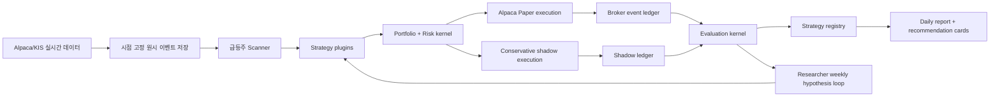

# 미국 급등주 자율 Paper Trading Research OS 설계

- 상태: 사용자 승인 완료
- 승인일: 2026-07-14
- 기준 계좌: USD 30,000
- 실행 범위: 미국 주식 정규장 Alpaca Paper Trading 전용
- 데이터 범위: 현재 IEX pilot, 시장 전체 Champion 승격 전 SIP 검증 필수
- 실거래: 금지

## 1. 결정 요약

VIX/SCR 연구, Regend/RVOL 연구, 미국 급등주 분봉 연구와 실시간 추천 코드를 하나의 프로젝트에서 관리한다. 하나의 지속형 연구 에이전트가 매 거래일 시장을 관찰하고, 실제 Alpaca paper 주문을 제출하고, 장 마감 후 성과와 실행 품질을 평가하고, 주간 단위로 새 가설과 challenger를 만든다.

이 시스템의 자가개선은 무제한 자기수정이 아니다. 에이전트는 전략과 연구 절차를 개선할 수 있지만 과거 원장을 지우거나 실거래 엔드포인트를 활성화할 수 없다. 평가기 변경은 새 버전으로 병렬 평가하며 기존 결과를 덮어쓰지 않는다.

핵심 결정은 다음과 같다.

1. 하나의 논리적 에이전트가 `Researcher`, `Developer`, `Reviewer`, `Operator` 모드를 순환한다.
2. 과거 replay와 실시간 paper 실행은 같은 전략 코드와 동일한 시점 계약을 사용한다.
3. 장전 데이터는 스캔에만 사용하고 주문은 정규장에만 제출한다.
4. Alpaca가 반환한 paper 체결과 보수적 자체 체결을 별도 원장으로 동시에 평가한다.
5. 계좌는 USD 30,000, 레버리지 1배, 거래당 초기 위험 USD 75로 정규화한다.
6. 전략은 사람의 일일 승인 없이 자동으로 생성·실험·승격·강등·중단된다.
7. 실제 자금 주문 경로는 코드와 설정에 포함하지 않는다.

## 2. 배경과 현재 상태

현재 작업은 다음 세 영역으로 나뉘어 있다.

- VIX/SCR: VIX와 관련 지표를 종목 신호 또는 이벤트 조건으로 조사한 연구. 현재까지 통계적으로 확정된 독립 전략은 없으며 시장 상태 특성으로 재사용할 가치가 있다.
- Regend/RVOL: 미국 전체 종목 일봉에서 다음 날 시가 진입과 1.5 ATR 손절, 2R 목표, 최대 20일 보유를 비교한 스윙 연구. RVOL20 2 이하 등은 paper 후보이지 확정 전략이 아니다.
- 급등주 intraday: Alpaca/KIS 분봉, 스캐너, ORB, VWAP reclaim, HOD breakout, Gap-and-Go, 인과성 게이트, paper 추천 원장과 비용 민감도 코드가 존재한다.

현재 프로젝트는 추천 생성과 가상 결과 추적까지만 허용하며 브로커 주문 API는 없다. 이번 승인으로 제품 경계는 다음과 같이 변경된다.

> KIS와 기타 실데이터 공급자는 계속 읽기 전용으로 유지한다. Alpaca에 한해 `paper-api.alpaca.markets`의 paper 계좌 조회, 주문 제출·취소, 포지션 조회·청산을 허용한다. `api.alpaca.markets` 실거래 주소와 실계좌 자격증명은 금지한다.

초기 설계 커밋에서 프로젝트의 `AGENTS.md` 제품 경계를 위 문장과 일치하도록 갱신했다. 이후 구현은 이 paper-only 예외와 실거래 금지선을 함께 보존해야 한다.

## 3. 목표와 비목표

### 3.1 목표

- 미국 전체 종목에서 그 시점까지 실제로 알려진 급등주 후보를 찾는다.
- 정규장 중 ORB, VWAP 첫 눌림목 재돌파, HOD 돌파 등의 전략을 Alpaca paper 주문으로 검증한다.
- 후보 선정, 포트폴리오 배정, 주문, 체결, 청산, 평가와 전략 상태 변경을 재현 가능하게 기록한다.
- 백테스트와 실시간 결과의 차이를 지속적으로 측정한다.
- 모든 시도와 실패를 포함해 과최적화와 다중검정을 보정한다.
- 사용자에게 종목, 조건부 진입, 손절, 목표, 무효화와 paper 상태가 포함된 한국어 추천 카드를 제공한다.
- 장기적으로 유망한 1~2개 전략만 Paper Champion으로 유지한다.

### 3.2 비목표

- 실제 자금 주문 또는 실거래 전환
- 보장 수익 또는 확정 수익 주장
- 미래의 당일 고가·종가·거래량을 사용한 후보 선정
- 일봉으로 ORB·VWAP·HOD 패턴을 근사한 결과를 분봉 전략 증거로 사용
- 커뮤니티 수익 주장만으로 전략을 채택
- 매일 한두 건의 결과에 맞춰 파라미터를 즉시 변경
- 에이전트가 과거 실패 기록, 원시 이벤트 또는 기존 평가 결과를 삭제

## 4. 외부 연구에서 채택한 원칙

### 4.1 연구와 개발, 객관 평가의 분리

[Microsoft RD-Agent](https://github.com/microsoft/RD-Agent)와 [RD-Agent-Quant 논문](https://arxiv.org/abs/2505.15155)은 가설 생성, 구현, 평가 피드백과 실험 스케줄링을 분리한다. 본 설계는 이 단계를 하나의 에이전트 내부 모드로 사용하지만 다중 에이전트 토폴로지는 채택하지 않는다.

[AlphaEvolve](https://deepmind.google/blog/alphaevolve-a-gemini-powered-coding-agent-for-designing-advanced-algorithms/)와 [Darwin Gödel Machine](https://arxiv.org/abs/2505.22954)은 후보 생성기가 평가기와 아카이브의 통제를 받아야 함을 보여준다. 이에 따라 창의적 전략 코드는 변경 가능하지만 원장과 실거래 금지선은 변경 불가능한 경계로 둔다.

[Self-Refine](https://proceedings.neurips.cc/paper_files/paper/2023/hash/91edff07232fb1b55a505a9e9f6c0ff3-Abstract-Conference.html)과 [Reflexion](https://arxiv.org/abs/2303.11366)의 언어적 자기반성은 실패 회고와 다음 가설 생성에 사용한다. 에이전트의 서술형 평가는 객관적 성과지표를 대체하지 않는다.

### 4.2 실시간 전진검증

[LiveTradeBench](https://arxiv.org/abs/2511.03628)의 핵심 교훈에 따라 정적 백테스트 점수만으로 전략을 승인하지 않는다. 시점이 고정된 실시간 데이터와 실제 paper 주문 이벤트를 독립 검증 단계로 둔다.

### 4.3 과최적화 통제

[Probability of Backtest Overfitting](https://papers.ssrn.com/sol3/papers.cfm?abstract_id=2326253)과 [Deflated Sharpe Ratio](https://papers.ssrn.com/sol3/papers.cfm?abstract_id=2460551)에 따라 최고 결과만 저장하지 않는다. 모든 가설, 파라미터, 비용 가정, 실패와 재실행 횟수를 experiment ledger에 추가하고 DSR/PBO 또는 동등한 다중검정 진단을 계산한다.

### 4.4 과거와 실시간 코드 일치

[QuantConnect LEAN](https://www.quantconnect.com/docs/v2/writing-algorithms/key-concepts/algorithm-engine)과 [Microsoft Qlib](https://github.com/microsoft/qlib)의 구성 원칙을 차용해 동일한 `Strategy` 구현이 historical event stream과 live event stream을 소비하게 한다. 실시간 전용 전략 사본을 별도로 만들지 않는다.

### 4.5 계보, champion/challenger와 중단

[Google Cloud MLOps](https://docs.cloud.google.com/architecture/mlops-continuous-delivery-and-automation-pipelines-in-machine-learning), [MLflow Model Registry](https://mlflow.org/docs/latest/ml/model-registry/workflow), [NIST AI RMF](https://www.nist.gov/itl/ai-risk-management-framework), [FINRA Regulatory Notice 15-09](https://www.finra.org/rules-guidance/notices/15-09)의 공통 원칙에 따라 데이터 계보, 버전, 비교 기준, shadow/pilot, 모니터링, 롤백과 kill switch를 일급 객체로 둔다.

## 5. 비교한 아키텍처

### 5.1 무제한 자기수정 루프 — 기각

에이전트가 전략뿐 아니라 평가식, 데이터 선택, 승격 기준까지 직접 바꾸면 목표 함수 해킹과 데이터 스누핑을 구별하기 어렵다. 재현성과 실패 이력이 사라질 위험이 크므로 채택하지 않는다.

### 5.2 제한된 단일 Research OS — 채택

하나의 에이전트가 역할을 순환하고 결정론적 도구와 append-only 원장이 그 결과를 검증한다. 현재 Python 코드와 점진적으로 통합할 수 있고 사용자의 단일 에이전트 요구에도 맞는다.

### 5.3 RD-Agent/Qlib/LEAN 중심 대형 플랫폼 — 보류

검증된 개념은 유용하지만 현재 프로젝트를 전면 교체하면 다중 에이전트 운영, 언어·인프라 전환과 데이터 계약 재작성 비용이 크다. 먼저 로컬 SQLite/Parquet 기반으로 동일 원칙을 구현하고 규모가 커질 때 일부 도구를 선택적으로 도입한다.

## 6. 논리 아키텍처



### 6.1 단일 에이전트의 네 모드

- `Researcher`: 실패, 체결 차이, 시장 국면 변화와 연구 문헌에서 반증 가능한 가설을 만든다.
- `Developer`: 전략 플러그인과 테스트를 작성하고 동일 event interface에 연결한다.
- `Reviewer`: 인과성, 비용, OOS, bootstrap, DSR/PBO, 인접 파라미터 안정성과 포트폴리오 영향을 판정한다.
- `Operator`: 거래일 상태기계를 실행하고 paper 주문, 대사, kill switch와 장후 보고를 관리한다.

모드는 권한이 다른 별도 에이전트가 아니라 한 에이전트의 명시적인 작업 단계다. 한 단계의 산출물이 원장에 저장되기 전 다음 단계로 이동할 수 없다.

### 6.2 변경 가능한 영역

- 전략 플러그인과 파라미터 후보
- 스캐너 challenger
- 특징량과 가설
- 보고서와 추천 카드 형식
- 평가기 새 버전 제안
- 자동 중단·승격 결정

### 6.3 하드 안전선

- 실거래 도메인과 자격증명 로딩 금지
- 과거 원장 삭제·덮어쓰기 금지
- 장전 주문과 오버나이트 포지션 금지
- 인과성 및 완료 봉 규칙 약화 금지
- risk limit을 우회하는 주문 금지
- 활성 evaluator를 동일 실험 도중 교체 금지

## 7. 데이터 계층

### 7.1 공급자

- Alpaca Market Data: 분봉, 실시간 trades/quotes, 뉴스와 종목 목록의 주 공급자
- Alpaca Paper Trading: 주문, 체결, 계좌와 포지션 상태의 유일한 변경 가능 외부 시스템
- KIS: 독립적인 읽기 전용 후보·시세 비교 공급자
- 거래소/공식 데이터: 휴장, 조기 폐장, 거래정지 검증

현재 Alpaca paper-only 계정은 IEX 데이터 권한을 기본으로 한다. IEX-only 데이터는 수집·실험·Challenger까지 허용하지만 미국 전체 급등주 전략의 `PAPER_CHAMPION` 증거로는 사용하지 않는다. SIP 또는 동등한 consolidated feed에서 같은 전략 버전을 다시 검증해야 한다.

### 7.2 원시 데이터 계약

모든 데이터 이벤트에는 다음을 저장한다.

- 공급자와 feed 이름
- 종목과 거래소
- event timestamp와 receive timestamp
- UTC 및 `America/New_York` 거래일
- 원시 가격·수량·호가 상태
- 데이터 지연과 sequence 정보
- 조정 여부와 corporate-action reference
- 파일/파티션 checksum

원시 데이터는 날짜별 immutable partition으로 저장한다. 수정이 필요하면 기존 파티션을 덮어쓰지 않고 correction event와 새 version을 추가한다.

### 7.3 시점 계약

- 전략은 현재 시각보다 앞서 완성된 데이터만 읽는다.
- 1분봉 기반 의사결정은 해당 봉이 끝난 다음에만 가능하다.
- 장전·장중 후보 선정 시 미래의 당일 고가, 종가, 최종 거래량을 사용하지 않는다.
- 현재 랭킹에서 발견한 종목의 과거 봉으로 과거 시각 추천을 생성하지 않는다.
- historical replay는 실제 관찰 지연을 재생하고 신호 시각과 주문 가능 시각을 분리한다.
- 동일 봉 안에서 손절과 목표 순서를 알 수 없으면 shadow 평가에서 손절을 먼저 적용한다.

## 8. Strategy와 Scanner 계약

### 8.1 공통 Strategy 인터페이스

각 전략 버전은 개념적으로 다음 계약을 구현한다.

```text
metadata() -> strategy_id, version, hypothesis_id, parameter_set
on_session_start(context) -> state
on_market_event(completed_event, point_in_time_context) -> zero_or_more SignalIntent
on_order_event(order_event) -> updated_state
on_session_end(close_event) -> exit_or_noop
```

`SignalIntent`는 주문이 아니며 다음을 포함한다.

- strategy/version과 hypothesis ID
- symbol과 생성 시각
- 조건부 entry 방식과 가격
- stop, target 1R/2R, time exit
- invalidation condition
- signal confidence가 아니라 정량적 ranking score
- 사용한 데이터의 최대 시각
- 설명 가능한 rationale fields

Risk kernel이 승인한 뒤에만 `OrderIntent`가 된다.

### 8.2 급등주 Scanner

미국 전체 point-in-time active universe를 입력으로 사용하되 실제 후보는 각 관찰 시점의 조건으로 제한한다.

- 장전 또는 현재 시점 gap
- 그 시점까지 누적한 상대거래량
- 그 시점까지의 당일 상승률
- 가격 범위
- 거래대금과 스프레드
- 거래정지 여부
- point-in-time float와 catalyst가 있을 때만 해당 특성 사용

threshold는 최고 한 점으로 선택하지 않는다. gap, RVOL, 가격, 거래대금의 인접값 grid와 후보 누락/과잉, 이후 경로와 거래 가능성을 함께 저장한다. portfolio coordinator는 신호 결과를 보기 전에 후보와 최대 포지션을 다시 선정한다.

### 8.3 초기 전략군

1. 5분 ORB: 첫 paper 실행 전략
2. 첫 눌림목 후 VWAP reclaim: 독립 challenger
3. HOD breakout + 거래량 재확대: 독립 challenger
4. Gap-and-Go 성공/실패 분류: 초기에는 분류와 shadow 결과만 기록
5. VIX/SCR, Regend/RVOL: intraday 전략에 섞지 않고 별도 regime 특성 또는 독립 benchmark로 유지

전략을 결합하면 반드시 새로운 사전 등록 strategy version으로 취급한다. 사후에 유리한 거래만 기존 전략에서 섞지 않는다.

### 8.4 하나의 프로젝트 안의 연구 lane

모든 기존 연구는 같은 repository, experiment ledger, evaluator registry와 에이전트를 사용하되 거래 주기와 실행 권한을 lane으로 분리한다.

| lane | 포함 연구 | 실행 권한 | 주 용도 |
|---|---|---|---|
| `intraday_momentum` | ORB, VWAP reclaim, HOD, Gap-and-Go | Alpaca regular-session paper 주문 | 현재 최우선 forward-validation |
| `swing_momentum` | Regend, RVOL, 신고가·모멘텀 | shadow/recommendation 전용 | 기존 일봉 결과 보존과 독립 비교 |
| `market_regime` | VIX, VIX3M, SKEW, SCR | 주문 없음 | 시장 상태 진단과 사전 등록된 regime challenger |

lane은 결과를 분리하기 위한 경계이지 별도 프로젝트가 아니다. 공통 원장에서는 동일한 `hypothesis_id`, `strategy_version`, `data_version`, `evaluator_version` 체계를 사용한다. 한 lane의 결과를 다른 lane에 추가하려면 새로운 결합 가설과 비교 실험을 먼저 등록해야 한다. 예를 들어 VIX 필터가 ORB 성과를 개선하는지는 `ORB baseline`과 `ORB + VIX regime`을 같은 기간·같은 위험으로 비교하는 별도 challenger이며, 기존 ORB의 유리한 거래만 사후 제거해서는 안 된다.

## 9. 거래일 운영 상태기계

시간은 고정 KST가 아니라 거래소 calendar의 open/close를 기준으로 계산한다.

### 9.1 정상 거래일 예시

| ET | 단계 | 허용 동작 |
|---|---|---|
| 08:00–09:25 | 장전 수집 | 스캔·저장·위험 판정만, 주문 금지 |
| 09:25–09:30 | 시작 대사 | 계좌·주문·포지션·연결·달력·kill switch 검증 |
| 09:30–11:30 | 주요 진입 | ORB 및 스캐너 재선정 |
| 09:35–15:30 | 후속 패턴 | VWAP reclaim/HOD challenger |
| close−30분 | 신규 진입 중단 | 열린 포지션 관리만 |
| close−10분 | 주문 정리 | 미체결 진입 주문 취소 |
| close−5분 | 강제 평탄화 | 모든 포지션 청산 시작 |
| close+15분 | 장후 대사 | 주문·체결·포지션 0 확인, 두 원장 평가 |

조기 폐장일에도 동일한 close-relative 규칙을 적용한다. Alpaca calendar와 로컬 검증 달력이 불일치하거나 미게시 연도이면 fail-closed한다.

### 9.2 세 개의 개선 시계

- 장중 시장 시계: 데이터, 스캔, 신호, 주문, 체결, 리스크
- 일일 평가 시계: 결과 확정, 데이터 품질, 실행 차이와 손익
- 주간 연구 시계: 새 가설, 파라미터 plateau, challenger 생성

전략 파라미터는 장중 또는 매일 결과 한두 건에 반응해 변경하지 않는다. 주간 연구 cycle에서만 새 immutable version을 만든다. 한 주에 활성화할 신규 challenger는 최대 1개를 기본으로 한다.

## 10. Paper Execution 설계

### 10.1 도메인 격리

- 허용 Trading API: `https://paper-api.alpaca.markets`
- 금지 Trading API: `https://api.alpaca.markets`
- 허용 Market Data API: `https://data.alpaca.markets`
- 자격증명 파일: 구현 시 기존 `~/.config/trading-agent/alpaca.env`를 `~/.config/trading-agent/alpaca-paper.env`로 명확히 분리
- 자격증명 파일 권한: 정확히 `600`
- base URL은 환경변수로 임의 변경하지 않고 paper 상수 allowlist로 검증

실거래 주소 문자열이 execution package 또는 설정에 나타나면 테스트와 시작 preflight가 실패해야 한다.

### 10.2 주문 상태기계

```text
signal_created
→ risk_approved | risk_rejected
→ submitted
→ accepted | rejected
→ partially_filled*
→ filled | canceled | expired
→ exit_submitted
→ closed
```

- 모든 주문에 결정론적인 `client_order_id`를 부여한다.
- 재시작·재시도는 같은 intent에 새 주문을 만들지 않는다.
- REST 제출 결과와 `trade_updates` WebSocket 이벤트를 모두 원장에 저장한다.
- WebSocket 단절 중에는 신규 주문을 차단한다.
- 재연결 후 REST snapshot과 이벤트 원장을 대사한 뒤에만 재개한다.
- 부분체결된 수량에 대해서만 exit 보호 주문을 유지한다.
- entry가 취소되거나 만료되면 연결된 미필요 exit 주문도 취소한다.
- reject는 숨기지 않고 strategy, risk, broker 사유를 구분해 저장한다.

### 10.3 포트폴리오 중재

모든 적격 신호를 먼저 만든 뒤 outcome을 보기 전에 최대 3개 포지션을 선정한다. 한 종목에 여러 전략 신호가 겹치면 단일 Alpaca 계좌에서 중복 순포지션을 만들지 않는다.

- broker 주문은 사전 등록된 ranking과 risk budget으로 한 개만 선택한다.
- 선택되지 않은 적격 신호는 conservative shadow 원장에서 계속 추적한다.
- 초기에는 champion이 없으므로 challenger에 동일한 위험 예산과 사전 결정된 rotation quota를 준다.
- champion이 생기면 기본 paper 위험 예산의 60%를 champion, 40%를 challenger 탐색에 배정한다.
- 전략별 성과와 실제 포트폴리오 성과를 별도 표로 보고한다.

## 11. 이중 체결 원장

### 11.1 Broker Paper Ledger

Alpaca가 제공한 원본 주문과 체결 이벤트를 수정 없이 저장한다.

- submitted/accepted/rejected/canceled/expired
- partial fill과 fill 가격·수량·시각
- broker order ID와 client order ID
- 계좌·포지션 snapshot reference
- API latency와 연결 상태

이 원장은 API 운영 품질과 paper 계좌 손익을 측정한다. Alpaca paper는 실제 주문 잔량, 시장충격, 지연 슬리피지, 주문 대기열을 완전히 재현하지 않으므로 경제적 검증의 유일한 근거로 사용하지 않는다.

### 11.2 Conservative Shadow Ledger

동일한 `OrderIntent`를 당시 시세와 보수적 정책으로 독립 재체결한다.

- bid와 ask가 모두 존재하고 spread gate를 통과해야 한다.
- buy limit은 adverse slippage를 더한 ask가 limit 이하일 때만 체결한다.
- sell limit은 adverse slippage를 뺀 bid가 limit 이상일 때만 체결한다.
- stop은 갭이 발생하면 stop 가격보다 불리한 첫 거래 가능 가격을 사용한다.
- bar만 있을 때는 다음 1분봉 시가를 기본 주문 가능 가격으로 사용한다.
- 한 분 내 손절·목표가 모두 닿으면 손절 우선이다.
- fillable quantity는 요청 수량, 계좌 risk cap, 직전 완료 분봉 거래량 기반 participation cap 중 최소값이다.
- 사후 분석은 편도 5/10/20bp 비용을 모두 제공하고 승격은 20bp 결과를 사용한다.

shadow fill 정책 자체는 evaluator version에 포함한다. 정책을 변경하면 모든 과거 intent를 새 버전으로 재평가하고 기존 결과와 차이 보고서를 만든다.

## 12. USD 30,000 소형 계좌 위험 계약

### 12.1 기본 한도

| 항목 | 한도 |
|---|---:|
| 기준 equity | USD 30,000 |
| 레버리지 | 1.0x |
| 거래당 초기 위험 | USD 75, equity의 0.25% |
| 종목당 최대 명목금액 | USD 6,000, equity의 20% |
| 동시 포지션 | 최대 3개 |
| 총 계획 초기 위험 | 최대 USD 225 |
| 일일 kill switch | 실현 + 보수적 미실현 손실 USD 300 |
| 오버나이트 | 0 |

Alpaca dashboard의 실제 paper 잔고가 USD 30,000과 다르더라도 broker가 표시한 buying power를 포지션 크기에 사용하지 않는다. 로컬 `paper_portfolio_equity`를 USD 30,000에서 시작하고 모든 risk decision은 이 가상 소형 계좌를 기준으로 한다. 거래당 위험은 `min(USD 75, 현재 conservative equity의 0.25%)`로 계산해 손실 후에는 자동으로 줄고 이익 후에도 USD 75를 넘지 않는다.

초기 주문 수량은 다음의 최소값이다.

```text
risk_budget = min(75, current_conservative_equity * 0.0025)
qty = min(
  floor(risk_budget / abs(entry - stop)),
  floor(6000 / entry),
  liquidity_allowed_qty
)
```

손절 거리가 0이거나 비정상적으로 좁고, 예상 spread와 20bp 비용을 포함한 총 위험이 USD 75를 넘으면 주문을 거절한다.

### 12.2 Kill switch

다음 조건에서는 신규 진입을 즉시 차단한다.

- 실현손익 + conservative unrealized P&L이 −USD 300 이하
- market data heartbeat 초과
- order stream 단절
- broker와 로컬 주문·포지션 불일치
- active halt 또는 유효하지 않은 bid/ask
- 최대 포지션, 명목금액, 총 risk budget 초과
- 거래소 달력 불일치
- EOD flatten 실패

안전 이벤트는 해당 거래일 정지와 전략 자체 정지를 구분한다. 공급자 장애는 전략 알파 실패로 계산하지 않지만 실행 가능성 지표에는 포함한다.

## 13. Strategy Registry와 자동 수명주기

```text
IDEA
→ HISTORICAL
→ EXPERIMENTAL_PAPER
→ CHALLENGER
→ PAPER_CHAMPION
↔ SUSPENDED
→ REJECTED
```

### 13.1 상태 의미

- `IDEA`: 가설, 반증 조건, 데이터와 비용 계약이 등록된 상태
- `HISTORICAL`: causality와 historical replay를 수행하는 상태
- `EXPERIMENTAL_PAPER`: 실제 paper 주문은 허용하지만 유망 전략 주장을 하지 않는 상태
- `CHALLENGER`: 최소 안전·표본 게이트를 통과해 champion과 동일 위험으로 비교하는 상태
- `PAPER_CHAMPION`: 추천 카드 우선 후보인 paper 전략. 실거래 승인이 아니다.
- `SUSPENDED`: 성과, 데이터 또는 실행 품질 문제로 신규 주문을 중단한 상태
- `REJECTED`: 가설이 반증되었거나 구조적 결함이 확인된 상태

### 13.2 Paper Champion 자동 승격 조건

모든 조건을 만족해야 한다.

1. 최소 60거래일의 forward 관찰
2. 최소 100건의 완결 paper 거래
3. Broker Paper Ledger PF 1.15 이상
4. Conservative Shadow Ledger PF 1.15 이상
5. 편도 20bp 비용에서도 평균 거래수익 양수
6. 거래일 단위 block-bootstrap 95% CI의 평균 하한이 0 이상
7. 전체 실험 횟수를 포함한 DSR/PBO가 사전 등록 기준 통과
8. 단일 거래가 총이익의 15% 이하
9. 인접 파라미터 다수가 같은 방향을 유지하는 plateau
10. 인과성 위반, 미대사 주문, 오버나이트 포지션 0
11. IEX-only가 아닌 SIP 또는 동등 consolidated feed 검증

100건에 먼저 도달해도 60거래일 전에는 승격하지 않고, 60거래일에 도달해도 100건 전에는 승격하지 않는다.

### 13.3 자동 중단과 강등

- lookahead 또는 후보 시점 위반: 즉시 `SUSPENDED`, 해당 버전 결과 무효 표시
- EOD 미청산 또는 주문 수량 불일치: 즉시 `SUSPENDED`
- 30거래 rolling PF 0.80 미만: `CHALLENGER` 또는 `PAPER_CHAMPION`에서 shadow-only로 강등
- 누적 MDD가 사전 위험 예산 초과: 신규 주문 동결
- 데이터·주문 연결 장애: 해당 거래일만 fail-closed하고 반복 패턴을 운영 결함으로 승격
- 새 버전이 기존 전략을 대체할 때: 기존 버전은 삭제하지 않고 `SUSPENDED` 또는 benchmark로 보존

## 14. 평가 커널

### 14.1 필수 지표

전략별, strategy version별, 포트폴리오별로 다음을 계산한다.

- PF
- 승률
- 평균 및 중앙 거래수익
- 누적수익
- MDD
- 거래 수와 거래일 수
- 평균 R과 R 분포
- 편도 5/10/20bp 비용 민감도
- fill/partial-fill/reject/cancel 비율
- intent-to-submit, submit-to-ack, ack-to-fill latency
- broker fill과 conservative fill 차이
- 일별·월별·연도별 결과
- 최대 연속 손실과 tail loss
- 종목·가격대·유동성·gap/RVOL 구간별 결과

### 14.2 통계와 과최적화

- bootstrap은 개별 거래를 독립 표본으로 가정하지 않고 거래일 block 단위로 수행한다.
- 파라미터 최고점이 아닌 인접값 plateau를 우선한다.
- `experiment_trials`에 실패와 중단을 포함한 전체 시도 수를 기록한다.
- DSR과 PBO 또는 적용 가능한 동등 진단을 계산한다.
- 2025년 이후 데이터도 이미 반복 탐색에 노출된 구간이면 untouched OOS라고 부르지 않는다.
- 새 untouched window는 시간 경과로만 생성하며 중간에 승격 기준을 그 기간 결과에 맞추지 않는다.

### 14.3 평가기 버전 변경

에이전트는 새 evaluator를 자동 제안하고 테스트할 수 있다. 그러나 활성 버전을 제자리 수정하지 않는다.

1. `evaluator_vNext`를 새 ID로 생성한다.
2. 전체 historical intents와 forward intents를 vCurrent/vNext로 병렬 재평가한다.
3. metric delta, 순위 변경, 승격·강등 변경 목록을 저장한다.
4. 회귀·인과성·불변 안전선 테스트를 통과해야 다음 주기부터 활성화한다.
5. 기존 evaluator와 결과는 영구 보존한다.

## 15. Experiment Ledger와 저장 모델

초기 구현은 SQLite metadata/event ledger와 날짜별 Parquet/CSV market partitions를 사용한다. 대형 orchestration/registry 제품은 필요 시 후속 도입한다.

핵심 엔터티는 다음과 같다.

- `market_sessions`
- `universe_snapshots`
- `raw_market_partitions`
- `candidate_snapshots`
- `hypotheses`
- `strategy_versions`
- `experiment_trials`
- `signals`
- `risk_decisions`
- `order_intents`
- `broker_order_events`
- `broker_fills`
- `position_snapshots`
- `shadow_fills`
- `daily_metrics`
- `promotion_events`
- `evaluator_versions`
- `agent_decisions`
- `recommendation_outbox`

외부 이벤트와 상태 변경 테이블은 append-only다. 현재 상태는 이벤트를 접어 만든 projection이며 언제든 재생성할 수 있어야 한다.

모든 전략·평가기·데이터 파티션·실험은 다음 lineage를 가진다.

```text
code_version
+ strategy_version
+ evaluator_version
+ data_partition_checksums
+ feed_entitlement
+ parameter_set
+ cost_model
+ portfolio_policy
```

## 16. 자가개선 루프

### 16.1 매일

1. 장전/장중 데이터와 주문 이벤트 수집
2. paper 주문과 conservative shadow 체결
3. 장 마감 대사
4. 데이터 품질과 실행 incident 분류
5. 두 원장의 성과 확정
6. 한국어 일일 요약과 추천 카드 결과 저장

일일 루프는 기존 전략 파라미터를 변경하지 않는다.

### 16.2 매주

1. 실패 원인과 broker-shadow 괴리 요약
2. 유효한 새 가설 최대 3개 생성
3. 사전 반증 조건과 실험 예산 등록
4. 전략을 하나씩 순차 백테스트
5. Ruff, type check, tests와 CLI QA
6. 최대 1개 신규 challenger 활성화

전체시장 분봉 로딩과 heavy backtest는 동시에 하나만 실행한다. RSS 9.5GiB에서 안전 중단해 10GiB 한도를 넘지 않는다.

### 16.3 승격 주기

각 일일 평가 후 조건을 계산할 수 있지만 표본 게이트가 충족될 때만 상태를 바꾼다. 신규 champion은 기존 champion과 최소 20거래일 겹치는 비교 기간을 갖고 동일 위험·동일 데이터에서 우월해야 한다.

## 17. 추천 카드

각 실제 paper intent와 사용자 표시 카드에는 다음을 포함한다.

- symbol
- strategy와 version
- 현재 상태: Experimental/Challenger/Paper Champion
- 관찰 시각과 데이터 feed
- 조건부 진입 가격과 주문 형태
- 수량과 명목금액
- 손절 가격과 USD 위험
- 1R/2R 목표
- time exit
- 무효화 조건
- scanner 근거: gap, RVOL, 가격, 거래대금, spread
- 주문 상태와 실제 paper fill
- conservative shadow fill
- 미체결·거절 사유

예시:

```text
[PAPER · CHALLENGER] XYZ / ORB v1.3
관찰: 09:36:02 ET, IEX_ONLY
진입: 12.45 이상 재돌파 시 buy limit 12.48, 최대 400주
손절: 12.28, 계획 위험 USD 68
목표: 12.65(1R), 12.85(2R)
무효화: VWAP 이탈, spread 100bp 초과, halt, 10:30 이후 미체결
Broker: submitted → partial 200 @ 12.47 → filled 400 @ 12.48
Shadow: 300 @ 12.50, 100주는 유동성 제한 미체결
```

이 카드는 실제 투자 권유나 확정 수익 주장이 아니라 paper forward-validation 기록이다.

## 18. 장애와 복구

### 18.1 시작 시

- 로컬의 마지막 order event와 Alpaca open orders/positions를 대사한다.
- 알 수 없는 주문이나 포지션이 있으면 신규 진입을 차단한다.
- 중복 scheduler instance가 있으면 하나만 leader가 되고 나머지는 종료한다.

### 18.2 장중

- WebSocket 단절: 신규 주문 차단, 열린 주문·포지션은 REST로 확인
- 부분체결: 실제 체결 수량만 보호하고 나머지 entry 상태 유지 또는 취소
- 주문 거절: 자동 가격 완화 재주문 금지. 원인을 기록하고 새 intent가 있을 때만 재제출
- 데이터 지연: 신호와 주문 차단
- halt: 신규 주문 차단, 기존 주문 상태 추적
- 프로세스 재시작: 동일 client order ID로 멱등 복구

### 18.3 장 마감

- close−10분 미체결 진입 취소
- close−5분부터 열린 포지션 청산
- close 이후 open orders/positions가 0이 아니면 incident와 strategy suspension 생성
- 장후 대사 완료 전 다음 거래일을 시작하지 않는다.

## 19. 보안과 비밀 관리

- 자격증명은 프로젝트 외부 파일에서만 읽는다.
- paper key와 live key를 같은 파일이나 변수 이름으로 공유하지 않는다.
- 파일 권한이 `600`이 아니면 시작을 거절한다.
- key, secret, account ID, request header와 raw auth response를 로그에 남기지 않는다.
- 객체 표현과 예외 메시지에서 비밀을 redaction한다.
- 실거래 도메인은 DNS 요청 전에 allowlist 검증으로 차단한다.
- paper account number도 사용자 보고서에서는 안정적인 비식별 alias만 사용한다.

## 20. 테스트 전략

### 20.1 단위·속성 테스트

- completed-bar causality
- premarket scan / regular-order separation
- position sizing과 모든 risk cap
- same-bar stop-first
- candidate selection before outcome
- adjacent parameter plateau
- append-only 상태 전이
- evaluator version immutability

### 20.2 계약·통합 테스트

- fake Alpaca REST/WebSocket으로 accept, reject, partial fill, cancel, disconnect 재현
- 동일 `client_order_id` 재실행 시 주문 중복 없음
- broker snapshot과 local ledger 대사
- 조기 폐장 close-relative 일정
- IEX entitlement가 Champion 승격을 차단
- 실거래 URL 또는 live-key-like 설정이 preflight에서 실패

### 20.3 Replay/live parity

저장된 market/order event stream을 재생했을 때 동일 strategy version이 동일 signal과 risk decision을 만들어야 한다. 네트워크 수신 시각 차이처럼 비결정적인 값은 입력 event에 고정한다.

### 20.4 필수 검증

- targeted pytest
- 전체 pytest
- Ruff
- basedpyright
- 각 CLI `--help`
- 잘못된 입력 한 건
- 저장된 event replay happy path
- 실제 Alpaca paper 계좌의 최소 수량 smoke 주문과 취소/체결 event 확인
- 장 마감 open orders/positions 0 수동 확인

## 21. 단계적 구현 순서

### Phase 0 — 제품 경계와 안전선

- `AGENTS.md`를 paper-only 승인과 일치하도록 갱신
- paper credential 파일 분리
- 실거래 도메인 차단 테스트
- Strategy/Execution/Evaluation 인터페이스와 event ledger schema 고정

### Phase 1 — 읽기 전용 대사와 주문 상태기계

- Alpaca paper account/order/position read adapter
- calendar/clock와 trade update stream
- idempotent order intent와 crash recovery
- fake provider 통합 테스트

### Phase 2 — ORB 실제 Paper Trading

- 5분 ORB 한 전략만 실제 paper 주문
- USD 30,000 risk profile
- regular-session-only와 EOD flatten
- broker ledger와 recommendation card

### Phase 3 — Conservative Shadow와 자동 평가

- quote/volume 기반 shadow fill
- 5/10/20bp 비용
- 일 단위 bootstrap, DSR/PBO
- daily report와 incident report

### Phase 4 — Challenger loop

- VWAP reclaim
- HOD breakout
- Gap-and-Go 실패 분류
- weekly hypothesis ledger와 자동 상태 전이

### Phase 5 — SIP 검증과 Paper Champion

- SIP entitlement 확인과 feed migration
- IEX/SIP 차이 보고
- 60거래일·100거래 승격 게이트
- champion/challenger portfolio quota

## 22. 완료 기준

다음 조건이 모두 관찰되어야 구현 완료로 본다.

1. 프로젝트에서 실거래 주소와 실거래 자격증명을 로딩할 수 없다.
2. 장전에는 스캔 기록만 있고 주문 intent가 없다.
3. ORB signal은 시초 5분이 완전히 끝나기 전에 생성되지 않는다.
4. 실제 Alpaca paper 주문 event가 append-only ledger에 저장된다.
5. 프로세스 재시작 후 주문이 중복 제출되지 않는다.
6. 부분체결·거절·취소·단절이 손실 없이 복구된다.
7. close 이후 주문과 포지션이 0이다.
8. broker paper와 conservative shadow 결과가 별도로 계산된다.
9. 모든 전략과 포트폴리오에 PF, 승률, 평균수익, 누적수익, MDD, 거래 수와 비용 민감도가 있다.
10. 실패한 가설과 모든 파라미터 시도가 experiment ledger에 남는다.
11. IEX-only 전략은 Paper Champion으로 승격되지 않는다.
12. 사용자에게 paper 상태가 명확한 한국어 추천 카드와 일일 평가가 제공된다.

## 23. 남은 운영 선택

다음 항목은 핵심 설계를 바꾸지 않으므로 구현 중 기본값으로 시작하고 설정으로 노출할 수 있다.

- 실시간 사용자 알림 채널
- 일일 보고서 전달 시각
- strategy별 challenger quota 세부값
- SIP 구독 또는 대체 consolidated feed 공급자

이 항목들은 paper 실행, 위험 한도, 인과성 또는 승격 기준을 약화할 수 없다.
