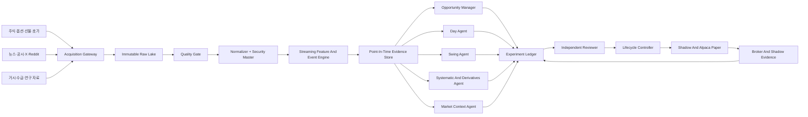

# 기관형 다중 시장 Quant Research OS 설계

- 상태: 제품 기획 승인, 구현 계획 작성 전
- 작성일: 2026-07-17
- 문서 권위: 최상위 제품·데이터·에이전트 아키텍처
- 제품 경계: 연구, 실시간 종목 발굴, 추천, shadow 검증, Alpaca Paper 전진검증
- 실제 자금 거래: 금지

## 1. 결정 요약

이 프로젝트는 자동매매 봇 하나가 아니다. 미국과 한국 시장을 상시 관찰하는 전문 에이전트 조직이 가설을 만들고, 같은 point-in-time 검증 커널에서 실험하며, 독립 Reviewer의 증거 판정에 따라 전략 버전을 승격·유지·중단·강등하는 Quant Research OS다.

제품은 다음 세 평면으로 나눈다.

1. `Data Plane`: 시장·공시·뉴스·소셜·거시 데이터를 허용된 계약으로 수집하고 원본, 시각, 수정 이력과 품질을 보존한다.
2. `Research Control Plane`: 가설, 전략 버전, 실험, Reviewer와 lifecycle을 append-only로 관리한다.
3. `Recommendation And Execution Plane`: 현재 시점의 종목 후보와 진입 조건을 발행하고, 권한이 있는 전략만 Alpaca Paper에서 체결 가능성을 검증한다.

하나의 저장소와 공통 검증 언어를 유지하되 데이터 부하, 실행 권한과 장애 범위는 분리한다. 현재의 SQLite 원장, intraday Paper 상태기계와 lane 계약은 유지한다. 대용량 tick·호가·옵션·소셜 데이터만 별도 저장 계층으로 점진적으로 이동한다.

## 2. 제품 결과

사용자가 받는 핵심 결과는 `RecommendationCard`다. 카드는 단순한 종목명이나 매수 문구가 아니라 다음 내용을 함께 제공한다.

- 시장, 종목과 canonical instrument ID
- day, swing, systematic 중 추천을 만든 agent family와 전략 버전
- 관측 시각, 데이터 최신성, 진입 가능 유효시간
- 현재 진입가 또는 조건부 진입 구간
- 손절, 목표, 예상 보유 시간과 무효화 조건
- 수급, 가격·거래량, 호가, 기술 지표, 뉴스, 공시, 테마, 소셜 근거
- 시장 국면과 주요 위험
- 신뢰도 구성 요소와 누락 데이터
- 해당 전략의 forward 표본, lifecycle과 검증 상태

카드는 확정수익을 주장하지 않는다. 가격·호가·시장 상태를 현재 시점에 확인할 수 없으면 `현재 진입 가능`으로 표시하지 않는다. 추천은 주문 권한이 아니며 Paper 주문 결과도 추천 품질의 한 증거일 뿐이다.

## 3. 비교한 접근과 채택안

### 3.1 기각: 현재 프로세스와 SQLite에 모든 데이터 추가

현재 구조는 bounded collector, append-only control ledger와 단일 Writer에 적합하다. 하지만 전 종목 tick, 옵션 체인, 호가와 소셜 스트림을 같은 SQLite에 넣으면 Writer 경합, 보존비용, 재생시간과 장애 범위가 급격히 커진다.

### 3.2 기각: 처음부터 다수 마이크로서비스와 Kafka 클러스터 구축

시장·전략 계약이 아직 진화하는 단계에서 서비스부터 분리하면 운영 복잡성과 스키마 조율 비용이 연구 속도보다 먼저 커진다. Mac mini 단일 운영 환경에도 맞지 않는다.

### 3.3 채택: 모듈러 모놀리스 control plane + 분리된 데이터 plane

현재 Python 패키지, 실행 원장과 실험 원장은 모듈러 모놀리스로 유지한다. 데이터 수집은 공급자 adapter와 durable raw spool로 격리하고, 대용량 원본과 canonical dataset은 object storage·Parquet에 저장한다. 독립 소비자와 처리량이 실제 임계치를 넘을 때만 durable event broker를 추가한다.

이 선택은 다음 공개 프로젝트의 검증된 경계를 조합한다.

- [LEAN](https://github.com/QuantConnect/Lean): backtest와 live에서 교체 가능한 data feed·transaction handler
- [NautilusTrader](https://nautilustrader.io/docs/latest/concepts/architecture/): event-driven kernel, data·risk·execution 분리, 동일한 live/replay 경로
- [Qlib](https://qlib.readthedocs.io/en/latest/component/workflow.html): 구성 기반 연구 workflow와 experiment recorder
- [Qlib OnlineManager](https://qlib.readthedocs.io/en/latest/component/online.html): 시점별 online model 이력
- [RD-Agent](https://github.com/microsoft/RD-Agent): 가설·구현·실험·피드백 R&D loop
- [OpenBB](https://github.com/OpenBB-finance/OpenBB): 공공·유료·사내 provider adapter
- [ArcticDB](https://docs.arcticdb.io/latest/): bitemporal version과 as-of 조회 원칙
- [FinNLP](https://github.com/AI4Finance-Foundation/FinNLP): 뉴스·소셜 source coverage 참고

어느 프로젝트도 전체 목표를 단독으로 해결하지 않는다. 외부 프로젝트는 경계와 검증 패턴을 참고하며, 실행 코어의 big-bang 교체는 하지 않는다.

## 4. 논리 아키텍처



데이터는 source에서 strategy로 직접 점프하지 않는다. 모든 전략은 canonical event와 저장된 evidence snapshot을 소비한다. LLM 분류 결과도 source bytes, prompt·model version, 관측 시각과 함께 저장된 뒤 사용한다.

## 5. 연구 좌표와 에이전트 조직

모든 연구는 다음 계층으로 식별한다.

```text
Market Domain
└── Agent Family
    └── Strategy Lane
        └── Strategy Version
            └── Experiment Trial
```

### 5.1 Market Domain

현재 구현된 `us_equities`와 `kr_equities`를 유지한다. 옵션·선물은 단순 데이터 컬럼이 아니라 종목 식별, 거래시간, 만기, multiplier, roll과 비용이 다르므로 이후 `us_derivatives`, `kr_derivatives` 계약으로 추가한다. 거시 데이터는 직접 주문하는 시장이 아니라 `global_macro` evidence domain으로 시작한다.

시장 도메인은 다음을 소유한다.

- 거래소·세션 달력과 시간대
- security master와 symbol alias
- 통화, 가격·수량 단위, corporate action
- 비용, 세금, 공매도·레버리지와 체결 제약
- 데이터 entitlement와 공급자 우선순위
- signal·shadow·Paper 실행 권한

### 5.2 Agent Family

- `opportunity_manager`: 시장 전체에서 후보와 근거를 발굴한다. 주문하지 않는다.
- `day_trading`: 당일 진입·청산과 장중 상태기계를 연구한다.
- `swing_trading`: 수일·수주 상태, overnight gap과 이벤트 위험을 연구한다.
- `systematic_quant`: 팩터, 평균회귀, 추세, 로테이션, 레버리지와 논문 전략을 연구한다.
- `derivatives_research`: 옵션 변동성·skew·term structure, 선물 basis·curve·roll 가설을 연구한다. 초기에는 read-only와 shadow-only다.
- `market_context`: 변동성, breadth, liquidity, macro와 risk regime snapshot을 발행한다.
- `allocation_manager`: 최소 두 독립 champion 이후 확정된 전일 snapshot만 읽어 다음 세션 위험예산을 계산한다.

`Independent Reviewer`, `Lifecycle Controller`, `Execution Engine`과 `Loop Engineer`는 trading agent family가 아니다. 이들은 각각 증거 심사, 상태 전이, Paper 집행과 연구 workflow를 담당하는 공통 control plane이다.

### 5.3 Strategy Lane

lane은 지표 하나나 source adapter 하나가 아니라 독립적으로 반증하고 승격할 수 있는 가설 단위다.

```text
us_equities/opportunity_manager/news_attention
us_equities/day_trading/orb
us_equities/day_trading/news_momentum
us_equities/swing_trading/earnings_drift
us_equities/systematic_quant/leveraged_trend
us_derivatives/derivatives_research/iv_term_structure
kr_equities/opportunity_manager/theme_momentum
kr_equities/day_trading/theme_leader_pullback
```

하나의 agent 안에 여러 lane과 불변 strategy version이 존재한다. agent를 실험 하나와 동일시하지 않는다. 서로 다른 agent 결과를 결합하려면 결합 규칙과 component version을 개장 전에 새 composite experiment로 등록한다.

## 6. Data Plane

### 6.1 Source class

| Source class | 데이터 예시 | 사용 목적 |
|---|---|---|
| Market microstructure | trade, quote, NBBO, L2, bar, auction, halt | 진입 가능성, 유동성, 체결 모델 |
| Derivatives | option chain·trade·quote·OI·IV·Greeks, futures curve·basis | 변동성·헤지·시장 기대 가설 |
| Regulatory and fundamental | SEC, DART, 재무, insider, 13F, 실적·가이던스 | catalyst와 중장기 상태 |
| News and events | licensed news, 회사 발표, RSS, GDELT metadata | 사건 탐지와 전파 속도 |
| Social attention | X, Reddit, Stocktwits와 허용된 커뮤니티 source | 관심 급증, 주장, 군집행동 |
| Macro and flow | FRED/ALFRED, Fed, BLS, Treasury, CFTC COT, ETF flow | regime, 금리·유동성·포지셔닝 |
| Research knowledge | 논문, 공식 문서, GitHub 구현 | 새 가설의 출처와 재현 기준 |

`모든 데이터`는 인터넷의 모든 bytes를 무단 저장한다는 뜻이 아니다. 전략적으로 유의미한 source를 coverage registry에 등록하고, 공식 API·유료 feed·허용된 수집 계약 안에서 원본 또는 허용된 파생치를 최대한 넓게 확보한다는 뜻이다.

### 6.2 Data Capability Registry

모든 provider는 다음 capability를 사전등록한다.

```text
source_id
source_class
market_domains
event_types
symbols_or_universe
historical_depth
expected_latency
timestamp_semantics
entitlement_tier
retention_policy
deletion_or_correction_contract
rate_and_connection_limits
freshness_slo
completeness_slo
health_state
```

각 `StrategyManifest`는 `required_data_capabilities`, 허용 가능한 fallback과 최소 품질을 선언한다. 필수 capability가 없거나 stale이면 전략은 `blocked_by_data` 또는 `research_only`가 되며 다른 데이터로 조용히 대체하지 않는다.

### 6.3 Acquisition Gateway

provider adapter는 인증, 연결, rate limit와 wire format만 소유한다. adapter는 전략 지표를 계산하거나 종목을 추천하지 않는다.

수집 순서는 다음과 같다.

1. 허용 endpoint·WebSocket topic과 entitlement 검증
2. connection generation과 subscription manifest 기록
3. 원문 bytes를 parsing 전에 durable raw receipt로 확정
4. sequence, provider timestamp와 local receipt timestamp 기록
5. schema validation과 canonical normalization
6. terminal source run과 coverage report 확정

연결 종료, partial page, sequence gap과 parse 실패를 빈 성공으로 처리하지 않는다. 재시작은 마지막 확정 offset 또는 provider cursor 이후부터 idempotent하게 재개한다.

### 6.4 Canonical Event Envelope

모든 시장·뉴스·소셜 이벤트는 최소한 다음 필드를 가진다.

```text
event_id
source_id
provider_event_id
entity_refs
event_type
event_time
published_at
provider_time
received_at
normalized_at
effective_from
effective_to
sequence_or_offset
correction_of
schema_version
raw_receipt_ref
content_hash
quality_flags
```

적용할 수 없는 timestamp는 명시적으로 비워 두며 서로의 대체값으로 사용하지 않는다. `received_at`은 우리 시스템이 실제로 알 수 있었던 시점을 나타내므로 backtest causality의 하한이다. 수정·삭제는 기존 event를 UPDATE하지 않고 correction 또는 tombstone event로 append한다.

### 6.5 Security Master

symbol text만으로 시장 데이터를 결합하지 않는다. `InstrumentId`는 다음을 point-in-time으로 보존한다.

- 시장, venue, asset class, currency와 timezone
- ticker·종목코드·CIK·corp code·ISIN·FIGI 등 provider alias
- 상장·폐지·이름변경 유효기간
- split, dividend, merger와 symbol change
- option underlying·expiry·strike·right·multiplier
- futures root·contract month·first notice·last trade·roll rule

과거 symbol을 현재 company에 무조건 연결하거나 현재 index constituent를 과거 universe에 소급 적용하지 않는다.

### 6.6 저장 계층

| 계층 | 역할 | 초기 구현 | 확장 시점 |
|---|---|---|---|
| Raw receipt | 원문 bytes와 수집 manifest | 로컬 durable spool + 압축 파일 | S3/MinIO object storage |
| Canonical dataset | 정규화 event와 correction | partitioned Parquet | Parquet + Iceberg catalog |
| Online query | 최근 event·feature·health | bounded memory/SQLite projection | ClickHouse 계열 |
| Research query | 대화형 분석과 backtest | DuckDB/Polars + Parquet | 분산 scan이 실제 필요할 때 확장 |
| Control ledger | hypothesis, version, trial, lifecycle | 기존 append-only SQLite | 다중 writer가 필요할 때 PostgreSQL 검토 |
| Event transport | 프로세스 간 전달·재생 | in-process bus + durable spool | 독립 소비자·처리량 임계 시 Redpanda/Kafka 검토 |

고용량 payload를 SQLite control ledger에 넣지 않는다. 반대로 단일 호스트의 저빈도 experiment·lane ledger를 확장성이라는 이유만으로 즉시 분산 DB로 옮기지 않는다.

### 6.7 데이터 품질과 SLO

source run마다 다음을 계산하고 원장에 남긴다.

- expected와 observed symbol·partition coverage
- event lag, stale duration과 heartbeat
- sequence gap, out-of-order와 duplicate 비율
- parse·schema rejection과 correction 비율
- corporate action·calendar 적용 상태
- entitlement·rate-limit·retention 상태
- 마지막 완전 checkpoint와 replay 가능 범위

품질 상태는 `complete`, `degraded`, `incomplete`, `failed`로 구분한다. `degraded` data를 사용할 수 있는 전략은 manifest에 허용 조건을 명시해야 한다. 실행·추천 기준을 충족하지 못하면 해당 signal을 차단하되 raw evidence와 incident는 보존한다.

### 6.8 X·Reddit·소셜 evidence

소셜 source는 단순 positive/negative sentiment 숫자로 축약하지 않는다.

```text
허용된 raw post/comment 또는 provider event
→ 삭제·수정·retention 상태 반영
→ 언어·스팸·봇·중복·조정행동 탐지
→ 종목·기업·인물·제품 entity linking
→ 주장·사건·stance·sentiment 추출
→ 작성자·커뮤니티 기준선 대비 novelty와 burst
→ 뉴스·공시·가격·거래량 교차검증
→ SocialEvidenceSnapshot
```

LLM은 entity·claim·stance 분류와 요약에 사용할 수 있지만 주문, 비중과 승격을 결정하지 않는다. 모델·prompt version, 입력 reference와 출력 hash를 저장한다. provider가 삭제나 보존 제한을 요구하면 원문 대신 허용된 ID와 파생 feature만 보존하고 correction/tombstone을 replay에 반영한다.

### 6.9 동적 구독

전 종목의 최고 해상도 데이터를 무조건 동시에 받지 않는다.

1. 저비용 broad scanner가 가격·거래량·뉴스·소셜 이상치를 찾는다.
2. `OpportunityManager`가 근거와 함께 bounded watch universe를 발행한다.
3. subscription manager가 해당 종목의 quote, trade, order book, option contract를 고해상도로 구독한다.
4. 후보가 만료되면 구독을 해제하되 수집 manifest와 raw evidence는 보존한다.

이 구조는 데이터 비용과 연결 한도를 통제하면서도 실제 기회 종목에는 높은 해상도를 제공한다.

## 7. 공유 검증 커널

historical, replay, shadow와 live projection은 같은 canonical event, feature code와 strategy version을 사용한다. 환경 차이는 clock, source adapter와 execution adapter에만 둔다.

기술 지표는 provider가 제공한 불투명한 최종값을 여러 source에서 혼합하지 않는다. raw bar·trade에서 공통 indicator kernel로 VWAP, ATR, RSI, MACD, RVOL과 breadth를 계산하고 다음을 기록한다.

- indicator name과 semantic version
- 입력 event range와 warmup
- session·corporate-action 정책
- 계산 timestamp와 feature hash
- missing·stale input 처리 결과

동일한 canonical input, strategy version과 configuration은 replay와 live에서 동일한 signal을 만들어야 한다. 비결정적인 LLM 결과는 live 시점에 저장하고 replay에서는 다시 호출하지 않는다.

## 8. 에이전트 간 evidence 계약

### 8.1 OpportunitySnapshot

Opportunity Manager는 후보 발굴 결과만 발행한다.

```text
market_id
opportunity_id
observed_at
valid_until
instrument_ids
rank_and_score_components
evidence_refs
feature_snapshot_refs
source_coverage
data_quality
producer_version
```

### 8.2 MarketContextSnapshot

시장 국면은 독립 snapshot이다.

```text
market_id
observed_at
valid_until
regime_labels
breadth_and_volatility_features
macro_and_flow_refs
coverage
producer_version
```

다른 전략이 context를 사용하려면 정확한 context version과 결합 규칙을 새 experiment에 등록한다.

### 8.3 SocialEvidenceSnapshot

```text
instrument_or_theme_refs
window_start
observed_at
source_coverage
message_and_author_counts
novelty_and_burst_features
bot_and_duplication_flags
claims_and_stance
corroborating_evidence_refs
retention_state
classifier_version
```

### 8.4 TradeSignalEnvelope

```text
market_id
agent_family
strategy_lane_id
strategy_version
signal_id
instrument_id
observed_at
entry_type
entry_price_or_trigger
quote_observed_at
stop_price
targets
expected_holding_period
valid_until
invalidation_rule
opportunity_id
context_snapshot_ref
evidence_refs
data_quality
```

### 8.5 RecommendationCard

카드는 위 immutable contract를 사람이 읽을 수 있게 투영한 결과다. 카드 formatter는 근거를 추가하거나 전략 판단을 변경하지 않는다. 외부 알림은 local outbox에 확정된 카드만 전달하며 전달 실패가 signal이나 trial 원장을 변경하지 않는다.

Telegram과 Hermes는 향후 이 outbox를 소비하는 전달·운영 adapter다. 둘 다 strategy 판단, lifecycle 승격, risk 변경 또는 주문 권한을 갖지 않는다.

## 9. Research And Promotion Loop

### 9.1 가설 source

가설은 다음 경로에서 생성할 수 있다.

- 논문과 공식 연구
- GitHub의 전략·데이터 처리 구현
- 실패한 기존 trial과 cohort 분석
- 시장 microstructure·수급·뉴스·소셜 이상현상
- agent가 제안한 경제적 mechanism과 counterfactual

출처는 성과 증거가 아니다. 모든 아이디어는 기존 `ResearchSource`와 `ResearchHypothesisCard`에 claim, limitation, economic mechanism과 counterfactual baseline을 먼저 기록한다.

### 9.2 실험 단계

```text
ResearchSource
→ Hypothesis preregistration
→ immutable StrategyVersion
→ data capability check
→ historical replication
→ purged walk-forward/OOS
→ shadow forward trial
→ Alpaca Paper forward trial (권한 있는 US lane만)
→ Independent Reviewer
→ next-session lifecycle event
```

각 trial은 universe, 기간, feature version, 비용, latency, parameter search space, stop condition과 evaluation policy를 시작 전에 고정한다. 실패와 censored 결과도 삭제하지 않는다.

### 9.3 평가 주기

매일 결과를 기록하되 하루 손익으로 전략을 새로 선택하지 않는다. Reviewer는 다음을 함께 본다.

- 누적 적격 거래일과 표본 수
- 최근 rolling window와 장기 expanding window
- 시장 regime·유동성·가격·테마 cohort
- 거래비용, slippage, financing과 capacity
- block bootstrap, DSR/PBO와 parameter plateau
- data coverage, incident와 censored 비율
- broker Paper와 conservative shadow의 차이

조기중단, 승격과 강등은 버전형 policy에 따라 다음 세션부터 적용한다. LLM은 보고서를 요약할 수 있지만 lifecycle event를 단독으로 승인할 수 없다.

### 9.4 Champion과 조합

agent마다 여러 challenger를 동시에 shadow 평가할 수 있다. champion은 agent 전체가 아니라 특정 lane의 특정 strategy version이다. 서로 다른 lane의 결과를 사후 평균하거나 좋은 기간만 결합하지 않는다.

두 전략을 함께 사용하려면 다음을 가진 새 composite hypothesis가 필요하다.

- component strategy version
- 결합·우선순위·conflict rule
- 공유 노출과 중복 신호 처리
- 동일 기간 counterfactual baseline
- 별도 trial과 Reviewer evidence

## 10. Recommendation과 Paper 실행

### 10.1 권한 분리

- Opportunity Manager와 Market Context Agent는 주문권한이 없다.
- KR agent와 derivatives agent는 초기에는 read-only·shadow-only다.
- 미국 실행 가능 lane만 명시적 `LaneAccountBinding`과 `PaperMutationArm`을 가질 수 있다.
- Allocation Manager는 신호나 주문을 만들지 않는다.
- 실제 자금 endpoint와 실계좌 주문 경로는 프로젝트에 존재할 수 없다.

### 10.2 실행 lane

실행 lane마다 별도 정책, 계좌 fingerprint, 원장과 single Writer를 사용한다. intraday와 swing의 차이는 overnight boolean이 아니라 별도 상태기계로 표현한다.

- intraday: 정규장 진입, cutoff, 보호 OCO, EOD flat
- swing: multi-session entry·hold·gap-risk·exit·corporate-action 상태
- signal-only regime: 주문·계좌·포지션 상태 없음
- 직접 거래하는 ETF rotation: 별도 manifest와 Paper account가 승인된 뒤에만 가능

계좌, 주문, 포지션, 원장과 data freshness가 불일치하면 fail-closed한다. broker Paper fill과 conservative shadow fill은 별도 evidence로 유지한다.

### 10.3 현재 위험 계약

현재 intraday pilot의 승인된 smoke 한도는 기존 lane manifest가 유일한 권위다. 최대 notional USD 100, planned risk USD 10, 최대 1포지션, daily loss USD 30과 편도 최소 20bp 비용을 성과 근거 없이 넓히지 않는다. 상위 제품 설계는 이 값을 변경하지 않는다.

## 11. 상시 운영 모델

### 11.1 장전

- provider entitlement·clock·calendar·source health 확인
- 전일 correction, corporate action과 security master 반영
- broad universe scanner와 event calendar 갱신
- 당일 experiment·strategy version·risk contract 고정
- data capability가 부족한 lane을 `blocked_by_data`로 확정

### 11.2 장중

- provider별 수집 supervisor와 raw-first receipt
- broad scanner 후 dynamic high-resolution subscription
- canonical normalization과 streaming feature 갱신
- Opportunity·Context·TradeSignal 발행
- quote freshness·spread·market special-state 재검증
- local outbox와 허용된 Paper execution
- source lag, sequence gap, strategy health와 reconciliation 감시

### 11.3 장후

- EOD flat 또는 multi-session 상태 확정
- broker/shadow/원장 대사
- 데이터 coverage와 incident 확정
- trial outcome, lane daily snapshot과 Reviewer event 생성
- 다음 세션 lifecycle projection
- raw partition close, hash manifest와 replay checkpoint 생성

### 11.4 주간·월간

- cohort와 regime별 성과·붕괴 분석
- 실패 원장에서 신규 가설 후보 생성
- 논문·GitHub·공식 데이터 source 조사와 lineage 등록
- parameter search budget와 다중검정 총 시도 수 감사
- provider 비용·coverage·retention과 저장 용량 점검

## 12. 배포와 확장

### 12.1 Mac mini 단계

초기 운영은 한 Mac mini에서 다음 프로세스를 분리해 supervisor로 관리한다.

- provider acquisition workers
- raw spool finalizer와 normalizer
- feature·opportunity·strategy runtime
- Paper execution single Writer
- 장후 Reviewer와 lifecycle jobs
- local outbox·report projection

프로세스는 같은 canonical contract를 사용하되 별도 lock, checkpoint와 bounded queue를 가진다. 무거운 backtest·데이터 변환은 동시에 하나만 실행하고 RSS 10 GiB 전에 안전 중단한다.

### 12.2 확장 조건

다음 조건이 실제로 발생할 때만 외부 event broker, ClickHouse, PostgreSQL 또는 cloud object storage를 도입한다.

- 원본 데이터가 로컬 보존 한도를 지속적으로 초과
- 하나의 durable stream을 독립 소비자 셋 이상이 서로 다른 offset으로 소비
- replay가 운영 window 안에 완료되지 않음
- 단일 Writer가 control-plane 처리량 병목이 됨
- 장애복구 목표가 단일 호스트로 충족되지 않음

확장은 contract와 object identity를 유지한 storage adapter 교체로 수행한다. 전략 코드가 저장소 기술을 직접 알게 하지 않는다.

## 13. 보안·라이선스·데이터 권리

- 자격증명은 기존 mode-600 로컬 파일 계약을 유지하고 저장소, raw lake, report와 로그에 넣지 않는다.
- provider allow-list와 read/write authority를 adapter type으로 분리한다.
- 데이터별 entitlement, 사용 목적, 재배포, 보존과 삭제 조건을 capability registry에 기록한다.
- X·Reddit 등은 공식 API 또는 명시적으로 허용된 vendor 계약을 사용한다.
- 삭제·수정·계약 종료 시 적용할 tombstone·retention job을 source contract에 포함한다.
- 외부 카드에는 허용된 요약과 evidence ID만 포함하고 제한된 원문을 재배포하지 않는다.
- 채팅, issue, 문서나 로그에 노출된 credential은 사용하지 않고 폐기·재발급한다.

## 14. 장애와 복구

- raw receipt를 확정하기 전 event를 처리하지 않는다.
- 동일 provider event의 정확한 replay는 no-op, 다른 payload는 immutable conflict다.
- process restart는 확정 checkpoint와 raw receipt에서 같은 경로로 복구한다.
- source 하나의 실패를 전체 coverage 성공으로 축약하지 않는다.
- stale feature에서 생성된 signal은 발행 전에 차단한다.
- 알림 실패는 signal을 재생성하지 않고 delivery status만 별도로 기록한다.
- Paper mutation timeout은 deterministic ID와 targeted GET으로 확인하며 증거 없이 재전송하지 않는다.
- control ledger와 raw lake hash가 불일치하면 Reviewer와 lifecycle을 중단한다.
- 한 market domain의 장애가 다른 lane의 계좌·원장·lifecycle을 변경하지 않는다.

## 15. 관측성과 감사

운영 대시보드와 일일 report는 최소 다음을 노출한다.

- provider connection·entitlement·subscription 상태
- event lag, sequence gap, parse rejection과 coverage
- raw·canonical partition checkpoint와 replay watermark
- active opportunity·signal 수와 만료·차단 사유
- strategy별 required capability 충족 상태
- trial 표본, censored·failed 비율과 lifecycle
- Paper order·position·protective order·shadow reconciliation
- storage 사용량, processing latency와 queue pressure

계좌 식별자, credential, 원문 인증 응답과 제한된 provider payload는 report에 포함하지 않는다.

## 16. 테스트 전략

### 16.1 Contract test

- provider capability와 strategy requirement 호환성
- canonical timestamp, correction과 tombstone
- security master alias와 유효기간
- market·agent·lane·version 조합
- signal과 recommendation의 evidence completeness
- 실행권한 없는 lane의 account binding 거부

### 16.2 Adapter conformance

모든 adapter는 fixture로 다음 동일 계약을 통과해야 한다.

- raw-before-parse
- timeout·rate limit·reconnect·resume
- duplicate·out-of-order·sequence gap
- correction·deletion
- credential·payload redaction
- terminal coverage report

### 16.3 Replay/live parity

같은 raw partition, security master version, feature version과 strategy version은 replay와 live projection에서 같은 ordered event와 signal을 생성해야 한다.

### 16.4 Research validation

- universe survivorship와 corporate action
- purged walk-forward와 embargo
- 비용·latency·capacity sensitivity
- block bootstrap, DSR/PBO와 parameter plateau
- regime·cohort breakdown
- total experiment count와 rejected result 보존

### 16.5 운영 검증

- 장중 provider disconnect와 process kill fault injection
- restart recovery와 idempotent replay
- stale data·clock drift·partial coverage fail-closed
- Paper broker/shadow reconciliation
- CLI `--help`, invalid input와 fixture happy path
- 변경 범위 pytest, 전체 pytest, Ruff와 basedpyright

## 17. 점진적 마일스톤

### Milestone 0: 문서와 권위 정리

- 이 설계를 canonical product architecture로 지정
- README에 제품 결과, agent 조직과 data plane 반영
- 기존 2026-07-15 설계는 구현된 공통 계약의 하위 문서로 유지

### Milestone 1: 기존 intraday Paper checkpoint 완료

- 현재 smoke 위험 한도를 유지
- GET-only generic safety planner와 armed mutation 경로의 risk contract 차이를 명시하고, 실행 가능 경로는 active lane manifest를 단일 권위로 사용
- 정규장 조건이 자연스럽게 충족될 때 armed entry·protective lifecycle·EOD flat·reconciliation 검증
- 조건이 없으면 POST를 만들지 않고 fake broker E2E와 runbook evidence를 유지

### Milestone 2: 데이터 foundation 계약

- `DataSourceId`, `DataCapability`, `DataEntitlement`, `CanonicalEventEnvelope`
- `InstrumentId`, alias와 corporate-action contract
- `StrategyDataRequirement`와 `blocked_by_data`
- 네트워크·실행 mutation 없는 contract-only checkpoint

### Milestone 3: Raw lake와 deterministic replay

- 기존 bounded US·KR collector의 raw receipt를 object partition manifest로 projection
- Parquet canonical event writer와 DuckDB query
- correction, tombstone, checkpoint와 replay conformance

### Milestone 4: US equity always-on data vertical

- broad scanner와 dynamic quote·trade subscription
- 공통 indicator kernel과 feature snapshot
- 현재 US Opportunity·TradeSignal을 새 evidence contract에 연결
- 장중 장기 실행, restart와 gap recovery 검증

### Milestone 5: News·공시·소셜 evidence

- SEC·DART·회사 발표·허용 뉴스 source 확장
- X·Reddit 공식 connector entitlement와 retention 계약
- entity·claim·burst·corroboration pipeline
- social evidence는 shadow experiment에만 사용

### Milestone 6: Derivatives와 market context

- US options chain·quote·trade·OI read-only adapter
- 선물·macro·CFTC·volatility context
- option contract와 futures roll security master
- derivatives agent는 shadow-only로 시작

### Milestone 7: KR real-time recommendation vertical

- LS/KIS 체결·호가·VI·가격제한·수급 read-only adapter
- 현재 KR catalyst cycle을 live Opportunity에 연결
- theme leader day shadow와 recommendation card
- 국내 주문·계좌 mutation 없음

### Milestone 8: Loop Engineer v2

- source-driven hypothesis queue
- strategy implementation patch와 immutable version
- historical·walk-forward·shadow 자동 orchestration
- comparison-ready Reviewer, promotion review와 recovery policy
- 자동 코드 생성은 테스트된 PR과 version 등록까지만 허용

### Milestone 9: Paper forward validation 확대

- 승격된 US day lane의 broker/shadow 표본 누적
- 검증된 US swing state machine과 별도 Paper account 계약
- lane별 daily snapshot과 운영 SLO를 함께 평가

### Milestone 10: Allocation Manager

- 최소 두 독립 champion 이후에만 구현
- 확정된 전일 snapshot만 읽는 next-session risk budget
- 주문·종목 발굴·당일 재배분 권한 없음

## 18. 기존 문서와의 관계

- [2026-07-15 멀티마켓 통합 설계](2026-07-15-multi-market-agent-research-os-design.md)는 현재 구현된 `MarketId`, `AgentFamily`, `StrategyLaneRef`, `OpportunitySnapshot`, `TradeSignalEnvelope`와 composite experiment 경계의 권위다.
- [Lane control-plane 계약](2026-07-15-lane-control-plane-contracts-design.md)은 실행 lane, account binding, risk contract와 daily snapshot의 권위다.
- [자율 Paper Research OS](2026-07-14-autonomous-paper-trading-research-os-design.md)는 intraday Paper 실행·평가 상세 계약의 권위다.
- [Research source lineage](2026-07-16-research-source-lineage-design.md)는 가설 source와 append-only lineage의 권위다.
- [KR Theme lane](2026-07-15-kr-theme-lane-design.md)은 한국 테마 수집·분류·shadow vertical의 권위다.

이 문서는 위 계약을 소급 변경하지 않는다. 충돌이 생기면 이미 구현된 안전·원장·실행 계약을 먼저 보존하고 별도 migration spec으로 변경한다.

## 19. 비목표

- 실제 자금 거래와 live brokerage endpoint
- LLM의 재량 주문, 위험한도 변경 또는 독립 승격
- 무단 크롤링과 데이터 재배포
- 모든 source를 첫 milestone에 동시에 연결
- 현재 코드를 한 번에 `core/`나 다수 서비스로 이동
- 데이터가 없을 때 synthetic value로 추천을 강제 생성
- backtest·논문·소셜 관심도를 확정수익으로 표현
- 최소 두 champion 이전 Portfolio Allocation Manager 구현

## 20. 제품 완료의 의미

이 제품은 connector 수가 많다고 완료되지 않는다. 다음 조건이 함께 충족되어야 기관형 Research OS 기반이 완성됐다고 본다.

1. 모든 추천을 당시 관측 가능한 raw evidence까지 재생할 수 있다.
2. strategy version과 required data capability가 고정돼 있다.
3. live와 replay가 같은 feature·signal 결과를 만든다.
4. 실패·중도절단·수정·삭제와 실험 총 시도 수가 보존된다.
5. 전문 agent가 독립 lane을 운영하고 결합은 새 실험으로만 이뤄진다.
6. Reviewer와 lifecycle이 전략 구현·주문 프로세스와 독립돼 있다.
7. 상시 운영 중 provider 장애와 process restart를 데이터 손실 없이 복구한다.
8. 추천 카드가 근거, 시각, 진입, 위험, 무효화와 검증 상태를 함께 제공한다.
9. 승인된 미국 lane만 Alpaca Paper에서 broker/shadow 동시 검증을 수행한다.
10. 실제 자금 주문 경로는 존재하지 않는다.
