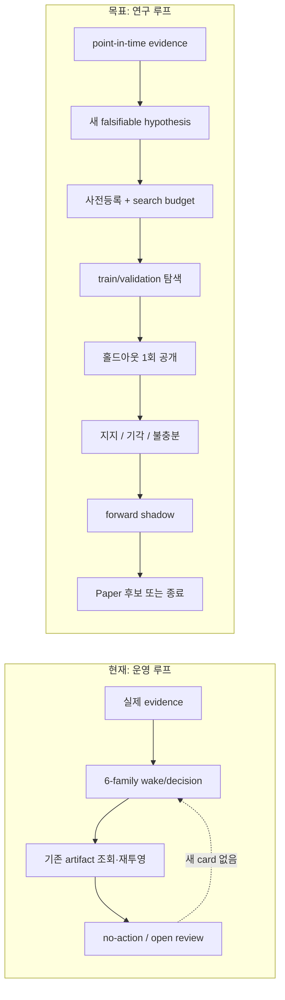
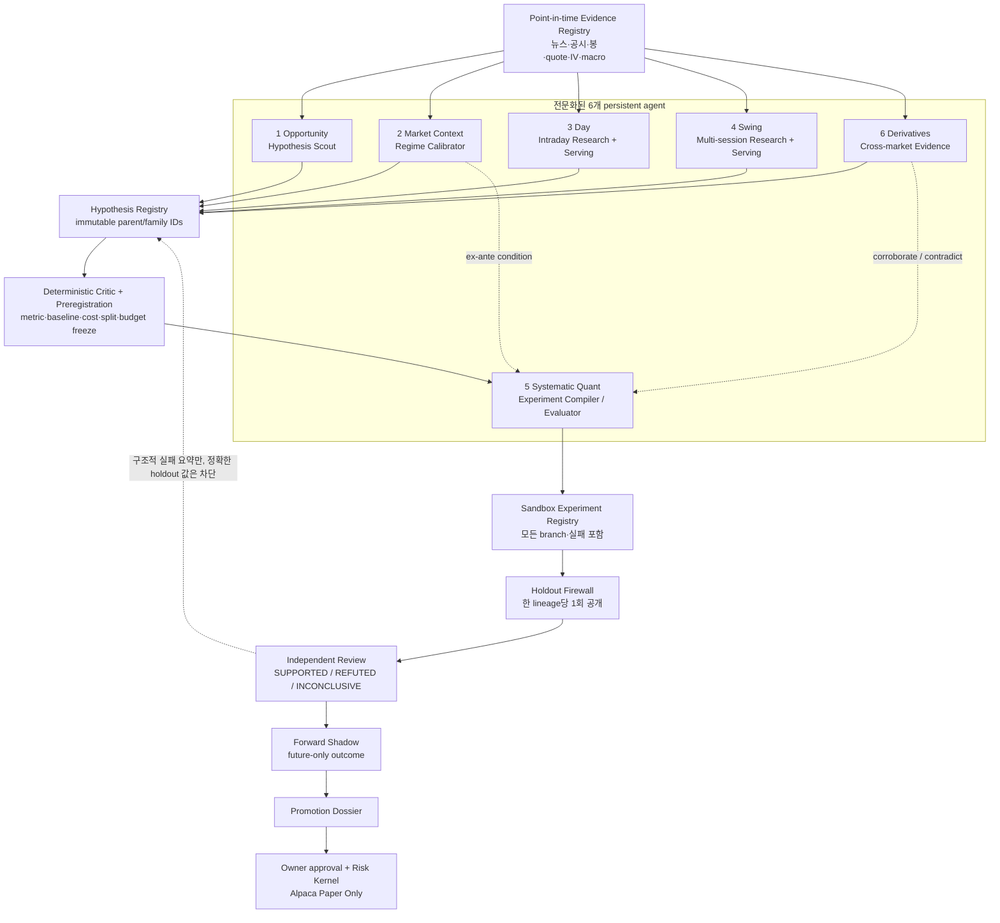
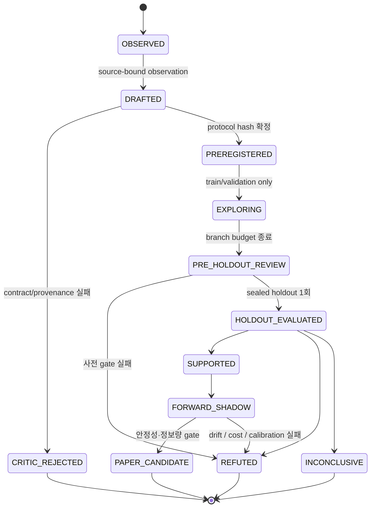

# 여섯 에이전트 유의미 연구 루프 설계

**상태:** 구현 전 승인 설계
**작성일:** 2026-08-17
**대상:** `trading-recommendation-agent`의 6-family persistent runtime
**한 줄 목표:** 여섯 에이전트가 단순히 깨어나고 기록을 남기는 수준을 넘어, 실제 근거에서 검증 가능한 가설을 만들고 누수 없는 실험과 전방 관찰을 통해 `지지·기각·불충분` 중 하나의 재현 가능한 결론을 축적하게 한다.

---

## 1. 결론

현재 프로젝트는 **여섯 에이전트가 상시 깨어나는 운영 골격**은 갖췄지만, 사용자가 처음 기획한 **근거 → 새 가설 → 사전등록 → 실험 → 독립 검토 → 다음 연구**의 인식론적 루프는 닫히지 않았다.

2026-08-17 배포 런타임을 읽기 전용으로 확인한 결과:

- Opportunity Manager에는 `propose_hypothesis` 완료 기록이 없었다.
- Systematic Quant에는 `request_heavy_experiment` 완료 기록이 없었다.
- 최신 여섯 family 결과는 모두 `no_action` 또는 이에 준하는 상태였고 artifact reference가 없었다.
- experiment ledger에는 legacy hypothesis 4개와 started-only trial 2개가 있지만, research source 0개, research hypothesis card 0개였다.

따라서 지금 상태를 “6개 연구 에이전트가 유의미한 신호를 계속 찾고 있다”고 말하면 안 된다. 정확한 표현은 **“6-family scheduler와 안전한 action boundary는 동작하지만, 신규 가설과 terminal experiment를 생산하는 연결이 비어 있다”**이다.

권장 구조는 **전문화된 6개 발견·해석 에이전트 + 중앙의 결정론적 사전등록·실험·홀드아웃 게이트**를 결합한 하이브리드다. 여섯 에이전트의 자율성은 “무엇을 조사할지”에 쓰고, 유의미성 판정은 재현 가능한 코드와 봉인된 데이터가 맡는다.

> 이 구조는 수익을 보장하지 않는다. 대신 거짓 양성, 미래정보 누수, 선택 편향을 줄이고, 실제 데이터에서 나온 긍정·부정·불충분 결과를 모두 자산으로 남긴다. 실제 alpha 여부는 구현 후 미사용 시간구간과 forward shadow에서만 결정된다.

---

## 2. 기획 의도와 현재 구현의 차이

README는 이 제품을 단순한 종목 추천 봇이 아니라 `외부 데이터 → 후보 → 가설 → 격리 실험 → 추천 → Alpaca Paper → 독립 Reviewer`를 typed contract와 immutable ledger로 잇는 Research OS로 정의한다 ([README.md:1-18](../../../README.md#L1-L18)). 여섯 역할과 생성형 Python 실험의 의도도 명확하다 ([README.md:115-149](../../../README.md#L115-L149)).

초기 6-agent 설계 역시 Opportunity가 provenance-bound hypothesis를 만들고, Systematic이 실제 source에서 bounded experiment와 Reviewer feedback을 닫도록 요구했다 ([2026-07-31 설계:95-145](2026-07-31-six-persistent-research-agents-design.md#L95-L145), [332-367](2026-07-31-six-persistent-research-agents-design.md#L332-L367)).

그러나 현재 action 경로에는 다음 단절이 있다.

| 구간 | 현재 구현 | 실제 의미 | 빠진 연결 |
|---|---|---|---|
| Opportunity → hypothesis | `PROPOSE_HYPOTHESIS`가 기존 source-matching card를 조회함 | 신규 가설을 만들지 않음 | 후보 근거를 `ResearcherPipeline`에 전달하고 새 card 등록 |
| Researcher → ledger | 별도 pipeline은 generator → critic → artifact → manifest → card 등록을 수행함 | 작동 가능한 우회 경로는 존재 | persistent Opportunity action에서 호출하지 않음 |
| Critic | rejected duplicate와 free parameter 개수만 검사 | source fidelity와 mechanism enum은 선언만 됨 | 실제 근거 일치, 실행 가능성, protocol 완결성 검사 |
| Systematic | 사전 준비된 activation이 있을 때만 heavy child 실행 | 실행기는 있으나 자동 intake가 끊김 | 새 preregistered card → bounded experiment request |
| Reviewer feedback | 다음 cycle context에 들어갈 수 있음 | 일반 feedback 루프는 존재 | holdout 결과가 같은 가설을 과적합시키지 못하는 방화벽 |

직접 근거:

- Opportunity의 proposal branch는 새 card를 생성하지 않고 `matching_card_key()`가 `None`이면 실패한다 ([research_agent_primary_actions.py:55-104](../../../trading_agent/research_agent_primary_actions.py#L55-L104)).
- 반면 별도 `ResearcherPipeline.run()`은 새 proposal을 critique하고 immutable artifact·manifest·card·queue를 등록한다 ([researcher_pipeline.py:77-109](../../../trading_agent/researcher_pipeline.py#L77-L109)).
- 현재 `LlmHypothesisDraft`에는 universe, target, horizon, exact signal, primary metric, split, cost, trial-family budget가 없다 ([researcher_llm.py:59-81](../../../trading_agent/researcher_llm.py#L59-L81)).
- `DeterministicHypothesisCritic`은 중복과 free parameter 수만 실제 검사한다 ([critic_agent.py:51-73](../../../trading_agent/critic_agent.py#L51-L73)).
- Systematic executor는 verified input activation이 있어야 child process를 시작한다 ([research_agent_systematic_executor.py:87-146](../../../trading_agent/research_agent_systematic_executor.py#L87-L146)).

### 현재와 목표의 차이



---

## 3. 무엇을 “유의미한 결과”라고 부를 것인가

에이전트가 메시지를 남기거나 backtest 수익률이 양수인 것은 유의미성의 충분조건이 아니다. 네 단계로 구분한다.

| 단계 | 통과 조건 | 통과하지 못한 예 |
|---|---|---|
| 1. 운영 유의미성 | 실제 evidence ID를 읽고 domain-specific artifact를 남김 | “시장 조사 필요”라는 prose만 생성 |
| 2. 연구 유의미성 | 사전등록된 가설이 재현 가능한 실험에서 `지지·기각·불충분`으로 terminal closure | trial이 시작 상태로만 남음 |
| 3. 신호 유의미성 | 비용 차감, 시간 누수 차단, baseline·불확실성·다중검정 보정 후 미사용 데이터에서 incremental value | 전체 기간 최고 Sharpe만 제시 |
| 4. 운용 유용성 | 충분한 forward shadow 표본에서 안정성·calibration을 보이고 독립 review를 통과 | backtest만으로 Paper 주문 권한 생성 |

중요한 운영 원칙:

1. **기각과 불충분도 성공적인 연구 결과다.** 실패를 삭제하면 search history를 숨겨 유의미성이 오히려 떨어진다.
2. **에이전트 KPI를 통과한 가설 수로 두지 않는다.** 그러면 각 에이전트가 거짓 양성을 최적화한다.
3. **가설 생성과 판정 권한을 분리한다.** LLM은 후보와 메커니즘을 제안할 수 있지만 metric 계산, split, 비용, promotion 판정은 결정론적 코드가 수행한다.
4. **데이터가 부족하면 `INCONCLUSIVE`가 정답이다.** 5일·10회처럼 근거 없는 고정 기간을 완료 기준으로 쓰지 않고, power 또는 신뢰구간 폭으로 정보 충분성을 판단한다.
5. **한 번 공개한 holdout은 다시 미사용 데이터가 될 수 없다.** 수정안은 새 hypothesis/family ID와 미래의 새 holdout을 사용한다.

---

## 4. 검토한 세 가지 구조

| 대안 | 장점 | 치명적 문제 | 판정 |
|---|---|---|---|
| A. 여섯 독립 trader/debate agent | 역할이 눈에 잘 보이고 아이디어 다양성 확보 | 같은 데이터·prompt를 공유하면 의견 수만 늘 뿐 독립 증거가 아님. 사후합리화와 holdout leakage 위험 | 기각 |
| B. 하나의 고정 중앙 pipeline | 재현성·감사·통계 통제가 쉬움 | market-context, intraday, derivatives 같은 domain discovery가 수동 feature factory로 축소됨 | 보류 |
| C. 전문 agent + 중앙 science gate | domain별 탐색과 과학적 판정을 분리. 현재 6-family runtime·ledger·sandbox를 재사용 가능 | contract와 feedback firewall을 엄격히 구현해야 함 | **채택** |

TradingAgents는 역할 전문화와 토론 패턴이 가능함을 보여주지만, 그 자체가 지속 가능한 alpha의 증명은 아니다 ([paper](https://arxiv.org/abs/2412.20138)). RD-Agent의 proposal/development/feedback 분리와 AI Scientist-v2의 bounded tree search는 탐색 운영에 참고할 수 있으나, 금융에서는 동일 feedback을 unrestricted refinement에 쓰면 전체 분기가 하나의 거대한 다중검정 family가 된다 ([RD-Agent pinned README](https://github.com/microsoft/RD-Agent/blob/6762f84f9bc0f5c6486c50a00e128a57ac6c3683/README.md#L513-L518), [AI Scientist-v2 paper](https://arxiv.org/abs/2504.08066), [bounded config](https://github.com/SakanaAI/AI-Scientist-v2/blob/96bd51617cfdbb494a9fc283af00fe090edfae48/bfts_config.yaml#L35-L76)).

따라서 채택안은 agentic search의 장점만 사용하고, 성능 판정은 고정 protocol과 봉인된 시간구간으로 격리한다.

---

## 5. 목표 아키텍처



### 5.1 권한 분리

| 주체 | 할 수 있음 | 할 수 없음 |
|---|---|---|
| 5개 발견 agent | evidence 선택, anomaly 설명, falsifiable hypothesis 초안 | holdout 조회, 성능 metric 계산, promotion 결정 |
| Systematic Quant | preregistered protocol 컴파일, sandbox 실행, metric 산출 | hypothesis 문구·primary metric·threshold 사후 변경 |
| Deterministic Critic | schema, provenance, duplication, data constructibility, budget 검사 | 방향성/수익성 직관으로 임의 승인 |
| Independent Reviewer | terminal evidence로 지지·기각·불충분 판정 | 같은 lineage를 수정하여 재시험 |
| Risk/Execution kernel | 승인된 version의 current-session recommendation 검증, Alpaca Paper 처리 | research score만으로 주문 생성, live endpoint 호출 |

Reviewer와 Critic은 일곱 번째 상시 market agent가 아니다. 여섯 역할이 만든 산출물을 판정하는 공유 control-plane component다.

---

## 6. 가설 생명주기와 feedback firewall



### Feedback firewall 규칙

1. proposal agent는 source, code error, data-constructibility, train/validation summary와 **일반화된 실패 유형**만 볼 수 있다.
2. sealed holdout의 정확한 수익률, Sharpe, 실패 구간, 종목별 기여도는 같은 lineage의 generator로 돌아가지 않는다.
3. holdout 공개 후 해당 lineage는 terminal이다. “조금 수정하고 같은 holdout 재시험”은 금지한다.
4. 새 설명이나 feature는 새 hypothesis ID를 받으며, 이전과 공유한 자유도는 같은 search-family budget에 포함한다.
5. 생성·실패·중단된 모든 branch는 attempt registry에 남고 다중검정 분모에서 빠질 수 없다.
6. Reviewer feedback은 다음 가설의 **연구 방법**을 개선할 수 있지만, 직전 holdout의 패턴을 암호처럼 전달하면 안 된다.

White의 Reality Check는 data snooping으로 선택된 최고 모델을 그대로 믿을 수 없음을 다루며 ([DOI](https://doi.org/10.1111/1468-0262.00152)), PBO는 backtest overfitting의 확률을 측정하는 방법을 제안한다 ([Bailey et al.](https://escholarship.org/uc/item/4w1110bb)). Deflated Sharpe Ratio는 비정규 수익과 여러 시도에서 발생한 selection bias를 반영한다 ([Bailey & López de Prado](https://papers.ssrn.com/sol3/papers.cfm?abstract_id=2460551)). 금융 factor 연구의 다중검정 문제 역시 훨씬 높은 증거 문턱이 필요함을 보여준다 ([Harvey, Liu, Zhu](https://www.nber.org/papers/w20592)).

---

## 7. 공통 데이터 계약

현재 `LlmHypothesisDraft`를 그대로 확장 호환하는 방식보다, 연구 protocol을 별도 immutable contract로 분리하는 편이 낫다. LLM 초안과 판정 가능한 사전등록을 같은 객체로 취급하면 불완전한 자연어가 authority를 갖기 때문이다.

### 7.1 `CandidateObservationV1`

```yaml
observation_id: content_hash
agent_family_id: opportunity_manager | market_context | day | swing | derivatives
observed_at: timezone-aware timestamp
as_of: latest information timestamp used
source_refs: [immutable receipt/canonical IDs]
point_in_time_policy: provider and revision rules
universe_snapshot_id: immutable universe membership
observation_formula: deterministic feature/anomaly definition
observed_value: typed scalar/vector/table reference
coverage: expected/received/stale/missing counts
novelty_links: related hypotheses and distance
trading_authority: false
```

### 7.2 `HypothesisDraftV2`

```yaml
hypothesis_id: immutable ID
parent_hypothesis_id: optional
search_family_id: all related attempts share this ID
owner_family: one of six agents
lane: us_day | kr_day | swing | systematic | derivatives_context
source_refs: exact observation/evidence IDs
universe: constructible point-in-time definition
predictor: exact formula and sampling time
target: exact outcome label
expected_direction: positive | negative | conditional
horizon: bars or market sessions
entry_exit_invalidation: deterministic rules
economic_mechanism: causal/economic story
alternative_explanations: [known confounds]
counterfactual_baseline: benchmark or nested model
primary_metric: one frozen metric
falsification_rule: threshold and sign
cost_model: fees, spread, slippage, latency
free_parameters: named bounded parameters
search_budget: max branches, seeds, wall/RSS budget
model_and_prompt_hashes: generator lineage
trading_authority: false
```

### 7.3 `ExperimentProtocolV1`

```yaml
protocol_hash: canonical content hash
hypothesis_id: immutable reference
dataset_manifest: provider, query, receipts, corporate actions, as-of policy
label_manifest: target construction and censoring
split_manifest: train, validation, sealed holdout, purge, embargo
execution_manifest: decision time, next-fill lag, spread/slippage/cost
benchmark: frozen comparator
primary_metric: frozen metric and uncertainty estimator
secondary_metrics: diagnostic only
multiple_testing: family size and FDR/Reality-Check/DSR/PBO method
negative_controls: shuffled label, delayed/impossible feature, null baseline
ablation_plan: mechanism-relevant removals
random_seeds: explicit list
holdout_commitment_hash: sealed before experiment
holdout_reveal_limit: 1
```

### 7.4 `ExperimentResultV1`

```yaml
result_id: immutable content hash
protocol_hash: exact protocol
attempt_refs: every success, failure, timeout and censored branch
dataset_and_code_hashes: reproducibility lineage
train_validation_summary: exploration result
holdout_revealed_at: null or one timestamp
holdout_primary_metric: value plus confidence interval
net_cost_baseline_delta: value plus confidence interval
selection_adjustment: FDR / Reality Check / DSR / PBO outputs
stability: time-fold, regime, universe and concentration diagnostics
negative_controls: pass/fail
ablation_results: mechanism consistency
limitations: data and inference limits
terminal_state: SUPPORTED | REFUTED | INCONCLUSIVE
trading_authority: false
```

### 7.5 `PromotionDossierV1`

```yaml
strategy_version: frozen artifact reference
supported_hypothesis: terminal result reference
forward_shadow_window: future-only manifest
information_sufficiency: power or CI-width decision
calibration_and_drift: lane-specific report
current_session_guards: freshness, completed bar, spread, session
independent_review: approval plus limitations
allowed_surface: research | shadow | alpaca_paper_candidate
owner_approval_required: true
live_trading_authority: false
```

Qlib의 Experiment → Recorder 계층처럼 params, metrics, artifacts를 한 실행 identity 아래 기록하는 패턴은 유용하다 ([SHA-pinned Qlib recorder 문서](https://github.com/microsoft/qlib/blob/79633dd9506ea689e5400dea0197717b5b3d74b7/docs/component/recorder.rst#L8-L111)). 이 프로젝트에서는 새 database를 추가하지 않고 기존 experiment ledger에 protocol, attempt-family, holdout commitment, promotion dossier event를 추가한다.

---

## 8. 에이전트별 실제 역할

### 8.1 Opportunity Manager: Hypothesis Scout

**질문:** “지금 관찰된 이상현상 중 무엇이 새롭고, 측정 가능하며, 경제적 설명을 가진 연구 가설이 될 수 있는가?”

- 입력: point-in-time 뉴스·공시·랭킹·가격/거래량 anomaly, 기존 hypothesis graph, source coverage.
- 결정론적 전처리: 중복 cluster, stale/coverage gate, feature 계산, known-event exclusion.
- LLM 역할: anomaly와 source를 묶어 메커니즘, 대안 설명, 반증 가능한 방향을 작성.
- 출력: `CandidateObservationV1`과 `HypothesisDraftV2`, 또는 구체적인 rejection code.
- 유의미성 gate: source ID가 실제로 존재하고, predictor와 target을 현재 data adapter로 재구성할 수 있으며, 기존 hypothesis와 구별되고, 반증 규칙이 수치화되어야 한다.
- 금지: 종목이 흥미롭다는 prose, 직접 recommendation/order, 기존 card를 찾은 것을 새 가설로 표시.

**최소 실제 연결:** `OpportunitySnapshot`의 선택 candidate와 exact evidence refs를 `ResearcherContextInput`으로 변환해 기존 `ResearcherPipeline`을 호출하고, 새로 등록된 card key를 result artifact로 되돌린다. 단, 이 연결은 `HypothesisDraftV2`와 강화된 Critic이 함께 들어갈 때만 의미가 있다.

### 8.2 Market Context: Regime Calibrator

**질문:** “현재 시장 상태를 사전에 측정했을 때 특정 가설의 조건부 성능이 실제로 달라지는가?”

- 입력: breadth, volatility, liquidity, rates, cross-asset, session boundary와 data coverage.
- 출력: 확률적 `ContextConditionV1` (`regime_probabilities`, confidence, coverage, calibration lineage).
- 역할: 다른 가설의 ex-ante condition/stratum을 제공. 매수·매도 veto가 아님.
- 검증: context-conditioned model이 unconditioned baseline 대비 holdout에서 incremental value를 보이는지, calibration error와 regime persistence가 허용 범위인지 확인.
- 금지: “risk-on/risk-off” 단일 라벨만 재출력, 사후에 잘 맞는 regime 이름을 바꾸기, context alone으로 주문 권한 생성.

### 8.3 Day Trading: Intraday Research + Promoted Serving

**질문:** “현재 세션의 완료된 봉과 fresh quote만으로 다음 지정 horizon의 비용 차감 결과를 예측하는가?”

두 모드를 분리한다.

1. **Research mode:** ORB/VWAP/HOD/Gap/RVOL/order-flow candidate를 exact label·horizon·fill lag와 함께 가설로 등록.
2. **Serving mode:** 이미 promotion된 frozen strategy version만 실행해 timestamp, entry, stop, targets, rationale, immutable outcome reference를 만든다.

- LLM은 가격, risk geometry, fill, PnL을 계산하지 않는다. 결정론적 engine이 계산한다.
- current NY session, latest completed bar, fresh feed, non-missing spread gate를 통과해야 serving recommendation이 가능하다.
- same-bar stop/target collision은 stop으로 처리한다.
- intraday hypothesis의 유의미성은 net-cost excess outcome, turnover/capacity, halt·spread 민감도, 날짜별 concentration으로 판단한다.
- 금지: historical result에서 바로 serving mode로 승격, 미완료 봉 사용, stale quote로 recommendation 생성.

### 8.4 Swing Trading: Multi-session Research + Promoted Serving

**질문:** “point-in-time catalyst와 일봉 상태가 지정된 여러 session horizon에서 비용·시장노출 조정 후 결과를 예측하는가?”

- 입력: post-close Opportunity/Context, point-in-time filings/news, corporate-action-adjusted daily bars, open shadow outcomes.
- 출력: `SwingHypothesisDraftV2` 또는 promotion된 version의 conditional thesis/recommendation.
- protocol 필수값: horizon, overlapping-label 처리, delisting/corporate-action rule, entry timing, max holding, invalidation, benchmark exposure.
- 검증: purged temporal split, event overlap cluster, market/style-neutral baseline, time/regime stability.
- 금지: 수정 공시나 지수 편입 결과를 과거 시점 feature로 사용, 생존 종목만 사용, open state를 성공으로 종료.

### 8.5 Systematic Quant: Experiment Compiler / Evaluator

**질문:** “사전등록된 가설이 봉인된 protocol과 실제 비용 아래서 baseline보다 유의미한가?”

- 유일하게 heavy experiment를 실행하는 agent다.
- 입력은 Critic을 통과한 `ExperimentProtocolV1`만 허용한다.
- 생성 Python은 predictor/signal 계산만 하고, future data·network·credential·broker에 접근할 수 없다.
- host evaluator가 split, fills, cost, stop/target collision, metric, confidence interval, multiple-testing correction을 계산한다.
- train/validation 탐색은 branch/seed/depth/wall/RSS budget 안에서만 허용하며 모든 attempt를 기록한다.
- pre-holdout review 후 holdout을 한 번만 공개하고 `SUPPORTED`, `REFUTED`, `INCONCLUSIVE` 중 하나로 닫는다.
- 금지: holdout 결과로 같은 lineage code 수정, 좋은 seed만 남기기, 최고 Sharpe 한 줄만 보고, historical 결과로 Paper 권한 생성.

AI Scientist-v2의 bounded workers·stage iterations·debug depth는 search budget 설계에 참고하되, 금융 성능의 증거로 사용하지 않는다 ([config](https://github.com/SakanaAI/AI-Scientist-v2/blob/96bd51617cfdbb494a9fc283af00fe090edfae48/bfts_config.yaml#L35-L76)).

### 8.6 Derivatives Research: Cross-market Evidence Agent

**질문:** “옵션·선물에서 관찰한 IV, skew, term, basis가 현물 가설에 독립적인 추가 정보를 주는가?”

- 입력: source authority가 확인된 IV/skew/term/basis/volume/open-interest와 underlying context.
- 출력: `DerivativesEvidenceV1`, 새 `DerivativesHypothesisDraftV2`, 또는 기존 현물 가설에 대한 `CORROBORATES / CONTRADICTS / UNINFORMATIVE` link.
- coverage·quote age·surface construction·calendar alignment가 부족하면 `blocked_by_data`가 올바른 결과다.
- 검증: 현물-only baseline 대비 derivatives feature의 holdout incremental value, 거래 가능성, stale/indicative quote 민감도.
- 금지: 없는 Greeks/chain을 추정값으로 채우기, KIS·LS 등 read-only provider에서 계좌·주문 호출, derivatives context만으로 주문 권한 생성.

### 역할 요약

| Agent | 독점 책임 | 주 산출물 | “유의미” 판정 |
|---|---|---|---|
| Opportunity | anomaly → 새 연구 질문 | observation + hypothesis draft | novel, source-bound, constructible, falsifiable |
| Context | ex-ante 상태 확률화 | calibrated context condition | unconditioned 대비 OOS incremental value |
| Day | intraday research/serving 분리 | intraday hypothesis 또는 promoted recommendation | current-session + net-cost + stability |
| Swing | multi-session 연구/serving | swing hypothesis 또는 promoted thesis | PIT catalyst + overlap-safe temporal OOS |
| Systematic | protocol compile·실험·판정 | immutable experiment result | leakage-safe, all-attempt, adjusted evidence |
| Derivatives | cross-market 독립 증거 | derivative hypothesis/corroboration | spot baseline 대비 incremental value |

---

## 9. 실험과 promotion gate

다음은 **초기 설계 기본값**이며 alpha를 보장하는 보편 법칙이 아니다. 각 lane은 결과를 보기 전에 sample 특성과 metric에 맞춰 threshold를 사전등록해야 한다.

### 9.1 필수 gate

1. **Lineage:** 모든 source, dataset, prompt/model, code, config, protocol, attempt, result hash가 연결됨.
2. **Point-in-time:** universe membership, corporate action, 공시 수정, release timestamp가 당시 알 수 있었던 상태로 재현됨.
3. **Frozen primary:** primary metric, 방향, baseline, 비용, split, family budget가 첫 experiment 전에 고정됨.
4. **Temporal isolation:** label horizon만큼 purge, 필요한 경우 embargo, one-time sealed holdout.
5. **Costs:** fee + spread + lane별 slippage/latency를 차감하고 cost sensitivity를 보고함.
6. **Controls:** 최소 null baseline, shuffled/delayed feature, mechanism ablation을 실행.
7. **All attempts:** timeout·오류·기각·실패를 포함한 모든 branch가 registry에 남음.
8. **Uncertainty:** 점 추정치만이 아니라 confidence interval 또는 사전등록된 확률 판정을 제시.
9. **Multiple testing:** search family 전체에 FDR q-value 또는 Reality Check/SPA 계열을 적용. Sharpe가 primary일 때 DSR, 변형이 충분할 때 PBO를 함께 보고.
10. **Forward-only:** holdout 통과 후에는 다음 실제 시간구간의 shadow outcome으로만 추가 판정.

### 9.2 초기 수치 guardrail

| 항목 | 기본값 | 해석 |
|---|---:|---|
| Primary net-baseline delta | one-sided 95% lower bound > 0 | 비용 차감 후 baseline보다 나을 가능성의 최소 gate |
| Family-wise discovery | FDR `q ≤ 0.10` 또는 사전등록 equivalent | 시도 수를 숨기지 않음 |
| Sharpe selection adjustment | DSR probability `≥ 0.95` | Sharpe가 primary일 때만 적용 |
| Backtest overfit | PBO `≤ 0.20` | 충분한 split/variant가 있을 때 진단 |
| Temporal stability | 사전등록된 다수 fold/regime에서 같은 방향 | 전체 성과를 한 구간이 독점하면 중단 |
| Contribution concentration | 한 fold가 전체 OOS 기여의 40% 초과 시 경고 | lane별 표본에 맞춰 사전 조정 |
| Holdout reveal | 1회 | 초과 시 해당 lineage 무효 |
| Shadow duration | 고정 일수가 아니라 power/CI-width 충족 시까지 | 정보 부족이면 `INCONCLUSIVE` 유지 |

### 9.3 상태 판정

- `SUPPORTED`: 모든 필수 gate를 통과하고 frozen primary criterion이 holdout에서 충족.
- `REFUTED`: 방향 반대, baseline 미달, leakage/control 실패, 불안정성 또는 protocol 위반.
- `INCONCLUSIVE`: 데이터/정보량 부족, 신뢰구간이 넓음, provider coverage 부족. 통과도 실패도 아님.
- `PAPER_CANDIDATE`: `SUPPORTED` 이후 future-only shadow와 independent review까지 통과. 자동 주문 권한이 아니라 owner approval 대상.

최근의 agentic trading 연구도 강한 주장을 경계해야 한다. KTD-Fin은 leakage-controlled 평가에서 수익의 상당 부분이 passive market/style exposure로 설명되고 지속적 selection alpha가 제한적이라는 결과를 보고한다 ([preprint](https://arxiv.org/abs/2605.28359)). CLQT는 고정 구간 수익 순위보다 time gate, 비용, 일관성, hash-chain 재현성을 강조한다 ([preprint](https://arxiv.org/abs/2606.29771)). 이는 최신 preprint이므로 독립 복제가 완료된 정설로 취급하지 않지만, 이 설계의 보수적 판정 원칙과 방향은 일치한다.

반대로 QuantEvolver는 executable feedback을 통한 benchmark 향상을 보고한다 ([preprint](https://arxiv.org/abs/2605.15412)). 그러나 독립적인 live/untouched temporal replication이 없는 최신 결과이므로 “agent feedback이 실제 alpha를 보장한다”는 근거로 사용하지 않는다. 최근 재현성 검토 역시 LLM trading 연구에서 temporal leakage, 비용 모델, protocol disclosure를 핵심 문제로 지적한다 ([review](https://arxiv.org/abs/2606.08285)).

---

## 10. 한 가설이 실제로 닫히는 예

다음은 **contract 형식을 설명하기 위한 미검증 예시**이지 추천이나 발견된 signal이 아니다.

```text
Observation
  미국 주식 중 당일 10:00 NY까지 RVOL 상위 10%이고,
  시장 breadth가 사전 정의된 확장 상태이며,
  quote spread가 20bp 미만인 후보군이 관찰됨.

Hypothesis H-US-DAY-EXAMPLE-001
  10:00 완료봉 종가 대비 다음 60분 VWAP 수익률의
  비용 차감 횡단면 평균이 sector-matched baseline보다 크다.

Frozen protocol
  universe, 10:00 decision time, next-bar fill, 60분 label,
  spread/slippage, sector baseline, temporal folds, primary metric,
  branch budget 12, holdout hash를 결과 보기 전에 확정.

Experiment
  train/validation에서 12개 branch를 모두 기록.
  pre-holdout review 통과 시 sealed future block을 1회 평가.

Terminal result
  SUPPORTED / REFUTED / INCONCLUSIVE 중 하나와 CI, costs,
  concentration, controls, limitation을 immutable result로 기록.

Next
  SUPPORTED만 미래 세션 shadow로 이동.
  REFUTED/INCONCLUSIVE를 지우지 않음.
  수정 아이디어는 새 ID와 새 future holdout을 사용.
```

이 흐름에서 “유의미한 결과”는 예시 가설이 성공하는 것이 아니다. **한 번 정한 질문을 결과에 맞춰 바꾸지 않고 실제 데이터로 닫아, 다음 연구가 같은 실수를 반복하지 않게 하는 것**이다.

---

## 11. 구현 순서

새 인프라나 별도 orchestration system을 만들지 않는다. 현재 runtime, evidence store, experiment ledger, sandbox, reviewer, dashboard를 연결하고 필요한 contract만 추가한다.

### Slice 1. Opportunity 실제 신규 가설 vertical

**변경 중심:**

- `trading_agent/research_agent_primary_actions.py`
- `trading_agent/researcher_pipeline.py`
- `trading_agent/researcher_llm.py`
- `trading_agent/critic_agent.py`

**내용:** Opportunity candidate → `ResearcherContextInput` adapter, `HypothesisDraftV2`, deterministic source/mechanism/constructibility critic, 신규 card key 반환.

**완료 증거:** 실제 production-path Opportunity evidence 한 건에서 research source와 새 card가 생성되고 source→observation→draft→critique→card hash를 추적할 수 있다. 문장만 생성하거나 기존 card 조회로 끝나면 실패다.

### Slice 2. 공통 protocol과 immutable attempt family

**변경 중심:** existing experiment ledger model/store/migrations와 manifest projection.

**내용:** `ExperimentProtocolV1`, search-family, branch budget, all-attempt events, sealed holdout commitment와 reveal counter 추가.

**완료 증거:** 결과를 보기 전에 protocol hash가 확정되고, 실패 branch를 삭제해도 ledger chain 검증이 실패한다. generator process가 sealed holdout manifest를 읽을 수 없다.

### Slice 3. Systematic evaluator 연결

**변경 중심:**

- `trading_agent/research_agent_systematic_executor.py`
- autonomous cycle coordinator/evaluator
- generated sandbox boundary

**내용:** preregistered queue를 자동 intake하고, bounded train/validation experiment → pre-holdout review → one-time holdout → terminal result를 실행.

**완료 증거:** 실제 source-bound hypothesis 하나가 started에 머물지 않고 `SUPPORTED`, `REFUTED`, `INCONCLUSIVE` 중 하나로 닫힌다. timeout과 code failure도 attempt history에 남는다.

### Slice 4. Context·Derivatives의 조건/추가정보 contract

**내용:** Context를 calibrated probability artifact로, Derivatives를 spot-baseline 대비 incremental evidence artifact로 변경. 둘 다 직접 trading authority는 없다.

**완료 증거:** 단순 narrative 대신 coverage·as-of·value·confidence·calibration lineage가 있고 Systematic protocol에서 feature/condition으로 재구성된다.

### Slice 5. Day·Swing research/serving 분리

**내용:** hypothesis generation은 research version, recommendation은 promoted frozen version으로 명시적으로 분기. outcome feedback은 immutable event로 저장.

**완료 증거:** unpromoted backtest artifact가 serving path에 들어가면 fail closed. promoted version만 current-session gate를 거쳐 recommendation을 만들고 terminal outcome이 다음 연구 evidence로 연결된다.

### Slice 6. Reviewer·forward shadow·제품 표면

**내용:** terminal scientific decision, promotion dossier, future-only shadow sufficiency, lineage dashboard.

**완료 증거:** 화면의 중심이 “6 agents alive”가 아니라 다음 질문에 답한다.

- 오늘 새로 생긴 가설은 무엇인가?
- 어떤 source와 mechanism에 묶였는가?
- protocol은 결과 전에 언제 고정됐는가?
- 몇 개 branch를 시도했고 무엇이 실패했는가?
- holdout은 공개됐는가?
- 결과는 지지·기각·불충분 중 무엇인가?
- forward shadow에서 무엇이 달라졌는가?
- Paper 후보가 아니라면 정확히 어떤 gate가 막았는가?

---

## 12. 구현 acceptance matrix

| ID | 실제 시나리오 | 관찰해야 할 결과 | 실패 조건 |
|---|---|---|---|
| A1 | production source adapter에서 새 Opportunity evidence 수신 | 새 observation과 card, source/card count 증가, immutable refs | prose-only 또는 기존 card 재조회 |
| A2 | source가 stale/불완전/중복 | typed reject/no-action과 정확한 reason | 억지 가설 생성 |
| A3 | preregistered card가 Systematic queue 진입 | protocol hash, family budget, dataset/split/cost manifest | primary metric이 실행 뒤 변경 가능 |
| A4 | generated experiment에 실패 branch 포함 | 성공·실패·timeout 전 branch가 attempt ledger에 존재 | 좋은 branch만 남음 |
| A5 | holdout 접근 시도 | proposal/generator process에서 접근 거부; reveal counter 0 유지 | prompt나 feedback에 holdout 값 노출 |
| A6 | pre-holdout review 통과 후 1회 평가 | terminal `SUPPORTED/REFUTED/INCONCLUSIVE`, reveal counter 1 | started-only 또는 2회 이상 공개 |
| A7 | holdout 뒤 전략 수정 | 새 hypothesis/family/protocol ID 필요 | 기존 lineage에 덮어쓰기 |
| A8 | Context 또는 Derivatives artifact 사용 | unconditioned/spot-only baseline 대비 incremental test | label을 보고 regime/feature 선택 |
| A9 | Day/Swing unpromoted version serving 요청 | HTTP/broker 전 fail closed | recommendation/order 생성 |
| A10 | promoted Day current-session setup | timestamp, entry, stop, targets, rationale, outcome ref 모두 존재 | stale/missing spread/미완료 봉 허용 |
| A11 | 충분하지 않은 forward sample | `INCONCLUSIVE`/waiting with CI-width or power reason | 임의 날짜 만료로 승인 |
| A12 | Paper candidate | human approval + exact Alpaca Paper URL + risk kernel | live URL 또는 다른 provider mutation |

### 최소 운영 대시보드 지표

```text
Research throughput
  source-bound observations / new cards / preregistered protocols

Closure quality
  terminal experiments / started-only age / inconclusive reasons

Search honesty
  attempted branches / failed branches / family-size corrections

Signal evidence
  net-baseline delta + CI / DSR-PBO-FDR / fold-regime stability

Forward evidence
  shadow information sufficiency / calibration / drift / cost surprise

Authority
  research-only / shadow / paper-candidate / blocked reason
```

agent별 생산성 지표는 “좋은 결과 비율” 대신 source fidelity, protocol completeness, terminal closure rate, reproducibility rate, duplicate reduction, information gain을 사용한다.

---

## 13. 안전·제품 경계

이 설계는 안전 인프라를 확장하려는 계획이 아니다. 기존 제품 경계를 연구 결과가 우회하지 못하게 유지하는 최소 규칙이다.

- 실제 주문은 `https://paper-api.alpaca.markets`만 허용한다.
- Alpaca 외 provider는 read-only다.
- historical, replay, synthetic, backtest는 recommendation·allocation·order authority를 만들지 않는다.
- `PAPER_CANDIDATE`도 owner approval과 risk kernel 전에는 주문 권한이 없다.
- 새 live recommendation은 현재 New York session의 latest completed bar, fresh feed와 spread를 요구한다.
- recommendation에는 timestamp, entry, stop, targets, rationale, immutable outcome history가 모두 있어야 한다.
- 실패, 기각, censored, no-action 상태를 audit database에서 삭제하지 않는다.

---

## 14. 기대 효과와 남는 불확실성

### 이 설계로 실제 달라지는 것

- Opportunity가 기존 card를 찾는 역할에서 **새 가설을 생성·등록하는 주체**가 된다.
- Systematic이 대기 중인 실행기에서 **사전등록된 가설을 terminal 결론으로 닫는 evaluator**가 된다.
- Context와 Derivatives는 narrative가 아니라 **OOS incremental value를 평가할 수 있는 수치 artifact**가 된다.
- Day와 Swing은 아이디어 생성과 주문 후보 생성을 분리해 **연구 결과가 곧바로 거래 권한으로 변하는 문제**를 막는다.
- dashboard는 process heartbeat가 아니라 **source→hypothesis→protocol→attempt→result→shadow lineage**를 보여준다.
- negative result도 다음 가설의 중복을 줄이는 실제 지식이 된다.

### 설계만으로 확정할 수 없는 것

- 어떤 가설이 실제 시장에서 alpha를 갖는지
- forward sample을 충분히 모으는 데 걸리는 시간
- provider coverage와 market impact가 전략 capacity에 미치는 실제 크기
- regime 변화 뒤 유효성이 얼마나 유지되는지

이 네 가지는 문서나 agent 토론으로 해결되지 않는다. 위 protocol을 구현한 뒤 미래 데이터가 답해야 한다.

---

## 15. 최종 판정

사용자의 목표대로라면 **“여섯 에이전트가 각각 LLM을 호출한다”는 설계로는 부족하다.** 여섯 역할은 서로 다른 시장 증거와 연구 질문을 책임지고, 한 번 제안된 가설은 중앙의 immutable protocol·bounded experiment·holdout firewall·independent review를 통과해야 한다.

이 하이브리드 구조는 현재 프로젝트의 runtime, ledger, sandbox, recommendation engine과 paper-only boundary 위에 구현할 수 있다. 가장 먼저 해야 할 작업은 새 플랫폼 구축이 아니라 다음 두 연결이다.

1. `OpportunitySnapshot → ResearcherPipeline → 새 hypothesis card`
2. `새 preregistered card → Systematic terminal experiment → Reviewer decision`

이 두 vertical이 실제 production evidence 한 건으로 닫히기 전에는 “6개 에이전트가 유의미한 연구를 한다”고 완료 선언하지 않는다.

---

## 16. 근거와 출처

### 저장소·런타임 근거

1. [README: 제품 정의와 안전 경계](../../../README.md#L1-L18)
2. [README: 6-family runtime과 generated experiment](../../../README.md#L115-L149)
3. [초기 여섯 persistent research agent 설계](2026-07-31-six-persistent-research-agents-design.md)
4. [persistent runtime 설계](2026-08-02-six-agent-persistent-runtime-design.md)
5. [outcome-first operating loop 설계](2026-08-16-outcome-first-six-agent-operating-loop-design.md)
6. [Opportunity current action](../../../trading_agent/research_agent_primary_actions.py#L55-L104)
7. [별도 ResearcherPipeline registration path](../../../trading_agent/researcher_pipeline.py#L77-L109)
8. [현재 LLM hypothesis draft](../../../trading_agent/researcher_llm.py#L59-L81)
9. [현재 deterministic critic](../../../trading_agent/critic_agent.py#L51-L73)
10. [현재 Systematic executor](../../../trading_agent/research_agent_systematic_executor.py#L87-L146)
11. 배포 runtime read-only snapshot: `.omo/ulw-research/20260817-024558/wave-2-explore-live-state.md`

### 외부 연구·라이브러리

1. Yamada et al., [The AI Scientist-v2](https://arxiv.org/abs/2504.08066), 2025.
2. Sakana AI, [AI Scientist-v2 bounded search config, SHA `96bd516`](https://github.com/SakanaAI/AI-Scientist-v2/blob/96bd51617cfdbb494a9fc283af00fe090edfae48/bfts_config.yaml#L35-L76).
3. Microsoft, [RD-Agent workflow, SHA `6762f84`](https://github.com/microsoft/RD-Agent/blob/6762f84f9bc0f5c6486c50a00e128a57ac6c3683/README.md#L513-L518).
4. Microsoft, [Qlib Recorder, SHA `79633dd`](https://github.com/microsoft/qlib/blob/79633dd9506ea689e5400dea0197717b5b3d74b7/docs/component/recorder.rst#L8-L111).
5. Xiao et al., [TradingAgents](https://arxiv.org/abs/2412.20138), 2024.
6. Bailey et al., [The Probability of Backtest Overfitting](https://escholarship.org/uc/item/4w1110bb), 2015.
7. Bailey & López de Prado, [The Deflated Sharpe Ratio](https://papers.ssrn.com/sol3/papers.cfm?abstract_id=2460551), 2014.
8. White, [A Reality Check for Data Snooping](https://doi.org/10.1111/1468-0262.00152), 2000.
9. Harvey, Liu & Zhu, [... and the Cross-Section of Expected Returns](https://www.nber.org/papers/w20592), 2014/2016.
10. [KTD-Fin](https://arxiv.org/abs/2605.28359), 2026, preprint; counter-evidence, independent replication pending.
11. [CLQT](https://arxiv.org/abs/2606.29771), 2026, preprint; evaluation proposal, independent replication pending.
12. [QuantEvolver](https://arxiv.org/abs/2605.15412), 2026, preprint; reported benchmark gain, independent temporal/live replication pending.
13. [Beyond Agent Architecture: reproducibility review](https://arxiv.org/abs/2606.08285), 2026, review preprint.

외부 출처는 13개, 6개 도메인이다. GitHub 링크는 조사 시점의 commit SHA로 고정했다. 최신 preprint의 성능 수치는 설계 원칙의 보조·반대 증거로만 사용했으며, 이 프로젝트의 수익성 근거로 사용하지 않았다.
